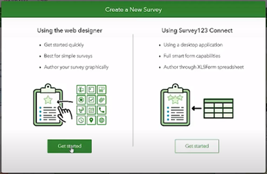

# ESRI Survey123 

## Survey123 Overview  {#s12top} 

From ESRI documentation: ArcGIS Survey123 is a complete, form-centric solution for creating, sharing, and analyzing surveys. Use it to create forms with skip logic, defaults, and support for multiple languages. Collect data using web or mobile devices, even when disconnected from the internet. Upload data securely, and analyze results on the web or in an ArcGIS app. 
https://doc.arcgis.com/en/survey123/reference/whatissurvey123.htm

From G2 Business Software Review: Survey123 is included with ArcGIS, and provides powerful features to help you leverage the power of location to boost your productivity while capturing data and analyzing the results of your surveys. https://www.g2.com/products/arcgis-survey123/reviews

## Survey123: Key Features 

### Survey123 Form Developing Interface

Surveys123 Survey Forms are created and stored through the ESRI web interface (see \@ref(fig:ESRIweb)); access requires a current ESRI license. Survey123 forms can be downloaded to tablets, iPhones or iPads, and data collection can be made while the device is offline. Survey results are uploaded to cloud storage next time the device is on-line. 

(\#fig:ESRIweb)Screen capture of the ESRI web interface for Survey123 and the option to Create New Survey.

There are two main options for designing a Survey123 survey form (\@ref(fig:ESRIweb2)): the Web Designer or Survey123 Connect tool. The Web Designer is a web-based menu-driven GUI that does not require learning any specific coding to set up a basic survey form.  Survey questions and response types can be specified using a drag and drop tool.

(\#fig:ESRIweb2)Screen capture of the ESRI web interface for Survey123 highlighting the two main options for designing a Survey123 form: the web designer or the Survey123 Connect tool.

Survey123 Connect is an option for more advanced survey form design, such as a nested structure or calculated responses from user inputs.  The Survey123 Connect approach requires defining the more advanced form properties within an ‘XLSForm spreadsheet’ using the XLSForm coding language (XLSForm spreadsheets: \@ref(fig:xlsform) and \@ref(fig:xlsform2)).  ESRI documentation for both Web designer and Connect can be found at: https://doc.arcgis.com/en/survey123/browser/create-surveys/createsurveys.htm
XLSForm formatting language is described at: https://xlsform.org/en/.

(\#fig:xlsform)Screen capture of ESRI Survey123 Connect software demonstrating the use of the XLSForm spreadsheet-based coding language and the ability to directly edit the JavaScript code that is linked to XLSForm parameters.

(\#fig:xlsform2)Screen capture of ArcGIS website description of the XLSForm features: https://gis.idaho.gov/wp-content/uploads/2021/03/ArcGIS-Apps-for-the-Field-State-of-ID.pdf.

## Survey123: Criteria Tables

### Survey123: Forms Options

<table class=" lightable-paper table" style='font-family: "Arial Narrow", arial, helvetica, sans-serif; margin-left: auto; margin-right: auto; font-size: 18px; width: auto !important; margin-left: auto; margin-right: auto;'>
<caption style="font-size: initial !important;">(\#tab:s1form)Forms Options</caption>
 <thead>
  <tr>
   <th style="text-align:left;position: sticky; top:0; background-color: #FFFFFF;position: sticky; top:0; background-color: #FFFFFF;"> Category </th>
   <th style="text-align:left;position: sticky; top:0; background-color: #FFFFFF;position: sticky; top:0; background-color: #FFFFFF;"> Feature </th>
   <th style="text-align:left;position: sticky; top:0; background-color: #FFFFFF;position: sticky; top:0; background-color: #FFFFFF;"> Available </th>
   <th style="text-align:left;position: sticky; top:0; background-color: #FFFFFF;position: sticky; top:0; background-color: #FFFFFF;"> Description </th>
   <th style="text-align:left;position: sticky; top:0; background-color: #FFFFFF;position: sticky; top:0; background-color: #FFFFFF;"> Group Notes </th>
   <th style="text-align:left;position: sticky; top:0; background-color: #FFFFFF;position: sticky; top:0; background-color: #FFFFFF;"> External  Reviews </th>
  </tr>
 </thead>
<tbody>
  <tr>
   <td style="text-align:left;min-width: 2.5cm; font-weight: bold;max-width: 3cm; font-weight: bold;"> Data entry validation/QC </td>
   <td style="text-align:left;min-width: 2.5cm; max-width: 3cm; "> Geo-referencing </td>
   <td style="text-align:left;min-width: 1.5cm; max-width: 2cm; "> Yes </td>
   <td style="text-align:left;min-width: 2cm; max-width: 5cm; "> Every Survey123 entry (object?) has an associated lat/long data </td>
   <td style="text-align:left;min-width: 2cm; max-width: 5cm; "> Uses device navigation: phone app or GPS device; Data can open in data in ArcGIS maps directly; Can change base map; Default is current location; Can tap the map to change location [test](https://doc.arcgis.com/en/survey123/browser/analyze-results/viewresults.htm#:~:text=Under%20the%20title%20for%20your,geodatabase%20and%20download%20your%20data) </td>
   <td style="text-align:left;min-width: 2cm; max-width: 5cm; ">  </td>
  </tr>
  <tr>
   <td style="text-align:left;min-width: 2.5cm; font-weight: bold;max-width: 3cm; font-weight: bold;">  </td>
   <td style="text-align:left;min-width: 2.5cm; max-width: 3cm; "> Constrained choices from a list </td>
   <td style="text-align:left;min-width: 1.5cm; max-width: 2cm; "> Yes </td>
   <td style="text-align:left;min-width: 2cm; max-width: 5cm; "> Web Designer </td>
   <td style="text-align:left;min-width: 2cm; max-width: 5cm; "> -Restricted lengths, Default values (e.g., Date, Time from device) </td>
   <td style="text-align:left;min-width: 2cm; max-width: 5cm; ">  </td>
  </tr>
  <tr>
   <td style="text-align:left;min-width: 2.5cm; font-weight: bold;max-width: 3cm; font-weight: bold;">  </td>
   <td style="text-align:left;min-width: 2.5cm; max-width: 3cm; ">  </td>
   <td style="text-align:left;min-width: 1.5cm; max-width: 2cm; "> Yes </td>
   <td style="text-align:left;min-width: 2cm; max-width: 5cm; "> Survey123 Connect: XLSForm spreadsheet </td>
   <td style="text-align:left;min-width: 2cm; max-width: 5cm; "> Above functionality, plus more advanced options such as: - select multiple responses from a list;smart fields: expressions and formulas to control the allowable input (e.g., total percentage &lt;= 100%)
- Auto limit by partial input
- Auto-completed suggestion </td>
   <td style="text-align:left;min-width: 2cm; max-width: 5cm; ">  </td>
  </tr>
  <tr>
   <td style="text-align:left;min-width: 2.5cm; font-weight: bold;max-width: 3cm; font-weight: bold;">  </td>
   <td style="text-align:left;min-width: 2.5cm; max-width: 3cm; "> Rules guiding answer series (e.g., “Conditional Questions” and “Skips”) </td>
   <td style="text-align:left;min-width: 1.5cm; max-width: 2cm; "> Yes </td>
   <td style="text-align:left;min-width: 2cm; max-width: 5cm; "> Web Designer  </td>
   <td style="text-align:left;min-width: 2cm; max-width: 5cm; "> This can be done with Web Designer using the ‘Set rule function’; However, in Web Designer, this function is limited to Single choice, Dropdown, Likert scale, and Rating questions </td>
   <td style="text-align:left;min-width: 2cm; max-width: 5cm; "> [tst4](https://support.esri.com/en/technical-article/000022942) </td>
  </tr>
  <tr>
   <td style="text-align:left;min-width: 2.5cm; font-weight: bold;max-width: 3cm; font-weight: bold;">  </td>
   <td style="text-align:left;min-width: 2.5cm; max-width: 3cm; ">  </td>
   <td style="text-align:left;min-width: 1.5cm; max-width: 2cm; "> Yes </td>
   <td style="text-align:left;min-width: 2cm; max-width: 5cm; "> Survey123 Connect: XLSForm spreadsheet </td>
   <td style="text-align:left;min-width: 2cm; max-width: 5cm; ">  </td>
   <td style="text-align:left;min-width: 2cm; max-width: 5cm; ">  </td>
  </tr>
  <tr>
   <td style="text-align:left;min-width: 2.5cm; font-weight: bold;max-width: 3cm; font-weight: bold;">  </td>
   <td style="text-align:left;min-width: 2.5cm; max-width: 3cm; "> Constrained choices from an external table </td>
   <td style="text-align:left;min-width: 1.5cm; max-width: 2cm; ">  </td>
   <td style="text-align:left;min-width: 2cm; max-width: 5cm; ">  </td>
   <td style="text-align:left;min-width: 2cm; max-width: 5cm; ">  </td>
   <td style="text-align:left;min-width: 2cm; max-width: 5cm; ">  </td>
  </tr>
  <tr>
   <td style="text-align:left;min-width: 2.5cm; font-weight: bold;max-width: 3cm; font-weight: bold;">  </td>
   <td style="text-align:left;min-width: 2.5cm; max-width: 3cm; "> Form Version Control </td>
   <td style="text-align:left;min-width: 1.5cm; max-width: 2cm; ">  </td>
   <td style="text-align:left;min-width: 2cm; max-width: 5cm; ">  </td>
   <td style="text-align:left;min-width: 2cm; max-width: 5cm; ">  </td>
   <td style="text-align:left;min-width: 2cm; max-width: 5cm; ">  </td>
  </tr>
  <tr>
   <td style="text-align:left;min-width: 2.5cm; font-weight: bold;max-width: 3cm; font-weight: bold;">  </td>
   <td style="text-align:left;min-width: 2.5cm; max-width: 3cm; "> Real-time Data Review </td>
   <td style="text-align:left;min-width: 1.5cm; max-width: 2cm; "> Yes </td>
   <td style="text-align:left;min-width: 2cm; max-width: 5cm; "> Survey123 HUB </td>
   <td style="text-align:left;min-width: 2cm; max-width: 5cm; "> The HUB webbased tool allows one to review raw data and summarize data submitted to each survey in the ‘Data’ and ‘Analyze’ tabs; Other summaries: word clouds, frequency plots </td>
   <td style="text-align:left;min-width: 2cm; max-width: 5cm; ">  </td>
  </tr>
  <tr>
   <td style="text-align:left;min-width: 2.5cm; font-weight: bold;max-width: 3cm; font-weight: bold;">  </td>
   <td style="text-align:left;min-width: 2.5cm; max-width: 3cm; ">  </td>
   <td style="text-align:left;min-width: 1.5cm; max-width: 2cm; "> No </td>
   <td style="text-align:left;min-width: 2cm; max-width: 5cm; "> Survey123 Connect </td>
   <td style="text-align:left;min-width: 2cm; max-width: 5cm; "> In trial demo, it was difficult to produce a listing of the lengths which was needed for field QC </td>
   <td style="text-align:left;min-width: 2cm; max-width: 5cm; ">  </td>
  </tr>
  <tr>
   <td style="text-align:left;min-width: 2.5cm; font-weight: bold;max-width: 3cm; font-weight: bold;">  </td>
   <td style="text-align:left;min-width: 2.5cm; max-width: 3cm; "> Real-time Edit (“on the fly”) </td>
   <td style="text-align:left;min-width: 1.5cm; max-width: 2cm; "> Yes </td>
   <td style="text-align:left;min-width: 2cm; max-width: 5cm; "> User needs to open a separate tab to edit the responses </td>
   <td style="text-align:left;min-width: 2cm; max-width: 5cm; ">  </td>
   <td style="text-align:left;min-width: 2cm; max-width: 5cm; ">  </td>
  </tr>
  <tr>
   <td style="text-align:left;min-width: 2.5cm; font-weight: bold;max-width: 3cm; font-weight: bold;"> Ease of Form Development </td>
   <td style="text-align:left;min-width: 2.5cm; max-width: 3cm; "> Intuitive form design tool </td>
   <td style="text-align:left;min-width: 1.5cm; max-width: 2cm; "> Yes </td>
   <td style="text-align:left;min-width: 2cm; max-width: 5cm; "> Web designer </td>
   <td style="text-align:left;min-width: 2cm; max-width: 5cm; "> Web designer intuitive </td>
   <td style="text-align:left;min-width: 2cm; max-width: 5cm; ">  </td>
  </tr>
  <tr>
   <td style="text-align:left;min-width: 2.5cm; font-weight: bold;max-width: 3cm; font-weight: bold;">  </td>
   <td style="text-align:left;min-width: 2.5cm; max-width: 3cm; ">  </td>
   <td style="text-align:left;min-width: 1.5cm; max-width: 2cm; "> No </td>
   <td style="text-align:left;min-width: 2cm; max-width: 5cm; "> Survey123 Connect: XLSForm spreadsheet </td>
   <td style="text-align:left;min-width: 2cm; max-width: 5cm; "> XLSForm formatting language required some effort to pick up. </td>
   <td style="text-align:left;min-width: 2cm; max-width: 5cm; ">  </td>
  </tr>
  <tr>
   <td style="text-align:left;min-width: 2.5cm; font-weight: bold;max-width: 3cm; font-weight: bold;">  </td>
   <td style="text-align:left;min-width: 2.5cm; max-width: 3cm; "> Coding language required? </td>
   <td style="text-align:left;min-width: 1.5cm; max-width: 2cm; "> No </td>
   <td style="text-align:left;min-width: 2cm; max-width: 5cm; "> Web designer </td>
   <td style="text-align:left;min-width: 2cm; max-width: 5cm; "> Web designer is a GUI tool that is menu driven and does not require learning any coding </td>
   <td style="text-align:left;min-width: 2cm; max-width: 5cm; ">  </td>
  </tr>
  <tr>
   <td style="text-align:left;min-width: 2.5cm; font-weight: bold;max-width: 3cm; font-weight: bold;">  </td>
   <td style="text-align:left;min-width: 2.5cm; max-width: 3cm; ">  </td>
   <td style="text-align:left;min-width: 1.5cm; max-width: 2cm; "> Yes </td>
   <td style="text-align:left;min-width: 2cm; max-width: 5cm; "> XLSForm spreadsheet </td>
   <td style="text-align:left;min-width: 2cm; max-width: 5cm; "> Survey123 Connect is an option for more advanced survey designs which requires configuration of an ‘XLSForm spreadsheet’.  XLSForm is an ESRII coding language specific to forms configuration. </td>
   <td style="text-align:left;min-width: 2cm; max-width: 5cm; "> Can be hard to edit XLSForm code: 
“Per my experience, if I delete some of the questions and add other [using] filters for the answers through the [XLSForm spread sheet], the answers will be totally. So, every time I have to make a new form for every survey in order to avoid messy information.”     
[tst2](https://www.g2.com/products/arcgis-survey123/reviews?page=2#survey-response-2154622) </td>
  </tr>
  <tr>
   <td style="text-align:left;min-width: 2.5cm; font-weight: bold;max-width: 3cm; font-weight: bold;">  </td>
   <td style="text-align:left;min-width: 2.5cm; max-width: 3cm; "> Different styles of question types </td>
   <td style="text-align:left;min-width: 1.5cm; max-width: 2cm; "> Yes </td>
   <td style="text-align:left;min-width: 2cm; max-width: 5cm; "> Web Designer  </td>
   <td style="text-align:left;min-width: 2cm; max-width: 5cm; "> Yes, both Web designer and Connect provide a range of question types: </td>
   <td style="text-align:left;min-width: 2cm; max-width: 5cm; "> https://doc.arcgis.com/en/survey123/browser/create-surveys/webdesigneressentials.htm </td>
  </tr>
  <tr>
   <td style="text-align:left;min-width: 2.5cm; font-weight: bold;max-width: 3cm; font-weight: bold;">  </td>
   <td style="text-align:left;min-width: 2.5cm; max-width: 3cm; ">  </td>
   <td style="text-align:left;min-width: 1.5cm; max-width: 2cm; "> Yes </td>
   <td style="text-align:left;min-width: 2cm; max-width: 5cm; "> Survey123 Connect: XLSForm spreadsheet </td>
   <td style="text-align:left;min-width: 2cm; max-width: 5cm; ">  </td>
   <td style="text-align:left;min-width: 2cm; max-width: 5cm; ">  </td>
  </tr>
  <tr>
   <td style="text-align:left;min-width: 2.5cm; font-weight: bold;max-width: 3cm; font-weight: bold;">  </td>
   <td style="text-align:left;min-width: 2.5cm; max-width: 3cm; "> Flexibility to configure in a logical order for field entry (e.g., nested desgin) </td>
   <td style="text-align:left;min-width: 1.5cm; max-width: 2cm; "> No </td>
   <td style="text-align:left;min-width: 2cm; max-width: 5cm; "> Web Designer  </td>
   <td style="text-align:left;min-width: 2cm; max-width: 5cm; ">  </td>
   <td style="text-align:left;min-width: 2cm; max-width: 5cm; ">  </td>
  </tr>
  <tr>
   <td style="text-align:left;min-width: 2.5cm; font-weight: bold;max-width: 3cm; font-weight: bold;">  </td>
   <td style="text-align:left;min-width: 2.5cm; max-width: 3cm; ">  </td>
   <td style="text-align:left;min-width: 1.5cm; max-width: 2cm; "> Yes </td>
   <td style="text-align:left;min-width: 2cm; max-width: 5cm; "> Survey123 Connect: XLSForm spreadsheet </td>
   <td style="text-align:left;min-width: 2cm; max-width: 5cm; "> In trial demo (Appendix 3): The XLSForm coding was required to represent a nested sampling design; this effort was time consuming to optimize </td>
   <td style="text-align:left;min-width: 2cm; max-width: 5cm; ">  </td>
  </tr>
  <tr>
   <td style="text-align:left;min-width: 2.5cm; font-weight: bold;max-width: 3cm; font-weight: bold;"> Other IEP Survey needs </td>
   <td style="text-align:left;min-width: 2.5cm; max-width: 3cm; "> Permissions Management </td>
   <td style="text-align:left;min-width: 1.5cm; max-width: 2cm; "> Yes </td>
   <td style="text-align:left;min-width: 2cm; max-width: 5cm; ">  </td>
   <td style="text-align:left;min-width: 2cm; max-width: 5cm; ">  </td>
   <td style="text-align:left;min-width: 2cm; max-width: 5cm; ">  </td>
  </tr>
  <tr>
   <td style="text-align:left;min-width: 2.5cm; font-weight: bold;max-width: 3cm; font-weight: bold;">  </td>
   <td style="text-align:left;min-width: 2.5cm; max-width: 3cm; "> Muti-users of an app </td>
   <td style="text-align:left;min-width: 1.5cm; max-width: 2cm; "> Yes </td>
   <td style="text-align:left;min-width: 2cm; max-width: 5cm; "> More than one user can submit data to an app at a time (same database); Survey123 HUB: can review responses by user </td>
   <td style="text-align:left;min-width: 2cm; max-width: 5cm; ">  </td>
   <td style="text-align:left;min-width: 2cm; max-width: 5cm; ">  </td>
  </tr>
  <tr>
   <td style="text-align:left;min-width: 2.5cm; font-weight: bold;max-width: 3cm; font-weight: bold;">  </td>
   <td style="text-align:left;min-width: 2.5cm; max-width: 3cm; "> Off-line capacity </td>
   <td style="text-align:left;min-width: 1.5cm; max-width: 2cm; "> Yes </td>
   <td style="text-align:left;min-width: 2cm; max-width: 5cm; "> Field App works offline and online </td>
   <td style="text-align:left;min-width: 2cm; max-width: 5cm; "> Does the data uploads automatically when back on-line?? </td>
   <td style="text-align:left;min-width: 2cm; max-width: 5cm; ">  </td>
  </tr>
  <tr>
   <td style="text-align:left;min-width: 2.5cm; font-weight: bold;max-width: 3cm; font-weight: bold;"> User Accessability </td>
   <td style="text-align:left;min-width: 2.5cm; max-width: 3cm; "> Multiple-language options </td>
   <td style="text-align:left;min-width: 1.5cm; max-width: 2cm; "> Yes </td>
   <td style="text-align:left;min-width: 2cm; max-width: 5cm; "> Form can be transposed to other languages; language of stored responses can be specified. </td>
   <td style="text-align:left;min-width: 2cm; max-width: 5cm; ">  </td>
   <td style="text-align:left;min-width: 2cm; max-width: 5cm; ">  </td>
  </tr>
  <tr>
   <td style="text-align:left;min-width: 2.5cm; font-weight: bold;max-width: 3cm; font-weight: bold;">  </td>
   <td style="text-align:left;min-width: 2.5cm; max-width: 3cm; "> Font adjustment/Speak-to-text </td>
   <td style="text-align:left;min-width: 1.5cm; max-width: 2cm; ">  </td>
   <td style="text-align:left;min-width: 2cm; max-width: 5cm; ">  </td>
   <td style="text-align:left;min-width: 2cm; max-width: 5cm; ">  </td>
   <td style="text-align:left;min-width: 2cm; max-width: 5cm; ">  </td>
  </tr>
</tbody>
</table>

### Survey123: Data Interface {#S12dat}

<table class=" lightable-paper table" style='font-family: "Arial Narrow", arial, helvetica, sans-serif; margin-left: auto; margin-right: auto; font-size: 18px; width: auto !important; margin-left: auto; margin-right: auto;'>
<caption style="font-size: initial !important;">(\#tab:s12dat)Data Interface Options</caption>
 <thead>
  <tr>
   <th style="text-align:left;position: sticky; top:0; background-color: #FFFFFF;position: sticky; top:0; background-color: #FFFFFF;"> Category </th>
   <th style="text-align:left;position: sticky; top:0; background-color: #FFFFFF;position: sticky; top:0; background-color: #FFFFFF;"> Feature </th>
   <th style="text-align:left;position: sticky; top:0; background-color: #FFFFFF;position: sticky; top:0; background-color: #FFFFFF;"> Available </th>
   <th style="text-align:left;position: sticky; top:0; background-color: #FFFFFF;position: sticky; top:0; background-color: #FFFFFF;"> Description </th>
   <th style="text-align:left;position: sticky; top:0; background-color: #FFFFFF;position: sticky; top:0; background-color: #FFFFFF;"> Group Notes </th>
   <th style="text-align:left;position: sticky; top:0; background-color: #FFFFFF;position: sticky; top:0; background-color: #FFFFFF;"> External  Reviews </th>
  </tr>
 </thead>
<tbody>
  <tr>
   <td style="text-align:left;min-width: 2.5cm; font-weight: bold;max-width: 3cm; font-weight: bold;"> Database interface </td>
   <td style="text-align:left;min-width: 2.5cm; max-width: 3cm; "> Cloud-storage </td>
   <td style="text-align:left;min-width: 1.5cm; max-width: 2cm; "> Yes </td>
   <td style="text-align:left;min-width: 2cm; max-width: 5cm; "> All Survey123 items (forms, web maps, tabular reference data, survey records) are stored in the respective ArcGIS Survey Hub online account https://survey123.arcgis.com/

ArcGIS Hub is a cloud-based engagement platform.  ArcGIS Hub is automatically available with a subscription to ArcGIS Online. </td>
   <td style="text-align:left;min-width: 2cm; max-width: 5cm; ">  </td>
   <td style="text-align:left;min-width: 2cm; max-width: 5cm; "> ArcGIS Survey123 consumes ArcGIS Online credits for storage, geocoding, and when printing reports (how does this relate to a State account?) </td>
  </tr>
  <tr>
   <td style="text-align:left;min-width: 2.5cm; font-weight: bold;max-width: 3cm; font-weight: bold;">  </td>
   <td style="text-align:left;min-width: 2.5cm; max-width: 3cm; "> Direct integration with database </td>
   <td style="text-align:left;min-width: 1.5cm; max-width: 2cm; "> No </td>
   <td style="text-align:left;min-width: 2cm; max-width: 5cm; "> Not a feature of Survey123 per se; would need to be configured by a database manager </td>
   <td style="text-align:left;min-width: 2cm; max-width: 5cm; "> As far as I can tell, Survey123 does not have a tool for integrating data into editing SQL or Access databases; need to verify </td>
   <td style="text-align:left;min-width: 2cm; max-width: 5cm; ">  </td>
  </tr>
  <tr>
   <td style="text-align:left;min-width: 2.5cm; font-weight: bold;max-width: 3cm; font-weight: bold;">  </td>
   <td style="text-align:left;min-width: 2.5cm; max-width: 3cm; "> Integrate data from local tables </td>
   <td style="text-align:left;min-width: 1.5cm; max-width: 2cm; "> Yes </td>
   <td style="text-align:left;min-width: 2cm; max-width: 5cm; "> Reference lists can reside in additional tabs in the XLSForm spreadsheet </td>
   <td style="text-align:left;min-width: 2cm; max-width: 5cm; "> Are these tables actually on the local hard drive or web based?  Need to verify </td>
   <td style="text-align:left;min-width: 2cm; max-width: 5cm; ">  </td>
  </tr>
  <tr>
   <td style="text-align:left;min-width: 2.5cm; font-weight: bold;max-width: 3cm; font-weight: bold;"> Edit after transfer </td>
   <td style="text-align:left;min-width: 2.5cm; max-width: 3cm; "> Editing data ‘on-the-fly’ (data already submitted) </td>
   <td style="text-align:left;min-width: 1.5cm; max-width: 2cm; "> Not easily done </td>
   <td style="text-align:left;min-width: 2cm; max-width: 5cm; "> Survey responses submitted to the web-based database from a user's device can be edited from the Sent folder in the Survey123 field app

The owner of a survey can also edit any responses sent for their survey on the survey's Data page on the Survey123 website, or in the web app using URL parameters.   https://doc.arcgis.com/en/survey123/browser/get-answers/editexistingdata.htm </td>
   <td style="text-align:left;min-width: 2cm; max-width: 5cm; "> In trial demo: User noted that it was not possible to view the full list of fish lengths, and it was not easy to edit responses ‘on-the-fly’) [See Yolo BiPass Survey123 Demo](#yoldem)) </td>
   <td style="text-align:left;min-width: 2cm; max-width: 5cm; ">  </td>
  </tr>
  <tr>
   <td style="text-align:left;min-width: 2.5cm; font-weight: bold;max-width: 3cm; font-weight: bold;"> Data format </td>
   <td style="text-align:left;min-width: 2.5cm; max-width: 3cm; "> Open (standard) format output </td>
   <td style="text-align:left;min-width: 1.5cm; max-width: 2cm; "> Yes </td>
   <td style="text-align:left;min-width: 2cm; max-width: 5cm; "> Can be downloaded as .CSV; User selects output format (CSV, Excel, KML, shapefile, or file geodatabase)  </td>
   <td style="text-align:left;min-width: 2cm; max-width: 5cm; ">  </td>
   <td style="text-align:left;min-width: 2cm; max-width: 5cm; "> Data can open in data in ArcGIS maps directly </td>
  </tr>
  <tr>
   <td style="text-align:left;min-width: 2.5cm; font-weight: bold;max-width: 3cm; font-weight: bold;">  </td>
   <td style="text-align:left;min-width: 2.5cm; max-width: 3cm; "> Data format logical / useable </td>
   <td style="text-align:left;min-width: 1.5cm; max-width: 2cm; "> Somewhat difficult </td>
   <td style="text-align:left;min-width: 2cm; max-width: 5cm; "> Exported in relational tables associated with nested forms design; used key ID to associate across levels; direct database update options not available </td>
   <td style="text-align:left;min-width: 2cm; max-width: 5cm; "> In trial demo (Appendix 3): The format of the .csv exported data was difficult to work with and required significant post-processing </td>
   <td style="text-align:left;min-width: 2cm; max-width: 5cm; "> “Cannot export in a clean way. Changes to the feature service do not translate to the online page, so you can't export from there in a way that leaves all the disabled fields off.”
https://www.g2.com/products/arcgis-survey123/reviews#survey-response-2743872

“There should be better tools to manage the resulting database when the schema needs to change.”
https://www.g2.com/products/arcgis-survey123/reviews#survey-response-2743872 </td>
  </tr>
  <tr>
   <td style="text-align:left;min-width: 2.5cm; font-weight: bold;max-width: 3cm; font-weight: bold;"> Data transfer </td>
   <td style="text-align:left;min-width: 2.5cm; max-width: 3cm; "> Real-time data transfer </td>
   <td style="text-align:left;min-width: 1.5cm; max-width: 2cm; "> Yes </td>
   <td style="text-align:left;min-width: 2cm; max-width: 5cm; "> Data can open in data in ArcGIS maps directly </td>
   <td style="text-align:left;min-width: 2cm; max-width: 5cm; ">  </td>
   <td style="text-align:left;min-width: 2cm; max-width: 5cm; ">  </td>
  </tr>
  <tr>
   <td style="text-align:left;min-width: 2.5cm; font-weight: bold;max-width: 3cm; font-weight: bold;">  </td>
   <td style="text-align:left;min-width: 2.5cm; max-width: 3cm; "> Cloud connectivity &amp; back up </td>
   <td style="text-align:left;min-width: 1.5cm; max-width: 2cm; "> Yes </td>
   <td style="text-align:left;min-width: 2cm; max-width: 5cm; "> Cloud connectivity &amp; back up </td>
   <td style="text-align:left;min-width: 2cm; max-width: 5cm; ">  </td>
   <td style="text-align:left;min-width: 2cm; max-width: 5cm; ">  </td>
  </tr>
  <tr>
   <td style="text-align:left;min-width: 2.5cm; font-weight: bold;max-width: 3cm; font-weight: bold;"> Data change logs </td>
   <td style="text-align:left;min-width: 2.5cm; max-width: 3cm; "> Audit trails (data version control) </td>
   <td style="text-align:left;min-width: 1.5cm; max-width: 2cm; "> No </td>
   <td style="text-align:left;min-width: 2cm; max-width: 5cm; ">  </td>
   <td style="text-align:left;min-width: 2cm; max-width: 5cm; "> As far as I can tell, Survey123 does not have mechanism for logging data edits; need to verify </td>
   <td style="text-align:left;min-width: 2cm; max-width: 5cm; ">  </td>
  </tr>
</tbody>
</table>

###  Survey123: Photo Integration and External Sensors {#s12pho}

<table class=" lightable-paper table" style='font-family: "Arial Narrow", arial, helvetica, sans-serif; margin-left: auto; margin-right: auto; font-size: 18px; width: auto !important; margin-left: auto; margin-right: auto;'>
<caption style="font-size: initial !important;">(\#tab:s12pho)Photo Integration and External Sensors</caption>
 <thead>
  <tr>
   <th style="text-align:left;position: sticky; top:0; background-color: #FFFFFF;position: sticky; top:0; background-color: #FFFFFF;"> Category </th>
   <th style="text-align:left;position: sticky; top:0; background-color: #FFFFFF;position: sticky; top:0; background-color: #FFFFFF;"> Feature </th>
   <th style="text-align:left;position: sticky; top:0; background-color: #FFFFFF;position: sticky; top:0; background-color: #FFFFFF;"> Available </th>
   <th style="text-align:left;position: sticky; top:0; background-color: #FFFFFF;position: sticky; top:0; background-color: #FFFFFF;"> Group Notes </th>
   <th style="text-align:left;position: sticky; top:0; background-color: #FFFFFF;position: sticky; top:0; background-color: #FFFFFF;"> External  Reviews </th>
  </tr>
 </thead>
<tbody>
  <tr>
   <td style="text-align:left;min-width: 2.5cm; font-weight: bold;max-width: 3.5cm; font-weight: bold;"> Photo Integration </td>
   <td style="text-align:left;min-width: 2.5cm; max-width: 4cm; "> Collect photo &amp; assoc. with element </td>
   <td style="text-align:left;min-width: 2cm; max-width: 2.5cm; "> Yes </td>
   <td style="text-align:left;min-width: 4cm; max-width: 5.5cm; "> multiple photos can be linked to a question field with comments and associated question to a record </td>
   <td style="text-align:left;min-width: 4cm; max-width: 5.5cm; ">  </td>
  </tr>
  <tr>
   <td style="text-align:left;min-width: 2.5cm; font-weight: bold;max-width: 3.5cm; font-weight: bold;">  </td>
   <td style="text-align:left;min-width: 2.5cm; max-width: 4cm; "> Ease of interface </td>
   <td style="text-align:left;min-width: 2cm; max-width: 2.5cm; "> Yes </td>
   <td style="text-align:left;min-width: 4cm; max-width: 5.5cm; ">  </td>
   <td style="text-align:left;min-width: 4cm; max-width: 5.5cm; "> "We have problems however, when it comes to photos. If a previous user has submitted photos, a later user can not. Also, it seems there are issues period in submitting photos on any record that is not the initial creating. Users editing a record within survey 123 cannot see photos submitted be previous users.”

https://www.g2.com/products/arcgis-survey123/reviews#survey-response-2743872 </td>
  </tr>
  <tr>
   <td style="text-align:left;min-width: 2.5cm; font-weight: bold;max-width: 3.5cm; font-weight: bold;">  </td>
   <td style="text-align:left;min-width: 2.5cm; max-width: 4cm; "> Multi-photo per element (and # limit) </td>
   <td style="text-align:left;min-width: 2cm; max-width: 2.5cm; "> Yes </td>
   <td style="text-align:left;min-width: 4cm; max-width: 5.5cm; "> You can allow the user to submit multiple files in the one question response, up to a maximum of 99. 
The maximum file size for an individual attachment submitted from the Survey123 field app is 10 MB. </td>
   <td style="text-align:left;min-width: 4cm; max-width: 5.5cm; ">  </td>
  </tr>
  <tr>
   <td style="text-align:left;min-width: 2.5cm; font-weight: bold;max-width: 3.5cm; font-weight: bold;">  </td>
   <td style="text-align:left;min-width: 2.5cm; max-width: 4cm; "> Drawing/Annotating on photo </td>
   <td style="text-align:left;min-width: 2cm; max-width: 2.5cm; "> Yes </td>
   <td style="text-align:left;min-width: 4cm; max-width: 5.5cm; "> The September 2021 release of ArcGIS Survey123 (version 3.13) includes ability to draw and annotate questions in the Survey123 field app. </td>
   <td style="text-align:left;min-width: 4cm; max-width: 5.5cm; "> https://community.esri.com/t5/arcgis-survey123-blog/updates-to-draw-and-annotate-in-arcgis-survey123/ba-p/1100656#:~:text=Draw%20and%20annotate%20are%20staple,a%20snapshot%20of%20a%20map. </td>
  </tr>
  <tr>
   <td style="text-align:left;min-width: 2.5cm; font-weight: bold;max-width: 3.5cm; font-weight: bold;"> X-tern sensors </td>
   <td style="text-align:left;min-width: 2.5cm; max-width: 4cm; "> GPS from device </td>
   <td style="text-align:left;min-width: 2cm; max-width: 2.5cm; "> Yes </td>
   <td style="text-align:left;min-width: 4cm; max-width: 5.5cm; "> GPS precision only as good as app on device </td>
   <td style="text-align:left;min-width: 4cm; max-width: 5.5cm; "> “The tool needs to have better integration capabilities with GPS and Bluetooth devices in order to capture location at a better scale than the tablet of phone can offer.” https://www.g2.com/products/arcgis-survey123/reviews?page=2#survey-response-766508 </td>
  </tr>
  <tr>
   <td style="text-align:left;min-width: 2.5cm; font-weight: bold;max-width: 3.5cm; font-weight: bold;">  </td>
   <td style="text-align:left;min-width: 2.5cm; max-width: 4cm; "> Integrate data from bar codes </td>
   <td style="text-align:left;min-width: 2cm; max-width: 2.5cm; "> Yes </td>
   <td style="text-align:left;min-width: 4cm; max-width: 5.5cm; "> the Survey123 field app can interpret barcodes though your device’s camera, so you do not need external barcode hardware

https://www.esri.com/arcgis-blog/products/survey123/announcements/barcode-scanning-in-survey123-for-arcgis/ </td>
   <td style="text-align:left;min-width: 4cm; max-width: 5.5cm; ">  </td>
  </tr>
  <tr>
   <td style="text-align:left;min-width: 2.5cm; font-weight: bold;max-width: 3.5cm; font-weight: bold;">  </td>
   <td style="text-align:left;min-width: 2.5cm; max-width: 4cm; "> Integrate data from external sensors </td>
   <td style="text-align:left;min-width: 2cm; max-width: 2.5cm; "> No </td>
   <td style="text-align:left;min-width: 4cm; max-width: 5.5cm; ">  </td>
   <td style="text-align:left;min-width: 4cm; max-width: 5.5cm; ">  </td>
  </tr>
</tbody>
</table>

###  Survey123:  Hardware Platforms  {#s12hrd}

[Top of section](#s12top)

<table class=" lightable-paper table" style='font-family: "Arial Narrow", arial, helvetica, sans-serif; margin-left: auto; margin-right: auto; font-size: 18px; width: auto !important; margin-left: auto; margin-right: auto;'>
<caption style="font-size: initial !important;">(\#tab:s12har)Hardware Platform Options</caption>
 <thead>
  <tr>
   <th style="text-align:left;position: sticky; top:0; background-color: #FFFFFF;position: sticky; top:0; background-color: #FFFFFF;"> Feature </th>
   <th style="text-align:left;position: sticky; top:0; background-color: #FFFFFF;position: sticky; top:0; background-color: #FFFFFF;"> Available </th>
   <th style="text-align:left;position: sticky; top:0; background-color: #FFFFFF;position: sticky; top:0; background-color: #FFFFFF;"> Group Notes </th>
   <th style="text-align:left;position: sticky; top:0; background-color: #FFFFFF;position: sticky; top:0; background-color: #FFFFFF;"> External  Reviews </th>
  </tr>
 </thead>
<tbody>
  <tr>
   <td style="text-align:left;min-width: 7cm; font-weight: bold;max-width: 8cm; font-weight: bold;"> Smart Phones and Tablets </td>
   <td style="text-align:left;min-width: 3cm; max-width: 3.5cm; ">  </td>
   <td style="text-align:left;min-width: 4.5cm; max-width: 5cm; ">  </td>
   <td style="text-align:left;min-width: 4.5cm; max-width: 5cm; ">  </td>
  </tr>
  <tr>
   <td style="text-align:left;min-width: 7cm; font-weight: bold;max-width: 8cm; font-weight: bold;"> -      iOS (phone and tablet) </td>
   <td style="text-align:left;min-width: 3cm; max-width: 3.5cm; "> Yes </td>
   <td style="text-align:left;min-width: 4.5cm; max-width: 5cm; ">  </td>
   <td style="text-align:left;min-width: 4.5cm; max-width: 5cm; ">  </td>
  </tr>
  <tr>
   <td style="text-align:left;min-width: 7cm; font-weight: bold;max-width: 8cm; font-weight: bold;"> -      Android(phone and tablet) </td>
   <td style="text-align:left;min-width: 3cm; max-width: 3.5cm; "> Yes </td>
   <td style="text-align:left;min-width: 4.5cm; max-width: 5cm; ">  </td>
   <td style="text-align:left;min-width: 4.5cm; max-width: 5cm; ">  </td>
  </tr>
  <tr>
   <td style="text-align:left;min-width: 7cm; font-weight: bold;max-width: 8cm; font-weight: bold;"> Desktop/laptop </td>
   <td style="text-align:left;min-width: 3cm; max-width: 3.5cm; ">  </td>
   <td style="text-align:left;min-width: 4.5cm; max-width: 5cm; ">  </td>
   <td style="text-align:left;min-width: 4.5cm; max-width: 5cm; ">  </td>
  </tr>
  <tr>
   <td style="text-align:left;min-width: 7cm; font-weight: bold;max-width: 8cm; font-weight: bold;"> -      Windows 7,8,10, 11 </td>
   <td style="text-align:left;min-width: 3cm; max-width: 3.5cm; "> Yes </td>
   <td style="text-align:left;min-width: 4.5cm; max-width: 5cm; "> Need to verify Windows 11 </td>
   <td style="text-align:left;min-width: 4.5cm; max-width: 5cm; ">  </td>
  </tr>
  <tr>
   <td style="text-align:left;min-width: 7cm; font-weight: bold;max-width: 8cm; font-weight: bold;"> -      MacOS (computer) </td>
   <td style="text-align:left;min-width: 3cm; max-width: 3.5cm; "> Yes </td>
   <td style="text-align:left;min-width: 4.5cm; max-width: 5cm; ">  </td>
   <td style="text-align:left;min-width: 4.5cm; max-width: 5cm; ">  </td>
  </tr>
  <tr>
   <td style="text-align:left;min-width: 7cm; font-weight: bold;max-width: 8cm; font-weight: bold;"> -      Ubuntu Linux </td>
   <td style="text-align:left;min-width: 3cm; max-width: 3.5cm; "> ? </td>
   <td style="text-align:left;min-width: 4.5cm; max-width: 5cm; ">  </td>
   <td style="text-align:left;min-width: 4.5cm; max-width: 5cm; ">  </td>
  </tr>
</tbody>
</table>

### Survey123: Security Factors {#s12sec}

<table class=" lightable-paper table" style='font-family: "Arial Narrow", arial, helvetica, sans-serif; margin-left: auto; margin-right: auto; font-size: 18px; width: auto !important; margin-left: auto; margin-right: auto;'>
<caption style="font-size: initial !important;">(\#tab:s12sec)Security Factors</caption>
 <thead>
  <tr>
   <th style="text-align:left;position: sticky; top:0; background-color: #FFFFFF;position: sticky; top:0; background-color: #FFFFFF;"> Feature </th>
   <th style="text-align:left;position: sticky; top:0; background-color: #FFFFFF;position: sticky; top:0; background-color: #FFFFFF;"> Available </th>
   <th style="text-align:left;position: sticky; top:0; background-color: #FFFFFF;position: sticky; top:0; background-color: #FFFFFF;"> Description </th>
   <th style="text-align:left;position: sticky; top:0; background-color: #FFFFFF;position: sticky; top:0; background-color: #FFFFFF;"> Group Notes </th>
   <th style="text-align:left;position: sticky; top:0; background-color: #FFFFFF;position: sticky; top:0; background-color: #FFFFFF;"> External  Reviews </th>
  </tr>
 </thead>
<tbody>
  <tr>
   <td style="text-align:left;min-width: 3cm; font-weight: bold;max-width: 4cm; font-weight: bold;"> Where’s the application/product origins from? </td>
   <td style="text-align:left;min-width: 2cm; max-width: 3cm; ">  </td>
   <td style="text-align:left;min-width: 3cm; max-width: 4cm; "> Headquartered in Redlands, California </td>
   <td style="text-align:left;min-width: 4.5cm; max-width: 5cm; "> Product thoroughly vetted in state agencies. </td>
   <td style="text-align:left;min-width: 4.5cm; max-width: 5cm; ">  </td>
  </tr>
  <tr>
   <td style="text-align:left;min-width: 3cm; font-weight: bold;max-width: 4cm; font-weight: bold;"> Is the application Cloud based, and if so, where? </td>
   <td style="text-align:left;min-width: 2cm; max-width: 3cm; "> Yes </td>
   <td style="text-align:left;min-width: 3cm; max-width: 4cm; "> Esri Managed AWS Cloud Services:
Esri's flagship software, ArcGIS, runs on Azure. Esri provides deployment tooling and prebuilt virtual machine images on two cloud platforms: Amazon Web Services (AWS) and Microsoft Azure: </td>
   <td style="text-align:left;min-width: 4.5cm; max-width: 5cm; "> You can deploy ArcGIS Enterprise on any cloud platform that provides virtual machines meeting the basic system requirements </td>
   <td style="text-align:left;min-width: 4.5cm; max-width: 5cm; ">  </td>
  </tr>
  <tr>
   <td style="text-align:left;min-width: 3cm; font-weight: bold;max-width: 4cm; font-weight: bold;"> Where is the data being stored for the application? </td>
   <td style="text-align:left;min-width: 2cm; max-width: 3cm; ">  </td>
   <td style="text-align:left;min-width: 3cm; max-width: 4cm; "> Everything stored in Azure. Storage exists in triplicate in specified data centers located around the world  </td>
   <td style="text-align:left;min-width: 4.5cm; max-width: 5cm; ">  </td>
   <td style="text-align:left;min-width: 4.5cm; max-width: 5cm; ">  </td>
  </tr>
  <tr>
   <td style="text-align:left;min-width: 3cm; font-weight: bold;max-width: 4cm; font-weight: bold;"> Is the data center FedRAMP certified? </td>
   <td style="text-align:left;min-width: 2cm; max-width: 3cm; "> Yes </td>
   <td style="text-align:left;min-width: 3cm; max-width: 4cm; "> Azure maintains the following authorizations: FedRAMP High Provisional Authorization to Operate (P-ATO) issued by the FedRAMP Joint Authorization Board (JAB) </td>
   <td style="text-align:left;min-width: 4.5cm; max-width: 5cm; ">  </td>
   <td style="text-align:left;min-width: 4.5cm; max-width: 5cm; ">  </td>
  </tr>
  <tr>
   <td style="text-align:left;min-width: 3cm; font-weight: bold;max-width: 4cm; font-weight: bold;"> Online Security measures </td>
   <td style="text-align:left;min-width: 2cm; max-width: 3cm; ">  </td>
   <td style="text-align:left;min-width: 3cm; max-width: 4cm; "> ArcGIS Online secures all access to your information. User identity is established when the user signs in, which always takes place over an encrypted connection (HTTPS). </td>
   <td style="text-align:left;min-width: 4.5cm; max-width: 5cm; "> Subsequent transactions require the token acquired at sign in and can take place over encrypted or unencrypted connections. </td>
   <td style="text-align:left;min-width: 4.5cm; max-width: 5cm; ">  </td>
  </tr>
</tbody>
</table>

### Survey123: Business Model and Customer Support {#s12bus}

[Top of section](#s12top)

<table class=" lightable-paper table" style='font-family: "Arial Narrow", arial, helvetica, sans-serif; margin-left: auto; margin-right: auto; font-size: 18px; margin-left: auto; margin-right: auto;'>
<caption style="font-size: initial !important;">(\#tab:s123bus)Business Model and Pricing</caption>
 <thead>
  <tr>
   <th style="text-align:left;position: sticky; top:0; background-color: #FFFFFF;position: sticky; top:0; background-color: #FFFFFF;"> Feature </th>
   <th style="text-align:left;position: sticky; top:0; background-color: #FFFFFF;position: sticky; top:0; background-color: #FFFFFF;"> Description </th>
   <th style="text-align:left;position: sticky; top:0; background-color: #FFFFFF;position: sticky; top:0; background-color: #FFFFFF;"> Price </th>
   <th style="text-align:left;position: sticky; top:0; background-color: #FFFFFF;position: sticky; top:0; background-color: #FFFFFF;"> Group Notes </th>
   <th style="text-align:left;position: sticky; top:0; background-color: #FFFFFF;position: sticky; top:0; background-color: #FFFFFF;"> External Reviews </th>
  </tr>
 </thead>
<tbody>
  <tr>
   <td style="text-align:left;min-width: 4cm; font-weight: bold;max-width: 5cm; font-weight: bold;"> Price (Option 1) </td>
   <td style="text-align:left;min-width: 4cm; max-width: 5cm; "> “Mobile Worker” includes Survey123 </td>
   <td style="text-align:left;min-width: 2cm; max-width: 2.5cm; "> $350/yr </td>
   <td style="text-align:left;min-width: 4.5cm; max-width: 5cm; ">  </td>
   <td style="text-align:left;min-width: 4.5cm; max-width: 5cm; ">  </td>
  </tr>
  <tr>
   <td style="text-align:left;min-width: 4cm; font-weight: bold;max-width: 5cm; font-weight: bold;">  </td>
   <td style="text-align:left;min-width: 4cm; max-width: 5cm; "> Requires 'foundational user' license; either Creator </td>
   <td style="text-align:left;min-width: 2cm; max-width: 2.5cm; "> $500/yr </td>
   <td style="text-align:left;min-width: 4.5cm; max-width: 5cm; ">  </td>
   <td style="text-align:left;min-width: 4.5cm; max-width: 5cm; ">  </td>
  </tr>
  <tr>
   <td style="text-align:left;min-width: 4cm; font-weight: bold;max-width: 5cm; font-weight: bold;">  </td>
   <td style="text-align:left;min-width: 4cm; max-width: 5cm; "> or GIS Professional </td>
   <td style="text-align:left;min-width: 2cm; max-width: 2.5cm; "> $700/yr </td>
   <td style="text-align:left;min-width: 4.5cm; max-width: 5cm; ">  </td>
   <td style="text-align:left;min-width: 4.5cm; max-width: 5cm; ">  </td>
  </tr>
  <tr>
   <td style="text-align:left;min-width: 4cm; font-weight: bold;max-width: 5cm; font-weight: bold;"> Price (Option 2) </td>
   <td style="text-align:left;min-width: 4cm; max-width: 5cm; "> ArcGIS Survey123 within the Online Acct </td>
   <td style="text-align:left;min-width: 2cm; max-width: 2.5cm; ">  </td>
   <td style="text-align:left;min-width: 4.5cm; max-width: 5cm; ">  </td>
   <td style="text-align:left;min-width: 4.5cm; max-width: 5cm; ">  </td>
  </tr>
  <tr>
   <td style="text-align:left;min-width: 4cm; font-weight: bold;max-width: 5cm; font-weight: bold;">  </td>
   <td style="text-align:left;min-width: 4cm; max-width: 5cm; "> CA State Licenses with ESRI </td>
   <td style="text-align:left;min-width: 2cm; max-width: 2.5cm; ">  </td>
   <td style="text-align:left;min-width: 4.5cm; max-width: 5cm; ">  </td>
   <td style="text-align:left;min-width: 4.5cm; max-width: 5cm; ">  </td>
  </tr>
  <tr>
   <td style="text-align:left;min-width: 4cm; font-weight: bold;max-width: 5cm; font-weight: bold;"> Business model </td>
   <td style="text-align:left;min-width: 4cm; max-width: 5cm; "> ESRII a very large company:
- difficult to get individual support
- significant web resources 
- huge user network within CA agencies. </td>
   <td style="text-align:left;min-width: 2cm; max-width: 2.5cm; ">  </td>
   <td style="text-align:left;min-width: 4.5cm; max-width: 5cm; ">  </td>
   <td style="text-align:left;min-width: 4.5cm; max-width: 5cm; "> “Company does not take feedback from customers”https://www.g2.com/products/arcgis-survey123/reviews#survey-response-2728634

“..there are several bugs that have been addressed by the user community but not yet addressed by the developers”
https://www.g2.com/products/arcgis-survey123/reviews#survey-response-2743872

“..every field user needs an account to input data. It constricts our usage.”
https://www.g2.com/products/arcgis-survey123/reviews?page=2#survey-response-766508

https://www.g2.com/products/arcgis-survey123/reviews#survey-response-2743872 </td>
  </tr>
  <tr>
   <td style="text-align:left;min-width: 4cm; font-weight: bold;max-width: 5cm; font-weight: bold;"> Technical Support </td>
   <td style="text-align:left;min-width: 4cm; max-width: 5cm; ">  </td>
   <td style="text-align:left;min-width: 2cm; max-width: 2.5cm; ">  </td>
   <td style="text-align:left;min-width: 4.5cm; max-width: 5cm; ">  </td>
   <td style="text-align:left;min-width: 4.5cm; max-width: 5cm; ">  </td>
  </tr>
</tbody>
</table>

