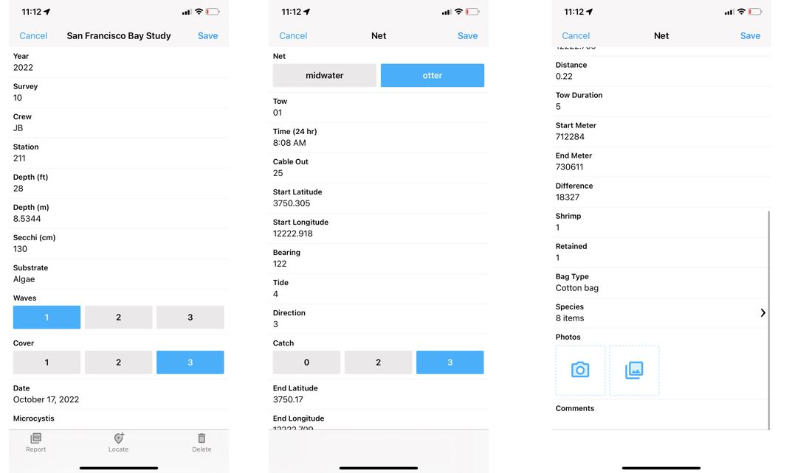
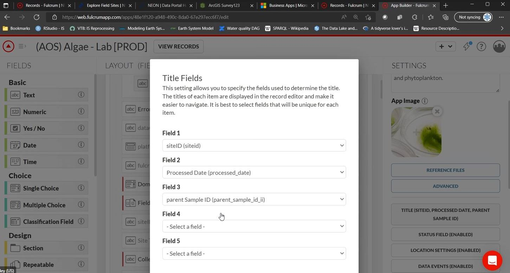

# Fulcrum App

## Fulcrum App Overview    {#fultop}

The Fulcrum App is a mobile data collection platform that provides tools to collect and analyze data in field surveys. There are two key components to the Fulcrum platform: the mobile app is for data collectors in the field and a web-based dashboard that provides an at-a-glance view of all field data collections in real time and summaries to date which can be accessible to anyone working on the project. 

Users can design forms using the intuitive, web-based drag-and-drop designer and deploy to their mobile workforce for gathering information like Text, Photos, SpatialVideo, SpatialAudio, Signatures, Barcodes, GPS Location, and more.

Fulcrum is currently being used by at least two major ecosystem monitoring field surveys: NOAA Ship Strikes Survey and National Ecological Observatory Network (hundreds of Fulcrum applications are currently deployed). Fulcrum can be use with both iOS and Android mobile devices. 
 

## Fulcrum App: Key Features 

### Professional Look

The Fulcrum App provides a clean and professional look in both the mobile and the web interface which is a stand-out feature as compared to Survey123 and Power Apps.  

(\#fig:fulook)Screen capture of the web-based Fulcrum app devopement tool demonstrating the the general look of the app for a mobile device (three different screens are shown)

### Intuitive Form Developing Interface

The app development tools in Fulcrum are straight forward to use and has a fairly easy learning curve. Significant resources are available to beginning form developers and Fulcrum support staff are willing to assist new users to set up a functioning app using the trial license. However, for more detailed apps with complex nested design, there is potential of "hitting the cliff" in form development, at which point one must be able to program in the Fulcrum-JSON code to configure the form. The interface with the json code behind the app features is fairly straight forward and the Fulcrum documentation providing code syntax for field control is extensive. https://docs.fulcrumapp.com/docs/data-events-setminlength

(\#fig:fumenu)Screen capture of the web-based Fulcrum app devopement tool demonstrating the the clear menu used to speicify unique titles.

(\#fig:fujson)Screen capture of the json form schema for a Fulcrum app form demonstrating the direct access to json editing in form development.

### Cloud Storage and Data Interface and Exporting

The Fulcrum App is build on the Google Cloud Platform and Google Drive.  Google Drive is a storage platform that includes a generous free storage quota, secure sharing mechanisms, mobile apps for both Android & iOS, and desktop apps for integrated backup and sync.  

Because Fulcrum data is stored on the Google Cloud Platform, it is replicated in real time to multiple data centers in separate geographic regions, which increases redundancy and loss prevention. The Fulcrum back-end is powered by PostgreSQL and PostGIS, the open source industry-standard database platform for working with spatial data. 

A Fulcrum REST API is available to programmatically link the Fulcrum database with a project database. The Fulcrum-Google Cloud interface also provides for a wide range of API links possible [Fulcrum API hooks](#fuhook).  Note that this listing does not include direct links to a non-cloud-service-based database, in contrast to the MS Power Apps options which provide an established link to connect to an 'on-premises' MS database.  The Fulcrum 'web hooks' are written in the internal JSON format and creating a customized link requires some coding: https://www.fulcrumapp.com/blog/syncing-fulcrum-with-your-own-database/. Significant Fulcrum documentation is available to support customizing links to project databases : https://docs.fulcrumapp.com/reference/records-update

(\#fig:fuhook)Depiction of the range of Fulcrum App-Google Cloud API hooks possible.

### Mapping Layers

Fulcrum has been rated as one of the best apps for geolocation with custom maps. Fulcrum is built on the Google Maps Platform, which leverages Google Maps and can provide a variety of map layers for field reference, including streets, terrain, and aerial imagery, as well as points of interest wn both the web and mobile interfaces. Fulcrum also supports custom map layers, which can be combined with the standard base-maps or used completely independently. Fulcrum has recently partnered with ESRI to provide more advanced GIS features and mapping. https://help.fulcrumapp.com/en/articles/4352017-what-are-layers  https://www.fulcrumapp.com/blog/chart-new-territory-using-advanced-geospatial-capabilities-with-esri-integration/

(\#fig:fulmap2)Screen capture of the Fulcrum mobile app demonstrating the mapping layers options.

(\#fig:fulmap3)Screen capture of the Fulcrum web management interface demonstrating the ability to review data while continuing to use the mapping layers.

## Fulcrum App: Criteria Tables

### Fulcrum App: Forms Options 

<table class=" lightable-paper table" style='font-family: "Arial Narrow", arial, helvetica, sans-serif; margin-left: auto; margin-right: auto; font-size: 18px; width: auto !important; margin-left: auto; margin-right: auto;'>
<caption style="font-size: initial !important;">(\#tab:fulcform)Forms Options</caption>
 <thead>
  <tr>
   <th style="text-align:left;position: sticky; top:0; background-color: #FFFFFF;position: sticky; top:0; background-color: #FFFFFF;"> Category </th>
   <th style="text-align:left;position: sticky; top:0; background-color: #FFFFFF;position: sticky; top:0; background-color: #FFFFFF;"> Feature </th>
   <th style="text-align:left;position: sticky; top:0; background-color: #FFFFFF;position: sticky; top:0; background-color: #FFFFFF;"> Available </th>
   <th style="text-align:left;position: sticky; top:0; background-color: #FFFFFF;position: sticky; top:0; background-color: #FFFFFF;"> Description </th>
   <th style="text-align:left;position: sticky; top:0; background-color: #FFFFFF;position: sticky; top:0; background-color: #FFFFFF;"> Group Notes </th>
   <th style="text-align:left;position: sticky; top:0; background-color: #FFFFFF;position: sticky; top:0; background-color: #FFFFFF;"> External  Reviews </th>
  </tr>
 </thead>
<tbody>
  <tr>
   <td style="text-align:left;min-width: 2.5cm; font-weight: bold;max-width: 3cm; font-weight: bold;"> Data entry validation/QC </td>
   <td style="text-align:left;min-width: 2.5cm; max-width: 3cm; "> Geo-referencing </td>
   <td style="text-align:left;min-width: 1.5cm; max-width: 2cm; "> Yes </td>
   <td style="text-align:left;min-width: 2cm; max-width: 5cm; "> Fulcrum is able to collect the GPS coordinates from the GPS of the e-device with a button within the form; Fulcrum does not provide mapping of all elements like Survey 123.  Fulcrum has recently developed integration with ESRI to provide advanced mapping features: https://help.fulcrumapp.com/en/articles/4813276-how-does-our-esri-integration-work; Location collection can be automatically collected with each record. </td>
   <td style="text-align:left;min-width: 2cm; max-width: 5cm; ">  </td>
   <td style="text-align:left;min-width: 2cm; max-width: 5cm; ">  </td>
  </tr>
  <tr>
   <td style="text-align:left;min-width: 2.5cm; font-weight: bold;max-width: 3cm; font-weight: bold;">  </td>
   <td style="text-align:left;min-width: 2.5cm; max-width: 3cm; "> Constrained choices from a list </td>
   <td style="text-align:left;min-width: 1.5cm; max-width: 2cm; "> Yes </td>
   <td style="text-align:left;min-width: 2cm; max-width: 5cm; "> Choice lists are natively supported or can be populated with record links </td>
   <td style="text-align:left;min-width: 2cm; max-width: 5cm; ">  </td>
   <td style="text-align:left;min-width: 2cm; max-width: 5cm; ">  </td>
  </tr>
  <tr>
   <td style="text-align:left;min-width: 2.5cm; font-weight: bold;max-width: 3cm; font-weight: bold;">  </td>
   <td style="text-align:left;min-width: 2.5cm; max-width: 3cm; "> Rules guiding answer series (e.g., “Conditional Questions” and “Skips”) </td>
   <td style="text-align:left;min-width: 1.5cm; max-width: 2cm; "> Yes </td>
   <td style="text-align:left;min-width: 2cm; max-width: 5cm; "> It is possible to configure conditional visibility of notes, sections and entry fields based on responses provided. </td>
   <td style="text-align:left;min-width: 2cm; max-width: 5cm; ">  </td>
   <td style="text-align:left;min-width: 2cm; max-width: 5cm; ">  </td>
  </tr>
  <tr>
   <td style="text-align:left;min-width: 2.5cm; font-weight: bold;max-width: 3cm; font-weight: bold;">  </td>
   <td style="text-align:left;min-width: 2.5cm; max-width: 3cm; "> Constrained choices from an external table </td>
   <td style="text-align:left;min-width: 1.5cm; max-width: 2cm; "> Yes </td>
   <td style="text-align:left;min-width: 2cm; max-width: 5cm; "> Choice lists are natively supported or can be populated with record links </td>
   <td style="text-align:left;min-width: 2cm; max-width: 5cm; ">  </td>
   <td style="text-align:left;min-width: 2cm; max-width: 5cm; ">  </td>
  </tr>
  <tr>
   <td style="text-align:left;min-width: 2.5cm; font-weight: bold;max-width: 3cm; font-weight: bold;">  </td>
   <td style="text-align:left;min-width: 2.5cm; max-width: 3cm; "> Form Version Control </td>
   <td style="text-align:left;min-width: 1.5cm; max-width: 2cm; "> Yes </td>
   <td style="text-align:left;min-width: 2cm; max-width: 5cm; "> Asked Pat for a link to a screen shot </td>
   <td style="text-align:left;min-width: 2cm; max-width: 5cm; ">  </td>
   <td style="text-align:left;min-width: 2cm; max-width: 5cm; ">  </td>
  </tr>
  <tr>
   <td style="text-align:left;min-width: 2.5cm; font-weight: bold;max-width: 3cm; font-weight: bold;">  </td>
   <td style="text-align:left;min-width: 2.5cm; max-width: 3cm; "> Real-time Data Review </td>
   <td style="text-align:left;min-width: 1.5cm; max-width: 2cm; "> Not simple </td>
   <td style="text-align:left;min-width: 2cm; max-width: 5cm; "> The web tool provides tools for data review and summaries.  Configuring the mobile app for real-time review may require customization. </td>
   <td style="text-align:left;min-width: 2cm; max-width: 5cm; "> In a Fulcrum trial, it was not easy to configure a listing of the lengths for review.  There did not appear to be a simple function for listing and reviewing the data in the collection form. </td>
   <td style="text-align:left;min-width: 2cm; max-width: 5cm; ">  </td>
  </tr>
  <tr>
   <td style="text-align:left;min-width: 2.5cm; font-weight: bold;max-width: 3cm; font-weight: bold;">  </td>
   <td style="text-align:left;min-width: 2.5cm; max-width: 3cm; "> Real-time Edit (“on the fly”) </td>
   <td style="text-align:left;min-width: 1.5cm; max-width: 2cm; "> Yes, but </td>
   <td style="text-align:left;min-width: 2cm; max-width: 5cm; "> Fields were editable until saved; </td>
   <td style="text-align:left;min-width: 2cm; max-width: 5cm; "> In a Fulcrum Trial for Bay Study, found it easily to make record changes before and after records were saved in the mobile app. </td>
   <td style="text-align:left;min-width: 2cm; max-width: 5cm; ">  </td>
  </tr>
  <tr>
   <td style="text-align:left;min-width: 2.5cm; font-weight: bold;max-width: 3cm; font-weight: bold;"> Ease of Form Development </td>
   <td style="text-align:left;min-width: 2.5cm; max-width: 3cm; "> Intuitive form design tool </td>
   <td style="text-align:left;min-width: 1.5cm; max-width: 2cm; "> Yes </td>
   <td style="text-align:left;min-width: 2cm; max-width: 5cm; "> Web tool for form design is intuitive and provides flexibilty for field position and type.  Form itself is easy to navigate between tabs and across/down fields. </td>
   <td style="text-align:left;min-width: 2cm; max-width: 5cm; ">  </td>
   <td style="text-align:left;min-width: 2cm; max-width: 5cm; ">  </td>
  </tr>
  <tr>
   <td style="text-align:left;min-width: 2.5cm; font-weight: bold;max-width: 3cm; font-weight: bold;">  </td>
   <td style="text-align:left;min-width: 2.5cm; max-width: 3cm; "> Coding language required? </td>
   <td style="text-align:left;min-width: 1.5cm; max-width: 2cm; "> No / Yes </td>
   <td style="text-align:left;min-width: 2cm; max-width: 5cm; "> Fulcrum is designed to be a NO-CODE app building interface. </td>
   <td style="text-align:left;min-width: 2cm; max-width: 5cm; "> In a Fulcrum Trial for Bay Study survey, the web drag-n-drop interface provided 80% of the form requirements needed, but technical support was requested to configure the real-time listings that are needed.  Form optimization would have likely required json coding. </td>
   <td style="text-align:left;min-width: 2cm; max-width: 5cm; ">  </td>
  </tr>
  <tr>
   <td style="text-align:left;min-width: 2.5cm; font-weight: bold;max-width: 3cm; font-weight: bold;">  </td>
   <td style="text-align:left;min-width: 2.5cm; max-width: 3cm; "> Different styles of question types </td>
   <td style="text-align:left;min-width: 1.5cm; max-width: 2cm; "> Yes </td>
   <td style="text-align:left;min-width: 2cm; max-width: 5cm; "> Multiple field types: basic, multiple choice, required fields; defaut values; requirement rules; visibility (conditional) rules, https://help.fulcrumapp.com/en/articles/75014-what-field-types-does-fulcrum-support </td>
   <td style="text-align:left;min-width: 2cm; max-width: 5cm; ">  </td>
   <td style="text-align:left;min-width: 2cm; max-width: 5cm; ">  </td>
  </tr>
  <tr>
   <td style="text-align:left;min-width: 2.5cm; font-weight: bold;max-width: 3cm; font-weight: bold;">  </td>
   <td style="text-align:left;min-width: 2.5cm; max-width: 3cm; "> Flexibility to configure in a logical order for field entry (e.g., nested desgin) </td>
   <td style="text-align:left;min-width: 1.5cm; max-width: 2cm; "> Yes </td>
   <td style="text-align:left;min-width: 2cm; max-width: 5cm; "> Can easilly group questions into sections; Can add "repeatables" to be used for repeating collections where number is unknown/expandable; </td>
   <td style="text-align:left;min-width: 2cm; max-width: 5cm; ">  </td>
   <td style="text-align:left;min-width: 2cm; max-width: 5cm; ">  </td>
  </tr>
  <tr>
   <td style="text-align:left;min-width: 2.5cm; font-weight: bold;max-width: 3cm; font-weight: bold;"> Other IEP Survey needs </td>
   <td style="text-align:left;min-width: 2.5cm; max-width: 3cm; "> Permissions Management </td>
   <td style="text-align:left;min-width: 1.5cm; max-width: 2cm; ">  </td>
   <td style="text-align:left;min-width: 2cm; max-width: 5cm; ">  </td>
   <td style="text-align:left;min-width: 2cm; max-width: 5cm; ">  </td>
   <td style="text-align:left;min-width: 2cm; max-width: 5cm; ">  </td>
  </tr>
  <tr>
   <td style="text-align:left;min-width: 2.5cm; font-weight: bold;max-width: 3cm; font-weight: bold;">  </td>
   <td style="text-align:left;min-width: 2.5cm; max-width: 3cm; "> Muti-users of an app </td>
   <td style="text-align:left;min-width: 1.5cm; max-width: 2cm; ">  </td>
   <td style="text-align:left;min-width: 2cm; max-width: 5cm; ">  </td>
   <td style="text-align:left;min-width: 2cm; max-width: 5cm; ">  </td>
   <td style="text-align:left;min-width: 2cm; max-width: 5cm; ">  </td>
  </tr>
  <tr>
   <td style="text-align:left;min-width: 2.5cm; font-weight: bold;max-width: 3cm; font-weight: bold;">  </td>
   <td style="text-align:left;min-width: 2.5cm; max-width: 3cm; "> Off-line capacity </td>
   <td style="text-align:left;min-width: 1.5cm; max-width: 2cm; ">  </td>
   <td style="text-align:left;min-width: 2cm; max-width: 5cm; ">  </td>
   <td style="text-align:left;min-width: 2cm; max-width: 5cm; ">  </td>
   <td style="text-align:left;min-width: 2cm; max-width: 5cm; ">  </td>
  </tr>
  <tr>
   <td style="text-align:left;min-width: 2.5cm; font-weight: bold;max-width: 3cm; font-weight: bold;"> User Accessability </td>
   <td style="text-align:left;min-width: 2.5cm; max-width: 3cm; "> Multiple-language options </td>
   <td style="text-align:left;min-width: 1.5cm; max-width: 2cm; ">  </td>
   <td style="text-align:left;min-width: 2cm; max-width: 5cm; ">  </td>
   <td style="text-align:left;min-width: 2cm; max-width: 5cm; ">  </td>
   <td style="text-align:left;min-width: 2cm; max-width: 5cm; ">  </td>
  </tr>
  <tr>
   <td style="text-align:left;min-width: 2.5cm; font-weight: bold;max-width: 3cm; font-weight: bold;">  </td>
   <td style="text-align:left;min-width: 2.5cm; max-width: 3cm; "> Font adjustment/Speak-to-text </td>
   <td style="text-align:left;min-width: 1.5cm; max-width: 2cm; ">  </td>
   <td style="text-align:left;min-width: 2cm; max-width: 5cm; ">  </td>
   <td style="text-align:left;min-width: 2cm; max-width: 5cm; ">  </td>
   <td style="text-align:left;min-width: 2cm; max-width: 5cm; ">  </td>
  </tr>
</tbody>
</table>

### Fulcrum App: Data Interface {#fuldat}

The data connectivity options in Fulcrum App are significant, as noted above and outlined in the Data Interface table. An important note is the ability of the Fulcrum App Mobile components that supports exporting the 'Collections' on a mobile device to a standard .json file.  This is a stand-out feature compared to Survey123 and Fulcrum, and can be critical when building in a back-up protocol for cases when internet data transfer is not available.  The Bay Study Power App project included this option to export to .json because there are some survey stations in which internet access is low or not available [See Bay Study Fulcrum App demo](#powdem).

<table class=" lightable-paper table" style='font-family: "Arial Narrow", arial, helvetica, sans-serif; margin-left: auto; margin-right: auto; font-size: 18px; width: auto !important; margin-left: auto; margin-right: auto;'>
<caption style="font-size: initial !important;">(\#tab:fulcdat)Data Interface Options</caption>
 <thead>
  <tr>
   <th style="text-align:left;position: sticky; top:0; background-color: #FFFFFF;position: sticky; top:0; background-color: #FFFFFF;"> Category </th>
   <th style="text-align:left;position: sticky; top:0; background-color: #FFFFFF;position: sticky; top:0; background-color: #FFFFFF;"> Feature </th>
   <th style="text-align:left;position: sticky; top:0; background-color: #FFFFFF;position: sticky; top:0; background-color: #FFFFFF;"> Available </th>
   <th style="text-align:left;position: sticky; top:0; background-color: #FFFFFF;position: sticky; top:0; background-color: #FFFFFF;"> Description </th>
   <th style="text-align:left;position: sticky; top:0; background-color: #FFFFFF;position: sticky; top:0; background-color: #FFFFFF;"> Group Notes </th>
   <th style="text-align:left;position: sticky; top:0; background-color: #FFFFFF;position: sticky; top:0; background-color: #FFFFFF;"> External  Reviews </th>
  </tr>
 </thead>
<tbody>
  <tr>
   <td style="text-align:left;min-width: 2.5cm; font-weight: bold;max-width: 3cm; font-weight: bold;"> Database interface </td>
   <td style="text-align:left;min-width: 2.5cm; max-width: 3cm; "> Cloud-storage </td>
   <td style="text-align:left;min-width: 1.5cm; max-width: 2cm; ">  </td>
   <td style="text-align:left;min-width: 2cm; max-width: 5cm; ">  </td>
   <td style="text-align:left;min-width: 2cm; max-width: 5cm; ">  </td>
   <td style="text-align:left;min-width: 2cm; max-width: 5cm; ">  </td>
  </tr>
  <tr>
   <td style="text-align:left;min-width: 2.5cm; font-weight: bold;max-width: 3cm; font-weight: bold;">  </td>
   <td style="text-align:left;min-width: 2.5cm; max-width: 3cm; "> Direct integration with database </td>
   <td style="text-align:left;min-width: 1.5cm; max-width: 2cm; ">  </td>
   <td style="text-align:left;min-width: 2cm; max-width: 5cm; ">  </td>
   <td style="text-align:left;min-width: 2cm; max-width: 5cm; ">  </td>
   <td style="text-align:left;min-width: 2cm; max-width: 5cm; ">  </td>
  </tr>
  <tr>
   <td style="text-align:left;min-width: 2.5cm; font-weight: bold;max-width: 3cm; font-weight: bold;">  </td>
   <td style="text-align:left;min-width: 2.5cm; max-width: 3cm; "> Integrate data from local tables </td>
   <td style="text-align:left;min-width: 1.5cm; max-width: 2cm; ">  </td>
   <td style="text-align:left;min-width: 2cm; max-width: 5cm; ">  </td>
   <td style="text-align:left;min-width: 2cm; max-width: 5cm; ">  </td>
   <td style="text-align:left;min-width: 2cm; max-width: 5cm; ">  </td>
  </tr>
  <tr>
   <td style="text-align:left;min-width: 2.5cm; font-weight: bold;max-width: 3cm; font-weight: bold;"> Edit after transfer </td>
   <td style="text-align:left;min-width: 2.5cm; max-width: 3cm; "> Editing data ‘on-the-fly’ (data already submitted) </td>
   <td style="text-align:left;min-width: 1.5cm; max-width: 2cm; ">  </td>
   <td style="text-align:left;min-width: 2cm; max-width: 5cm; ">  </td>
   <td style="text-align:left;min-width: 2cm; max-width: 5cm; ">  </td>
   <td style="text-align:left;min-width: 2cm; max-width: 5cm; ">  </td>
  </tr>
  <tr>
   <td style="text-align:left;min-width: 2.5cm; font-weight: bold;max-width: 3cm; font-weight: bold;"> Data format </td>
   <td style="text-align:left;min-width: 2.5cm; max-width: 3cm; "> Open (standard) format output </td>
   <td style="text-align:left;min-width: 1.5cm; max-width: 2cm; ">  </td>
   <td style="text-align:left;min-width: 2cm; max-width: 5cm; "> PDF report generation is really developed in Fulcrum; can develop workflow to send report automatically: email and/or text </td>
   <td style="text-align:left;min-width: 2cm; max-width: 5cm; ">  </td>
   <td style="text-align:left;min-width: 2cm; max-width: 5cm; ">  </td>
  </tr>
  <tr>
   <td style="text-align:left;min-width: 2.5cm; font-weight: bold;max-width: 3cm; font-weight: bold;">  </td>
   <td style="text-align:left;min-width: 2.5cm; max-width: 3cm; "> Data format logical / useable </td>
   <td style="text-align:left;min-width: 1.5cm; max-width: 2cm; ">  </td>
   <td style="text-align:left;min-width: 2cm; max-width: 5cm; ">  </td>
   <td style="text-align:left;min-width: 2cm; max-width: 5cm; ">  </td>
   <td style="text-align:left;min-width: 2cm; max-width: 5cm; ">  </td>
  </tr>
  <tr>
   <td style="text-align:left;min-width: 2.5cm; font-weight: bold;max-width: 3cm; font-weight: bold;"> Data transfer </td>
   <td style="text-align:left;min-width: 2.5cm; max-width: 3cm; "> Real-time data transfer </td>
   <td style="text-align:left;min-width: 1.5cm; max-width: 2cm; ">  </td>
   <td style="text-align:left;min-width: 2cm; max-width: 5cm; ">  </td>
   <td style="text-align:left;min-width: 2cm; max-width: 5cm; ">  </td>
   <td style="text-align:left;min-width: 2cm; max-width: 5cm; ">  </td>
  </tr>
  <tr>
   <td style="text-align:left;min-width: 2.5cm; font-weight: bold;max-width: 3cm; font-weight: bold;">  </td>
   <td style="text-align:left;min-width: 2.5cm; max-width: 3cm; "> Cloud connectivity &amp; back up </td>
   <td style="text-align:left;min-width: 1.5cm; max-width: 2cm; ">  </td>
   <td style="text-align:left;min-width: 2cm; max-width: 5cm; ">  </td>
   <td style="text-align:left;min-width: 2cm; max-width: 5cm; ">  </td>
   <td style="text-align:left;min-width: 2cm; max-width: 5cm; ">  </td>
  </tr>
  <tr>
   <td style="text-align:left;min-width: 2.5cm; font-weight: bold;max-width: 3cm; font-weight: bold;"> Data change logs </td>
   <td style="text-align:left;min-width: 2.5cm; max-width: 3cm; "> Audit trails (data version control) </td>
   <td style="text-align:left;min-width: 1.5cm; max-width: 2cm; "> Yes </td>
   <td style="text-align:left;min-width: 2cm; max-width: 5cm; "> https://help.fulcrumapp.com/en/articles/76663-how-does-version-history-work </td>
   <td style="text-align:left;min-width: 2cm; max-width: 5cm; ">  </td>
   <td style="text-align:left;min-width: 2cm; max-width: 5cm; ">  </td>
  </tr>
</tbody>
</table>

###  Fulcrum App: Photo Integration and External Sensors {#fulpho}

<table class=" lightable-paper table" style='font-family: "Arial Narrow", arial, helvetica, sans-serif; margin-left: auto; margin-right: auto; font-size: 18px; width: auto !important; margin-left: auto; margin-right: auto;'>
<caption style="font-size: initial !important;">(\#tab:fulcphot)Photo Integration and External Sensors</caption>
 <thead>
  <tr>
   <th style="text-align:left;position: sticky; top:0; background-color: #FFFFFF;position: sticky; top:0; background-color: #FFFFFF;"> Category </th>
   <th style="text-align:left;position: sticky; top:0; background-color: #FFFFFF;position: sticky; top:0; background-color: #FFFFFF;"> Feature </th>
   <th style="text-align:left;position: sticky; top:0; background-color: #FFFFFF;position: sticky; top:0; background-color: #FFFFFF;"> Available </th>
   <th style="text-align:left;position: sticky; top:0; background-color: #FFFFFF;position: sticky; top:0; background-color: #FFFFFF;"> Description </th>
   <th style="text-align:left;position: sticky; top:0; background-color: #FFFFFF;position: sticky; top:0; background-color: #FFFFFF;"> Group Notes </th>
   <th style="text-align:left;position: sticky; top:0; background-color: #FFFFFF;position: sticky; top:0; background-color: #FFFFFF;"> External  Reviews </th>
  </tr>
 </thead>
<tbody>
  <tr>
   <td style="text-align:left;min-width: 2.5cm; font-weight: bold;max-width: 3.5cm; font-weight: bold;"> Photo Integration </td>
   <td style="text-align:left;min-width: 2.5cm; max-width: 4cm; "> Collect photo &amp; assoc. with element </td>
   <td style="text-align:left;min-width: 2cm; max-width: 2.5cm; "> Yes </td>
   <td style="text-align:left;min-width: 4cm; max-width: 5.5cm; ">  </td>
   <td style="text-align:left;min-width: 4cm; max-width: 5.5cm; ">  </td>
   <td style="text-align:left;">  </td>
  </tr>
  <tr>
   <td style="text-align:left;min-width: 2.5cm; font-weight: bold;max-width: 3.5cm; font-weight: bold;">  </td>
   <td style="text-align:left;min-width: 2.5cm; max-width: 4cm; "> Ease of interface </td>
   <td style="text-align:left;min-width: 2cm; max-width: 2.5cm; "> Yes </td>
   <td style="text-align:left;min-width: 4cm; max-width: 5.5cm; ">  </td>
   <td style="text-align:left;min-width: 4cm; max-width: 5.5cm; ">  </td>
   <td style="text-align:left;">  </td>
  </tr>
  <tr>
   <td style="text-align:left;min-width: 2.5cm; font-weight: bold;max-width: 3.5cm; font-weight: bold;">  </td>
   <td style="text-align:left;min-width: 2.5cm; max-width: 4cm; "> Multi-photo per element (and # limit) </td>
   <td style="text-align:left;min-width: 2cm; max-width: 2.5cm; "> Yes </td>
   <td style="text-align:left;min-width: 4cm; max-width: 5.5cm; ">  </td>
   <td style="text-align:left;min-width: 4cm; max-width: 5.5cm; ">  </td>
   <td style="text-align:left;">  </td>
  </tr>
  <tr>
   <td style="text-align:left;min-width: 2.5cm; font-weight: bold;max-width: 3.5cm; font-weight: bold;">  </td>
   <td style="text-align:left;min-width: 2.5cm; max-width: 4cm; "> Drawing/Annotating on photo </td>
   <td style="text-align:left;min-width: 2cm; max-width: 2.5cm; "> Annotating Yes; Drawing No </td>
   <td style="text-align:left;min-width: 4cm; max-width: 5.5cm; ">  </td>
   <td style="text-align:left;min-width: 4cm; max-width: 5.5cm; "> https://help.fulcrumapp.com/en/articles/3130731-what-are-photo-fields </td>
   <td style="text-align:left;">  </td>
  </tr>
  <tr>
   <td style="text-align:left;min-width: 2.5cm; font-weight: bold;max-width: 3.5cm; font-weight: bold;"> X-tern sensors </td>
   <td style="text-align:left;min-width: 2.5cm; max-width: 4cm; "> GPS from device </td>
   <td style="text-align:left;min-width: 2cm; max-width: 2.5cm; "> Yes </td>
   <td style="text-align:left;min-width: 4cm; max-width: 5.5cm; ">  </td>
   <td style="text-align:left;min-width: 4cm; max-width: 5.5cm; ">  </td>
   <td style="text-align:left;">  </td>
  </tr>
  <tr>
   <td style="text-align:left;min-width: 2.5cm; font-weight: bold;max-width: 3.5cm; font-weight: bold;">  </td>
   <td style="text-align:left;min-width: 2.5cm; max-width: 4cm; "> Integratedata from bar codes </td>
   <td style="text-align:left;min-width: 2cm; max-width: 2.5cm; "> Yes </td>
   <td style="text-align:left;min-width: 4cm; max-width: 5.5cm; ">  </td>
   <td style="text-align:left;min-width: 4cm; max-width: 5.5cm; ">  </td>
   <td style="text-align:left;">  </td>
  </tr>
  <tr>
   <td style="text-align:left;min-width: 2.5cm; font-weight: bold;max-width: 3.5cm; font-weight: bold;">  </td>
   <td style="text-align:left;min-width: 2.5cm; max-width: 4cm; "> Integrate data from external sensors </td>
   <td style="text-align:left;min-width: 2cm; max-width: 2.5cm; "> Yes, potentially, using API </td>
   <td style="text-align:left;min-width: 4cm; max-width: 5.5cm; ">  </td>
   <td style="text-align:left;min-width: 4cm; max-width: 5.5cm; "> External sensors could be read in using configured API connection (https://docs.fulcrumapp.com/docs/developer-information).  These 'webhooks' are used to connect Fulcrum with Campbell dl potentially.   OR upload spreadsheet into the app and push that out.  Can populate fields in form from an uploaded spreadsheet. </td>
   <td style="text-align:left;">  </td>
  </tr>
  <tr>
   <td style="text-align:left;min-width: 2.5cm; font-weight: bold;max-width: 3.5cm; font-weight: bold;">  </td>
   <td style="text-align:left;min-width: 2.5cm; max-width: 4cm; ">  </td>
   <td style="text-align:left;min-width: 2cm; max-width: 2.5cm; ">  </td>
   <td style="text-align:left;min-width: 4cm; max-width: 5.5cm; ">  </td>
   <td style="text-align:left;min-width: 4cm; max-width: 5.5cm; ">  </td>
   <td style="text-align:left;">  </td>
  </tr>
  <tr>
   <td style="text-align:left;min-width: 2.5cm; font-weight: bold;max-width: 3.5cm; font-weight: bold;">  </td>
   <td style="text-align:left;min-width: 2.5cm; max-width: 4cm; ">  </td>
   <td style="text-align:left;min-width: 2cm; max-width: 2.5cm; ">  </td>
   <td style="text-align:left;min-width: 4cm; max-width: 5.5cm; ">  </td>
   <td style="text-align:left;min-width: 4cm; max-width: 5.5cm; ">  </td>
   <td style="text-align:left;">  </td>
  </tr>
  <tr>
   <td style="text-align:left;min-width: 2.5cm; font-weight: bold;max-width: 3.5cm; font-weight: bold;">  </td>
   <td style="text-align:left;min-width: 2.5cm; max-width: 4cm; ">  </td>
   <td style="text-align:left;min-width: 2cm; max-width: 2.5cm; ">  </td>
   <td style="text-align:left;min-width: 4cm; max-width: 5.5cm; ">  </td>
   <td style="text-align:left;min-width: 4cm; max-width: 5.5cm; ">  </td>
   <td style="text-align:left;">  </td>
  </tr>
</tbody>
</table>

###  Fulcrum App:  Hardware Platforms  {#fulhrd}

[Top of section](#fultop)

<table class=" lightable-paper table" style='font-family: "Arial Narrow", arial, helvetica, sans-serif; margin-left: auto; margin-right: auto; font-size: 18px; width: auto !important; margin-left: auto; margin-right: auto;'>
<caption style="font-size: initial !important;">(\#tab:fulchard)Hardware Platform Options</caption>
 <thead>
  <tr>
   <th style="text-align:left;position: sticky; top:0; background-color: #FFFFFF;position: sticky; top:0; background-color: #FFFFFF;"> Feature </th>
   <th style="text-align:left;position: sticky; top:0; background-color: #FFFFFF;position: sticky; top:0; background-color: #FFFFFF;"> Available </th>
   <th style="text-align:left;position: sticky; top:0; background-color: #FFFFFF;position: sticky; top:0; background-color: #FFFFFF;"> Group Notes </th>
   <th style="text-align:left;position: sticky; top:0; background-color: #FFFFFF;position: sticky; top:0; background-color: #FFFFFF;"> External  Reviews </th>
  </tr>
 </thead>
<tbody>
  <tr>
   <td style="text-align:left;min-width: 7cm; font-weight: bold;max-width: 8cm; font-weight: bold;"> Smart Phones and Tablets </td>
   <td style="text-align:left;min-width: 3cm; max-width: 3.5cm; ">  </td>
   <td style="text-align:left;min-width: 4.5cm; max-width: 5cm; ">  </td>
   <td style="text-align:left;min-width: 4.5cm; max-width: 5cm; ">  </td>
  </tr>
  <tr>
   <td style="text-align:left;min-width: 7cm; font-weight: bold;max-width: 8cm; font-weight: bold;"> -      iOS (phone and tablet) </td>
   <td style="text-align:left;min-width: 3cm; max-width: 3.5cm; "> Yes, offline works </td>
   <td style="text-align:left;min-width: 4.5cm; max-width: 5cm; ">  </td>
   <td style="text-align:left;min-width: 4.5cm; max-width: 5cm; ">  </td>
  </tr>
  <tr>
   <td style="text-align:left;min-width: 7cm; font-weight: bold;max-width: 8cm; font-weight: bold;"> -      Android(phone and tablet) </td>
   <td style="text-align:left;min-width: 3cm; max-width: 3.5cm; "> Yes, offline works </td>
   <td style="text-align:left;min-width: 4.5cm; max-width: 5cm; ">  </td>
   <td style="text-align:left;min-width: 4.5cm; max-width: 5cm; ">  </td>
  </tr>
  <tr>
   <td style="text-align:left;min-width: 7cm; font-weight: bold;max-width: 8cm; font-weight: bold;"> Desktop/laptop </td>
   <td style="text-align:left;min-width: 3cm; max-width: 3.5cm; ">  </td>
   <td style="text-align:left;min-width: 4.5cm; max-width: 5cm; ">  </td>
   <td style="text-align:left;min-width: 4.5cm; max-width: 5cm; ">  </td>
  </tr>
  <tr>
   <td style="text-align:left;min-width: 7cm; font-weight: bold;max-width: 8cm; font-weight: bold;"> -      Windows 7,8,10, 11 </td>
   <td style="text-align:left;min-width: 3cm; max-width: 3.5cm; "> Yes, web only </td>
   <td style="text-align:left;min-width: 4.5cm; max-width: 5cm; ">  </td>
   <td style="text-align:left;min-width: 4.5cm; max-width: 5cm; ">  </td>
  </tr>
  <tr>
   <td style="text-align:left;min-width: 7cm; font-weight: bold;max-width: 8cm; font-weight: bold;"> -      MacOS (computer) </td>
   <td style="text-align:left;min-width: 3cm; max-width: 3.5cm; "> Yes, web only </td>
   <td style="text-align:left;min-width: 4.5cm; max-width: 5cm; ">  </td>
   <td style="text-align:left;min-width: 4.5cm; max-width: 5cm; ">  </td>
  </tr>
  <tr>
   <td style="text-align:left;min-width: 7cm; font-weight: bold;max-width: 8cm; font-weight: bold;"> -      Ubuntu Linux </td>
   <td style="text-align:left;min-width: 3cm; max-width: 3.5cm; "> Yes, web only </td>
   <td style="text-align:left;min-width: 4.5cm; max-width: 5cm; ">  </td>
   <td style="text-align:left;min-width: 4.5cm; max-width: 5cm; ">  </td>
  </tr>
</tbody>
</table>

### Fulcrum App: Security Factors {#fulsec}

<table class=" lightable-paper table" style='font-family: "Arial Narrow", arial, helvetica, sans-serif; margin-left: auto; margin-right: auto; font-size: 18px; width: auto !important; margin-left: auto; margin-right: auto;'>
<caption style="font-size: initial !important;">(\#tab:fulcsec)Security Factors</caption>
 <thead>
  <tr>
   <th style="text-align:left;position: sticky; top:0; background-color: #FFFFFF;position: sticky; top:0; background-color: #FFFFFF;"> Feature </th>
   <th style="text-align:left;position: sticky; top:0; background-color: #FFFFFF;position: sticky; top:0; background-color: #FFFFFF;"> Available </th>
   <th style="text-align:left;position: sticky; top:0; background-color: #FFFFFF;position: sticky; top:0; background-color: #FFFFFF;"> Description </th>
   <th style="text-align:left;position: sticky; top:0; background-color: #FFFFFF;position: sticky; top:0; background-color: #FFFFFF;"> Group Notes </th>
   <th style="text-align:left;position: sticky; top:0; background-color: #FFFFFF;position: sticky; top:0; background-color: #FFFFFF;"> External  Reviews </th>
  </tr>
 </thead>
<tbody>
  <tr>
   <td style="text-align:left;min-width: 3cm; font-weight: bold;max-width: 4cm; font-weight: bold;"> Where’s the application/product origins from? </td>
   <td style="text-align:left;min-width: 2cm; max-width: 3cm; "> Fulcrum headquarters is in San Francisco </td>
   <td style="text-align:left;min-width: 3cm; max-width: 4cm; "> Fulcrum has conducted security audits for projects with aerospace company, toyota, verison, telegraph </td>
   <td style="text-align:left;min-width: 4.5cm; max-width: 5cm; ">  </td>
   <td style="text-align:left;min-width: 4.5cm; max-width: 5cm; ">  </td>
  </tr>
  <tr>
   <td style="text-align:left;min-width: 3cm; font-weight: bold;max-width: 4cm; font-weight: bold;"> Is the application Cloud based, and if so, where? </td>
   <td style="text-align:left;min-width: 2cm; max-width: 3cm; "> Fulcrum is cloud based hosted by AWS </td>
   <td style="text-align:left;min-width: 3cm; max-width: 4cm; ">  </td>
   <td style="text-align:left;min-width: 4.5cm; max-width: 5cm; ">  </td>
   <td style="text-align:left;min-width: 4.5cm; max-width: 5cm; ">  </td>
  </tr>
  <tr>
   <td style="text-align:left;min-width: 3cm; font-weight: bold;max-width: 4cm; font-weight: bold;"> Where is the data being stored for the application? </td>
   <td style="text-align:left;min-width: 2cm; max-width: 3cm; "> AWS servers are around the world </td>
   <td style="text-align:left;min-width: 3cm; max-width: 4cm; ">  </td>
   <td style="text-align:left;min-width: 4.5cm; max-width: 5cm; ">  </td>
   <td style="text-align:left;min-width: 4.5cm; max-width: 5cm; ">  </td>
  </tr>
  <tr>
   <td style="text-align:left;min-width: 3cm; font-weight: bold;max-width: 4cm; font-weight: bold;"> Is the data center FedRAMP certified? </td>
   <td style="text-align:left;min-width: 2cm; max-width: 3cm; "> AWS is authorized by FedRAMP </td>
   <td style="text-align:left;min-width: 3cm; max-width: 4cm; ">  </td>
   <td style="text-align:left;min-width: 4.5cm; max-width: 5cm; ">  </td>
   <td style="text-align:left;min-width: 4.5cm; max-width: 5cm; ">  </td>
  </tr>
  <tr>
   <td style="text-align:left;min-width: 3cm; font-weight: bold;max-width: 4cm; font-weight: bold;"> Online Security measures </td>
   <td style="text-align:left;min-width: 2cm; max-width: 3cm; "> Fulcrum has achieved SOC 2 Type 2 Certification. </td>
   <td style="text-align:left;min-width: 3cm; max-width: 4cm; "> All network communications in Fulcrum are secured with 256-bit SSL (TLS) connections ;  entire cloud infrastructure is continually replicated across multiple datacenter regions; The Fulcrum infrastructure is deployed on Amazon Web Services (AWS), and benefits from the security practices of AWS. </td>
   <td style="text-align:left;min-width: 4.5cm; max-width: 5cm; ">  </td>
   <td style="text-align:left;min-width: 4.5cm; max-width: 5cm; ">  </td>
  </tr>
</tbody>
</table>

### Fulcrum App: Business Model and Customer Support {#fulbus}

[Top of section](#fultop)

  

<table class=" lightable-paper table" style='font-family: "Arial Narrow", arial, helvetica, sans-serif; margin-left: auto; margin-right: auto; font-size: 18px; width: auto !important; margin-left: auto; margin-right: auto;'>
<caption style="font-size: initial !important;">(\#tab:fulpbus)Security Factors</caption>
 <thead>
  <tr>
   <th style="text-align:left;position: sticky; top:0; background-color: #FFFFFF;position: sticky; top:0; background-color: #FFFFFF;"> Feature </th>
   <th style="text-align:left;position: sticky; top:0; background-color: #FFFFFF;position: sticky; top:0; background-color: #FFFFFF;"> Available </th>
   <th style="text-align:left;position: sticky; top:0; background-color: #FFFFFF;position: sticky; top:0; background-color: #FFFFFF;"> Description </th>
   <th style="text-align:left;position: sticky; top:0; background-color: #FFFFFF;position: sticky; top:0; background-color: #FFFFFF;"> Group Notes </th>
   <th style="text-align:left;position: sticky; top:0; background-color: #FFFFFF;position: sticky; top:0; background-color: #FFFFFF;"> External  Reviews </th>
  </tr>
 </thead>
<tbody>
  <tr>
   <td style="text-align:left;min-width: 3cm; font-weight: bold;max-width: 4cm; font-weight: bold;"> Price (Option 1) </td>
   <td style="text-align:left;min-width: 2cm; max-width: 3cm; "> Starter: 
Task and issue management
Team, web, and external contributor Issue reporting, 
Task and inspection checklists, Customizable digital forms &amp; apps </td>
   <td style="text-align:left;min-width: 3cm; max-width: 4cm; "> $15 US / month </td>
   <td style="text-align:left;min-width: 4.5cm; max-width: 5cm; ">  </td>
   <td style="text-align:left;min-width: 4.5cm; max-width: 5cm; ">  </td>
  </tr>
  <tr>
   <td style="text-align:left;min-width: 3cm; font-weight: bold;max-width: 4cm; font-weight: bold;"> Price (Option 2) </td>
   <td style="text-align:left;min-width: 2cm; max-width: 3cm; "> Professional: 
Task and issue management
Team, web, and external contributor Issue reporting
Task and inspection checklists
Customizable digital forms &amp; apps
Advanced digital form functionality with automatic geotagging
Digital Signatures
Consolidated inspection performance dashboards </td>
   <td style="text-align:left;min-width: 3cm; max-width: 4cm; "> $33 US / user / month </td>
   <td style="text-align:left;min-width: 4.5cm; max-width: 5cm; "> Discussions with the Fulcrum sales rep included considering a discount for all IEP associated licenses even when not from same university </td>
   <td style="text-align:left;min-width: 4.5cm; max-width: 5cm; ">  </td>
  </tr>
  <tr>
   <td style="text-align:left;min-width: 3cm; font-weight: bold;max-width: 4cm; font-weight: bold;"> Price (Option 3) </td>
   <td style="text-align:left;min-width: 2cm; max-width: 3cm; "> Enterprise: 
Everything in the Professional package plus: SAML SSO &amp; Audit Logs
Operational API Access
Query API Access
Webhooks </td>
   <td style="text-align:left;min-width: 3cm; max-width: 4cm; "> "Let's Talk" </td>
   <td style="text-align:left;min-width: 4.5cm; max-width: 5cm; ">  </td>
   <td style="text-align:left;min-width: 4.5cm; max-width: 5cm; ">  </td>
  </tr>
  <tr>
   <td style="text-align:left;min-width: 3cm; font-weight: bold;max-width: 4cm; font-weight: bold;"> Business model </td>
   <td style="text-align:left;min-width: 2cm; max-width: 3cm; "> Small tech company </td>
   <td style="text-align:left;min-width: 3cm; max-width: 4cm; ">  </td>
   <td style="text-align:left;min-width: 4.5cm; max-width: 5cm; "> Sales person was pretty superficial and not always that helpful.  The rep for the Bay Area is new to the company; not as good as previous, according to other Fulcrum users. </td>
   <td style="text-align:left;min-width: 4.5cm; max-width: 5cm; ">  </td>
  </tr>
  <tr>
   <td style="text-align:left;min-width: 3cm; font-weight: bold;max-width: 4cm; font-weight: bold;"> Technical Support </td>
   <td style="text-align:left;min-width: 2cm; max-width: 3cm; "> Technical time for customization is expensive </td>
   <td style="text-align:left;min-width: 3cm; max-width: 4cm; ">  </td>
   <td style="text-align:left;min-width: 4.5cm; max-width: 5cm; ">  </td>
   <td style="text-align:left;min-width: 4.5cm; max-width: 5cm; ">  </td>
  </tr>
</tbody>
</table>

