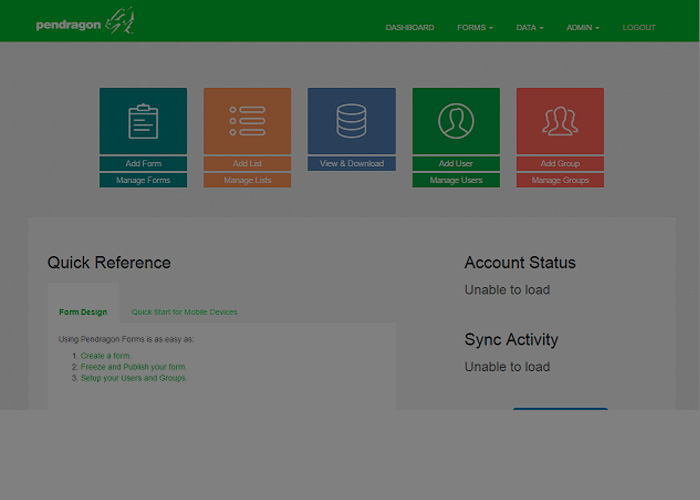
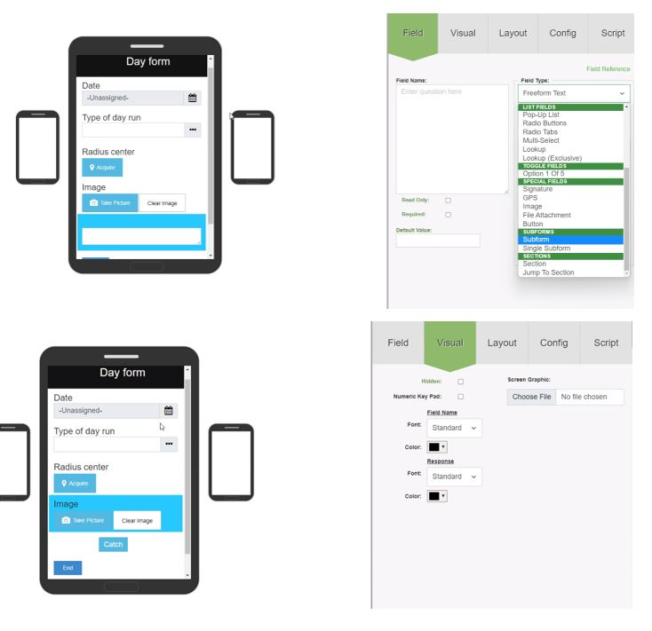
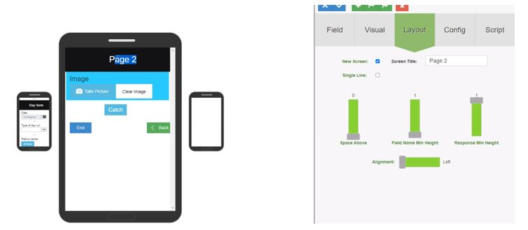
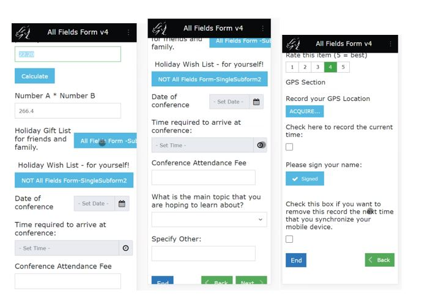
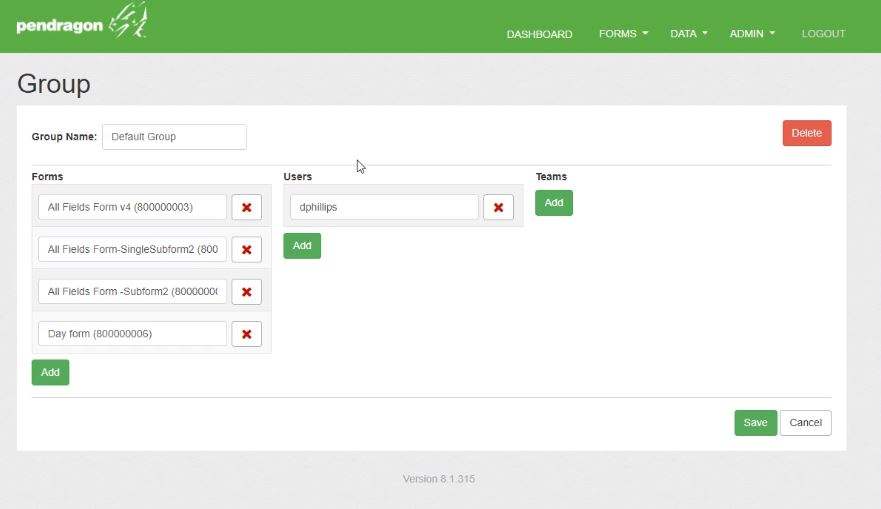
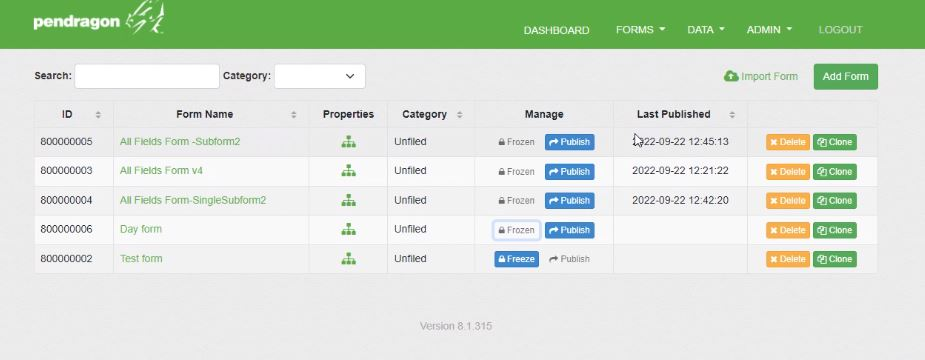
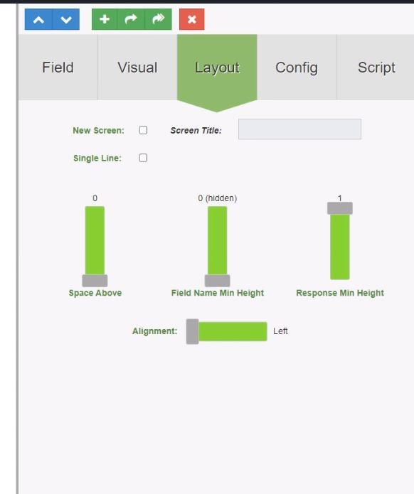
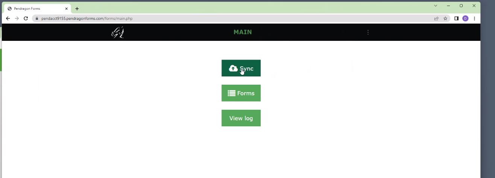

# Pendragon

## Pendragon Overview  {#pentop} 

Dan Phillips, a Pendragon Forms company representative, presented to the e-device group on Sept. 22, 2022. Dan suggests that Pendragon falls into the middle of the array of e-device software options, between the very simple, quick menu driven and completely customized form, and forms developed from scratch using base coding languages. Pendragon is in the middle because it has a basic structure that must be followed, but it also has significant flexibility with custom scripting options. On the more complex end, Pendragon forms can include sub-forms, scripting, and custom Java scripted rules and calculations. Pendragon, unlike some other competitors, creates and saves the form in a relational database. MySQL is the database server used.

## Pendragon: Key Features 

### Pendragon Form Developing Interface

There are two approaches to developing a data entry form:

  1.	Basic Form Designer 
  

Fields can be added one by one through the web-based forms designer GUI.  

(\#fig:pend1)Pendragon web-based forms designer GUI.

  

(\#fig:pend12)Pendragon web-based forms designer GUI.

   

(\#fig:pend13)Pendragon web-based forms designer GUI.

  
  2.	Custom built solutions

The core scripting language of Pendragon is simplified version of Java. Pendragon provides many built-in/proprietary "Calls" (functions) that provide common forms options that are often repeated many times within a form. Pendragon also provides an interface for user-developed Calls; Custom calls are a more advanced form-building options, but these can provides further flexibility and application optimization.  

### Pendragon Forms Options

- The date time stamp is included no mater what, but form of date-time can be customized.
- Full range of field types: Radio buttons (drop-down lists); look-up lists (for large list of records)
- GPS can be captured by Pendragon from the device. Precision of GPS depends on capacity of device.
- Images (more than one) can be captured by the device and associated with a record.
- Access to sub-forms can be added (nested format)
- Forms can extend across multiple pages.

(\#fig:pend2)Pendragon forms can extend across multiple pages.

- Voice to text can be used for text fields.
- Web-designer provides an 'All-fields" view for review of Form fields

- ‘Buttons’ are functions that use custom written scripts.
Dan Phillips (Pendragon) suggests:
For someone who has never done any scripting or coding before, the Forms design routine will be new.
For someone who has done some basic scripting, this tool will be quick to pick up.

- Option available to ‘Go To’ a second input field based on the response of the first input field.
- There are ways to hide certain fields based on the response of an initial input field.

### Pendragon Form Permissions Management

There are three different levels of access to a Pendragon account.  The User-level can only get in from the interface on the device and cannot design or change the data collection form;  The Designer-level can design forms but cannot control users;  The Administrative-level can do both. Completed forms can be assigned to groups and users can be added to have access to these forms.

- Completed forms can be assigned to groups and users can be added to have access to these forms.

(\#fig:pend3)Completed forms can be assigned to groups and users can be added to have access to these forms.

- Completed forms are ‘frozen’ to lock down form configurations; forms are 'published' to make available to specified users.

(\#fig:pend32)Completed forms are ‘frozen’ to lock down form configurations; forms are 'published' to make available to specified users.

### Pendragon Web Tool Options

- Web tool menu displays can help organize all forms created.
- Pendragon forms can be used and tested in any browser which allows you to test everything before it is deployed on a mobile device.
- The ‘mobile view’ of the All Fields form provides a preview of the form as it would appear on the device.
- Pendragon forms can be transposed to different device types (forms have a ‘responsive layout’)

(\#fig:pend4)Pendragon forms can be transposed to different device types.

### Pendragon Mobile Options

- The Form display will only show columns that fit on the page so the design choice is important for for different device types.
- Rules can be assigned to specify which records come off of the device.
- Rules can be assigned to indicate which fields are transferred during a synchronization.
- Two actions during synchronization: Records to server; new Forms to device 
- GPS: even if you don’t have internet, you can still import a GPS reading from your device.
- In offline mode: data is not transferred to the server – all data collected locally.
- Pendragon can collect GPS from device API; GPS through Bluetooth connections are a more complete problem.
- Pendragon can trace monitoring path and calculate distance

(\#fig:pend6)Pendragon forms collect the GPS of monitoring path and calculate basic trace distance.

### Pendragon Data Interface

- Custom API connections available
- NO version control on the cloud service so CANNOT revert to previous states of the database. 
- Default method for data collection is to run the export (export csv file plus image attachments). 
Dan: A secure obdc protocol could be configured so that users can develop their own version control; The user connects to Pendragon cloud storage through an API, pulls and saves data daily, uses their own script to establish version control.
- Pendragon data CANNOT backed up to local laptop right now.
- Can Pendragon be configured to synch to a local system?
Dan:  It would have to be set up like that originally; The built-in Java calls can send individual data to a server or an IP address. It is expecting a web server but a custom API could be configured to synch to a local system.

(\#fig:pend5)The Pendragon data transfer to the cloud SQL platform is initiated manually with a synch button outside of the data entry form.

## Pendragon: Criteria Tables

###  Pendragon: Forms Options

<table class=" lightable-paper table" style='font-family: "Arial Narrow", arial, helvetica, sans-serif; margin-left: auto; margin-right: auto; font-size: 18px; width: auto !important; margin-left: auto; margin-right: auto;'>
<caption style="font-size: initial !important;">(\#tab:Penform)Forms Options</caption>
 <thead>
  <tr>
   <th style="text-align:left;position: sticky; top:0; background-color: #FFFFFF;position: sticky; top:0; background-color: #FFFFFF;"> Category </th>
   <th style="text-align:left;position: sticky; top:0; background-color: #FFFFFF;position: sticky; top:0; background-color: #FFFFFF;"> Feature </th>
   <th style="text-align:left;position: sticky; top:0; background-color: #FFFFFF;position: sticky; top:0; background-color: #FFFFFF;"> Available </th>
   <th style="text-align:left;position: sticky; top:0; background-color: #FFFFFF;position: sticky; top:0; background-color: #FFFFFF;"> Description </th>
   <th style="text-align:left;position: sticky; top:0; background-color: #FFFFFF;position: sticky; top:0; background-color: #FFFFFF;"> Group Notes </th>
   <th style="text-align:left;position: sticky; top:0; background-color: #FFFFFF;position: sticky; top:0; background-color: #FFFFFF;"> External  Reviews </th>
  </tr>
 </thead>
<tbody>
  <tr>
   <td style="text-align:left;min-width: 2.5cm; font-weight: bold;max-width: 3cm; font-weight: bold;"> Data entry validation/QC </td>
   <td style="text-align:left;min-width: 2.5cm; max-width: 3cm; "> Geo-referencing </td>
   <td style="text-align:left;min-width: 1.5cm; max-width: 2cm; "> Yes </td>
   <td style="text-align:left;min-width: 2cm; max-width: 5cm; "> Only android feature can provide tracking.  Some trig functions available.  Theoretically could calculate distance using 'native' Pendragon scripting; but could also use Java scripting to develop a more advance calculation (e.g., survey distance) </td>
   <td style="text-align:left;min-width: 2cm; max-width: 5cm; ">  </td>
   <td style="text-align:left;min-width: 2cm; max-width: 5cm; ">  </td>
  </tr>
  <tr>
   <td style="text-align:left;min-width: 2.5cm; font-weight: bold;max-width: 3cm; font-weight: bold;">  </td>
   <td style="text-align:left;min-width: 2.5cm; max-width: 3cm; "> Constrained choices from a list </td>
   <td style="text-align:left;min-width: 1.5cm; max-width: 2cm; "> Yes </td>
   <td style="text-align:left;min-width: 2cm; max-width: 5cm; "> Drop down option, radio buttons (selection list), look up list can reference another form. </td>
   <td style="text-align:left;min-width: 2cm; max-width: 5cm; ">  </td>
   <td style="text-align:left;min-width: 2cm; max-width: 5cm; ">  </td>
  </tr>
  <tr>
   <td style="text-align:left;min-width: 2.5cm; font-weight: bold;max-width: 3cm; font-weight: bold;">  </td>
   <td style="text-align:left;min-width: 2.5cm; max-width: 3cm; "> Rules guiding answer series (e.g., “Conditional Questions” and “Skips”) </td>
   <td style="text-align:left;min-width: 1.5cm; max-width: 2cm; "> Yes </td>
   <td style="text-align:left;min-width: 2cm; max-width: 5cm; "> Also, can get more sophisticated with scripting.  Logic of survey where subsequent question are based on the responses of earlier questions. </td>
   <td style="text-align:left;min-width: 2cm; max-width: 5cm; ">  </td>
   <td style="text-align:left;min-width: 2cm; max-width: 5cm; ">  </td>
  </tr>
  <tr>
   <td style="text-align:left;min-width: 2.5cm; font-weight: bold;max-width: 3cm; font-weight: bold;">  </td>
   <td style="text-align:left;min-width: 2.5cm; max-width: 3cm; "> Constrained choices from an external table or set of rules </td>
   <td style="text-align:left;min-width: 1.5cm; max-width: 2cm; "> Yes </td>
   <td style="text-align:left;min-width: 2cm; max-width: 5cm; ">  </td>
   <td style="text-align:left;min-width: 2cm; max-width: 5cm; ">  </td>
   <td style="text-align:left;min-width: 2cm; max-width: 5cm; ">  </td>
  </tr>
  <tr>
   <td style="text-align:left;min-width: 2.5cm; font-weight: bold;max-width: 3cm; font-weight: bold;">  </td>
   <td style="text-align:left;min-width: 2.5cm; max-width: 3cm; "> Form Version Control </td>
   <td style="text-align:left;min-width: 1.5cm; max-width: 2cm; "> Yes </td>
   <td style="text-align:left;min-width: 2cm; max-width: 5cm; ">  </td>
   <td style="text-align:left;min-width: 2cm; max-width: 5cm; ">  </td>
   <td style="text-align:left;min-width: 2cm; max-width: 5cm; ">  </td>
  </tr>
  <tr>
   <td style="text-align:left;min-width: 2.5cm; font-weight: bold;max-width: 3cm; font-weight: bold;">  </td>
   <td style="text-align:left;min-width: 2.5cm; max-width: 3cm; "> Real-time Data Review </td>
   <td style="text-align:left;min-width: 1.5cm; max-width: 2cm; "> ? </td>
   <td style="text-align:left;min-width: 2cm; max-width: 5cm; "> No information </td>
   <td style="text-align:left;min-width: 2cm; max-width: 5cm; ">  </td>
   <td style="text-align:left;min-width: 2cm; max-width: 5cm; ">  </td>
  </tr>
  <tr>
   <td style="text-align:left;min-width: 2.5cm; font-weight: bold;max-width: 3cm; font-weight: bold;">  </td>
   <td style="text-align:left;min-width: 2.5cm; max-width: 3cm; "> Real-time Edit (“on the fly”) </td>
   <td style="text-align:left;min-width: 1.5cm; max-width: 2cm; ">  </td>
   <td style="text-align:left;min-width: 2cm; max-width: 5cm; ">  </td>
   <td style="text-align:left;min-width: 2cm; max-width: 5cm; ">  </td>
   <td style="text-align:left;min-width: 2cm; max-width: 5cm; ">  </td>
  </tr>
  <tr>
   <td style="text-align:left;min-width: 2.5cm; font-weight: bold;max-width: 3cm; font-weight: bold;"> Ease of Form Development </td>
   <td style="text-align:left;min-width: 2.5cm; max-width: 3cm; "> Intuitive form design tool </td>
   <td style="text-align:left;min-width: 1.5cm; max-width: 2cm; "> Yes </td>
   <td style="text-align:left;min-width: 2cm; max-width: 5cm; ">  </td>
   <td style="text-align:left;min-width: 2cm; max-width: 5cm; "> Dan Phillips (Pendragon) suggests that Pendragon falls into the middle of the array of e-device software options: between the very simple, quick menu driven and completely customized form developed from scratch using base coding languages. </td>
   <td style="text-align:left;min-width: 2cm; max-width: 5cm; ">  </td>
  </tr>
  <tr>
   <td style="text-align:left;min-width: 2.5cm; font-weight: bold;max-width: 3cm; font-weight: bold;">  </td>
   <td style="text-align:left;min-width: 2.5cm; max-width: 3cm; "> Coding language required? </td>
   <td style="text-align:left;min-width: 1.5cm; max-width: 2cm; "> No </td>
   <td style="text-align:left;min-width: 2cm; max-width: 5cm; "> Unless more complex forms required, and this would require Java scripting </td>
   <td style="text-align:left;min-width: 2cm; max-width: 5cm; ">  </td>
   <td style="text-align:left;min-width: 2cm; max-width: 5cm; ">  </td>
  </tr>
  <tr>
   <td style="text-align:left;min-width: 2.5cm; font-weight: bold;max-width: 3cm; font-weight: bold;">  </td>
   <td style="text-align:left;min-width: 2.5cm; max-width: 3cm; "> Different styles of question types </td>
   <td style="text-align:left;min-width: 1.5cm; max-width: 2cm; "> Yes </td>
   <td style="text-align:left;min-width: 2cm; max-width: 5cm; ">  </td>
   <td style="text-align:left;min-width: 2cm; max-width: 5cm; ">  </td>
   <td style="text-align:left;min-width: 2cm; max-width: 5cm; ">  </td>
  </tr>
  <tr>
   <td style="text-align:left;min-width: 2.5cm; font-weight: bold;max-width: 3cm; font-weight: bold;">  </td>
   <td style="text-align:left;min-width: 2.5cm; max-width: 3cm; "> Flexibility to configure in a logical order for field entry (e.g., nested design) </td>
   <td style="text-align:left;min-width: 1.5cm; max-width: 2cm; "> Yes </td>
   <td style="text-align:left;min-width: 2cm; max-width: 5cm; ">  </td>
   <td style="text-align:left;min-width: 2cm; max-width: 5cm; ">  </td>
   <td style="text-align:left;min-width: 2cm; max-width: 5cm; ">  </td>
  </tr>
  <tr>
   <td style="text-align:left;min-width: 2.5cm; font-weight: bold;max-width: 3cm; font-weight: bold;"> Other IEP Survey needs </td>
   <td style="text-align:left;min-width: 2.5cm; max-width: 3cm; "> Permissions Management </td>
   <td style="text-align:left;min-width: 1.5cm; max-width: 2cm; "> Yes </td>
   <td style="text-align:left;min-width: 2cm; max-width: 5cm; "> Three different types of users.  User can only get in from the interface on the device and cannot design or change the data collection form;  Designer can design forms but cannot control users;  Admin and do all of it.  Completed forms can be assigned to groups and users can be added to have access to these forms. </td>
   <td style="text-align:left;min-width: 2cm; max-width: 5cm; ">  </td>
   <td style="text-align:left;min-width: 2cm; max-width: 5cm; ">  </td>
  </tr>
  <tr>
   <td style="text-align:left;min-width: 2.5cm; font-weight: bold;max-width: 3cm; font-weight: bold;">  </td>
   <td style="text-align:left;min-width: 2.5cm; max-width: 3cm; "> Muti-users of an app </td>
   <td style="text-align:left;min-width: 1.5cm; max-width: 2cm; "> Yes </td>
   <td style="text-align:left;min-width: 2cm; max-width: 5cm; ">  </td>
   <td style="text-align:left;min-width: 2cm; max-width: 5cm; ">  </td>
   <td style="text-align:left;min-width: 2cm; max-width: 5cm; ">  </td>
  </tr>
  <tr>
   <td style="text-align:left;min-width: 2.5cm; font-weight: bold;max-width: 3cm; font-weight: bold;">  </td>
   <td style="text-align:left;min-width: 2.5cm; max-width: 3cm; "> Off-line capacity </td>
   <td style="text-align:left;min-width: 1.5cm; max-width: 2cm; "> Yes </td>
   <td style="text-align:left;min-width: 2cm; max-width: 5cm; "> Actually only works in off line mode.  When the data transfer synch occurs, one is out of the Forms entry mode. </td>
   <td style="text-align:left;min-width: 2cm; max-width: 5cm; ">  </td>
   <td style="text-align:left;min-width: 2cm; max-width: 5cm; ">  </td>
  </tr>
  <tr>
   <td style="text-align:left;min-width: 2.5cm; font-weight: bold;max-width: 3cm; font-weight: bold;"> User Accessability </td>
   <td style="text-align:left;min-width: 2.5cm; max-width: 3cm; "> Multiple-language options </td>
   <td style="text-align:left;min-width: 1.5cm; max-width: 2cm; "> ? </td>
   <td style="text-align:left;min-width: 2cm; max-width: 5cm; "> No information </td>
   <td style="text-align:left;min-width: 2cm; max-width: 5cm; ">  </td>
   <td style="text-align:left;min-width: 2cm; max-width: 5cm; ">  </td>
  </tr>
  <tr>
   <td style="text-align:left;min-width: 2.5cm; font-weight: bold;max-width: 3cm; font-weight: bold;">  </td>
   <td style="text-align:left;min-width: 2.5cm; max-width: 3cm; "> Font adjustment/Speak-to-text </td>
   <td style="text-align:left;min-width: 1.5cm; max-width: 2cm; "> Yes </td>
   <td style="text-align:left;min-width: 2cm; max-width: 5cm; "> Voice to text can be used for text fields </td>
   <td style="text-align:left;min-width: 2cm; max-width: 5cm; ">  </td>
   <td style="text-align:left;min-width: 2cm; max-width: 5cm; ">  </td>
  </tr>
</tbody>
</table>

### Pendragon: Data Interface {#pendat}

<table class=" lightable-paper table" style='font-family: "Arial Narrow", arial, helvetica, sans-serif; margin-left: auto; margin-right: auto; font-size: 18px; width: auto !important; margin-left: auto; margin-right: auto;'>
<caption style="font-size: initial !important;">(\#tab:Pendat)Data Interface Options</caption>
 <thead>
  <tr>
   <th style="text-align:left;position: sticky; top:0; background-color: #FFFFFF;position: sticky; top:0; background-color: #FFFFFF;"> Category </th>
   <th style="text-align:left;position: sticky; top:0; background-color: #FFFFFF;position: sticky; top:0; background-color: #FFFFFF;"> Feature </th>
   <th style="text-align:left;position: sticky; top:0; background-color: #FFFFFF;position: sticky; top:0; background-color: #FFFFFF;"> Available </th>
   <th style="text-align:left;position: sticky; top:0; background-color: #FFFFFF;position: sticky; top:0; background-color: #FFFFFF;"> Description </th>
   <th style="text-align:left;position: sticky; top:0; background-color: #FFFFFF;position: sticky; top:0; background-color: #FFFFFF;"> Group Notes </th>
   <th style="text-align:left;position: sticky; top:0; background-color: #FFFFFF;position: sticky; top:0; background-color: #FFFFFF;"> External  Reviews </th>
  </tr>
 </thead>
<tbody>
  <tr>
   <td style="text-align:left;min-width: 2.5cm; font-weight: bold;max-width: 3cm; font-weight: bold;"> Database interface </td>
   <td style="text-align:left;min-width: 2.5cm; max-width: 3cm; "> Cloud-storage </td>
   <td style="text-align:left;min-width: 1.5cm; max-width: 2cm; "> Yes </td>
   <td style="text-align:left;min-width: 2cm; max-width: 5cm; "> Pendragon Server software can be either Cloud-based or 'On-premise'. </td>
   <td style="text-align:left;min-width: 2cm; max-width: 5cm; ">  </td>
   <td style="text-align:left;min-width: 2cm; max-width: 5cm; ">  </td>
  </tr>
  <tr>
   <td style="text-align:left;min-width: 2.5cm; font-weight: bold;max-width: 3cm; font-weight: bold;">  </td>
   <td style="text-align:left;min-width: 2.5cm; max-width: 3cm; "> Direct integration with database </td>
   <td style="text-align:left;min-width: 1.5cm; max-width: 2cm; "> Yes/No </td>
   <td style="text-align:left;min-width: 2cm; max-width: 5cm; "> Pendragon saves the form in a relational database on MySQLdatabase server.  Further processes would be needed to download and transfer these relational tables to the user/project database. Custom API connections are available which could support integration with user/project database. </td>
   <td style="text-align:left;min-width: 2cm; max-width: 5cm; ">  </td>
   <td style="text-align:left;min-width: 2cm; max-width: 5cm; ">  </td>
  </tr>
  <tr>
   <td style="text-align:left;min-width: 2.5cm; font-weight: bold;max-width: 3cm; font-weight: bold;">  </td>
   <td style="text-align:left;min-width: 2.5cm; max-width: 3cm; "> Integrate data from local tables </td>
   <td style="text-align:left;min-width: 1.5cm; max-width: 2cm; "> ? </td>
   <td style="text-align:left;min-width: 2cm; max-width: 5cm; ">  </td>
   <td style="text-align:left;min-width: 2cm; max-width: 5cm; ">  </td>
   <td style="text-align:left;min-width: 2cm; max-width: 5cm; ">  </td>
  </tr>
  <tr>
   <td style="text-align:left;min-width: 2.5cm; font-weight: bold;max-width: 3cm; font-weight: bold;"> Edit after transfer </td>
   <td style="text-align:left;min-width: 2.5cm; max-width: 3cm; "> Editing data ‘on-the-fly’ (data already submitted) </td>
   <td style="text-align:left;min-width: 1.5cm; max-width: 2cm; "> ? </td>
   <td style="text-align:left;min-width: 2cm; max-width: 5cm; ">  </td>
   <td style="text-align:left;min-width: 2cm; max-width: 5cm; ">  </td>
   <td style="text-align:left;min-width: 2cm; max-width: 5cm; ">  </td>
  </tr>
  <tr>
   <td style="text-align:left;min-width: 2.5cm; font-weight: bold;max-width: 3cm; font-weight: bold;"> Data format </td>
   <td style="text-align:left;min-width: 2.5cm; max-width: 3cm; "> Open (standard) format output </td>
   <td style="text-align:left;min-width: 1.5cm; max-width: 2cm; "> Yes </td>
   <td style="text-align:left;min-width: 2cm; max-width: 5cm; "> Default form is .csv </td>
   <td style="text-align:left;min-width: 2cm; max-width: 5cm; ">  </td>
   <td style="text-align:left;min-width: 2cm; max-width: 5cm; ">  </td>
  </tr>
  <tr>
   <td style="text-align:left;min-width: 2.5cm; font-weight: bold;max-width: 3cm; font-weight: bold;">  </td>
   <td style="text-align:left;min-width: 2.5cm; max-width: 3cm; "> Data format logical / useable </td>
   <td style="text-align:left;min-width: 1.5cm; max-width: 2cm; "> Yes </td>
   <td style="text-align:left;min-width: 2cm; max-width: 5cm; ">  </td>
   <td style="text-align:left;min-width: 2cm; max-width: 5cm; ">  </td>
   <td style="text-align:left;min-width: 2cm; max-width: 5cm; ">  </td>
  </tr>
  <tr>
   <td style="text-align:left;min-width: 2.5cm; font-weight: bold;max-width: 3cm; font-weight: bold;"> Data transfer </td>
   <td style="text-align:left;min-width: 2.5cm; max-width: 3cm; "> Real-time data transfer </td>
   <td style="text-align:left;min-width: 1.5cm; max-width: 2cm; "> No </td>
   <td style="text-align:left;min-width: 2cm; max-width: 5cm; "> Not standard </td>
   <td style="text-align:left;min-width: 2cm; max-width: 5cm; ">  </td>
   <td style="text-align:left;min-width: 2cm; max-width: 5cm; ">  </td>
  </tr>
  <tr>
   <td style="text-align:left;min-width: 2.5cm; font-weight: bold;max-width: 3cm; font-weight: bold;">  </td>
   <td style="text-align:left;min-width: 2.5cm; max-width: 3cm; "> Cloud connectivity &amp; back up </td>
   <td style="text-align:left;min-width: 1.5cm; max-width: 2cm; "> Yes </td>
   <td style="text-align:left;min-width: 2cm; max-width: 5cm; "> Cloud upload is done manually as a separate step; separate mode from the Form/data entry mode. </td>
   <td style="text-align:left;min-width: 2cm; max-width: 5cm; ">  </td>
   <td style="text-align:left;min-width: 2cm; max-width: 5cm; ">  </td>
  </tr>
  <tr>
   <td style="text-align:left;min-width: 2.5cm; font-weight: bold;max-width: 3cm; font-weight: bold;"> Data change logs </td>
   <td style="text-align:left;min-width: 2.5cm; max-width: 3cm; "> Audit trails (data version control) </td>
   <td style="text-align:left;min-width: 1.5cm; max-width: 2cm; "> No </td>
   <td style="text-align:left;min-width: 2cm; max-width: 5cm; "> Custom API connections are available which could support user-developed version control routines. </td>
   <td style="text-align:left;min-width: 2cm; max-width: 5cm; ">  </td>
   <td style="text-align:left;min-width: 2cm; max-width: 5cm; ">  </td>
  </tr>
</tbody>
</table>

###  Pendragon: Photo Integration and External Sensors {#penpho}

<table class=" lightable-paper table" style='font-family: "Arial Narrow", arial, helvetica, sans-serif; margin-left: auto; margin-right: auto; font-size: 18px; width: auto !important; margin-left: auto; margin-right: auto;'>
<caption style="font-size: initial !important;">(\#tab:Penphot)Photo Integration and External Sensors</caption>
 <thead>
  <tr>
   <th style="text-align:left;position: sticky; top:0; background-color: #FFFFFF;position: sticky; top:0; background-color: #FFFFFF;"> Category </th>
   <th style="text-align:left;position: sticky; top:0; background-color: #FFFFFF;position: sticky; top:0; background-color: #FFFFFF;"> Feature </th>
   <th style="text-align:left;position: sticky; top:0; background-color: #FFFFFF;position: sticky; top:0; background-color: #FFFFFF;"> Available </th>
   <th style="text-align:left;position: sticky; top:0; background-color: #FFFFFF;position: sticky; top:0; background-color: #FFFFFF;"> Description </th>
   <th style="text-align:left;position: sticky; top:0; background-color: #FFFFFF;position: sticky; top:0; background-color: #FFFFFF;"> Group Notes </th>
   <th style="text-align:left;position: sticky; top:0; background-color: #FFFFFF;position: sticky; top:0; background-color: #FFFFFF;"> External  Reviews </th>
  </tr>
 </thead>
<tbody>
  <tr>
   <td style="text-align:left;min-width: 2.5cm; font-weight: bold;max-width: 3.5cm; font-weight: bold;"> Photo Integration </td>
   <td style="text-align:left;min-width: 2.5cm; max-width: 4cm; "> Collect photo &amp; assoc. with element </td>
   <td style="text-align:left;min-width: 2cm; max-width: 2.5cm; "> Yes </td>
   <td style="text-align:left;min-width: 4cm; max-width: 5.5cm; "> Photo integration supported for both OS </td>
   <td style="text-align:left;min-width: 4cm; max-width: 5.5cm; ">  </td>
   <td style="text-align:left;">  </td>
  </tr>
  <tr>
   <td style="text-align:left;min-width: 2.5cm; font-weight: bold;max-width: 3.5cm; font-weight: bold;">  </td>
   <td style="text-align:left;min-width: 2.5cm; max-width: 4cm; "> Ease of interface </td>
   <td style="text-align:left;min-width: 2cm; max-width: 2.5cm; "> Yes </td>
   <td style="text-align:left;min-width: 4cm; max-width: 5.5cm; ">  </td>
   <td style="text-align:left;min-width: 4cm; max-width: 5.5cm; ">  </td>
   <td style="text-align:left;">  </td>
  </tr>
  <tr>
   <td style="text-align:left;min-width: 2.5cm; font-weight: bold;max-width: 3.5cm; font-weight: bold;">  </td>
   <td style="text-align:left;min-width: 2.5cm; max-width: 4cm; "> Multi-photo per element (and # limit) </td>
   <td style="text-align:left;min-width: 2cm; max-width: 2.5cm; "> Yes </td>
   <td style="text-align:left;min-width: 4cm; max-width: 5.5cm; ">  </td>
   <td style="text-align:left;min-width: 4cm; max-width: 5.5cm; ">  </td>
   <td style="text-align:left;">  </td>
  </tr>
  <tr>
   <td style="text-align:left;min-width: 2.5cm; font-weight: bold;max-width: 3.5cm; font-weight: bold;">  </td>
   <td style="text-align:left;min-width: 2.5cm; max-width: 4cm; "> Drawing-on/ Annotating photo </td>
   <td style="text-align:left;min-width: 2cm; max-width: 2.5cm; "> No </td>
   <td style="text-align:left;min-width: 4cm; max-width: 5.5cm; "> No drawing option integrated in Pendration </td>
   <td style="text-align:left;min-width: 4cm; max-width: 5.5cm; ">  </td>
   <td style="text-align:left;">  </td>
  </tr>
  <tr>
   <td style="text-align:left;min-width: 2.5cm; font-weight: bold;max-width: 3.5cm; font-weight: bold;"> X-tern sensors </td>
   <td style="text-align:left;min-width: 2.5cm; max-width: 4cm; "> GPS from device </td>
   <td style="text-align:left;min-width: 2cm; max-width: 2.5cm; "> Yes </td>
   <td style="text-align:left;min-width: 4cm; max-width: 5.5cm; ">  </td>
   <td style="text-align:left;min-width: 4cm; max-width: 5.5cm; ">  </td>
   <td style="text-align:left;">  </td>
  </tr>
  <tr>
   <td style="text-align:left;min-width: 2.5cm; font-weight: bold;max-width: 3.5cm; font-weight: bold;">  </td>
   <td style="text-align:left;min-width: 2.5cm; max-width: 4cm; "> Integrate data from bar codes </td>
   <td style="text-align:left;min-width: 2cm; max-width: 2.5cm; "> Yes </td>
   <td style="text-align:left;min-width: 4cm; max-width: 5.5cm; ">  </td>
   <td style="text-align:left;min-width: 4cm; max-width: 5.5cm; ">  </td>
   <td style="text-align:left;">  </td>
  </tr>
  <tr>
   <td style="text-align:left;min-width: 2.5cm; font-weight: bold;max-width: 3.5cm; font-weight: bold;">  </td>
   <td style="text-align:left;min-width: 2.5cm; max-width: 4cm; "> Integrate data from external sensors </td>
   <td style="text-align:left;min-width: 2cm; max-width: 2.5cm; "> Maybe </td>
   <td style="text-align:left;min-width: 4cm; max-width: 5.5cm; "> Establishing communication to external sensors would require Pendragon tech time/fees; apparently they have done this a couple of times. </td>
   <td style="text-align:left;min-width: 4cm; max-width: 5.5cm; ">  </td>
   <td style="text-align:left;">  </td>
  </tr>
</tbody>
</table>

###  Pendragon:  Hardware Platforms  {#penhrd}

[Top of section](pentop)

<table class=" lightable-paper table" style='font-family: "Arial Narrow", arial, helvetica, sans-serif; margin-left: auto; margin-right: auto; font-size: 18px; width: auto !important; margin-left: auto; margin-right: auto;'>
<caption style="font-size: initial !important;">(\#tab:Penhard)Hardware Platform Options</caption>
 <thead>
  <tr>
   <th style="text-align:left;position: sticky; top:0; background-color: #FFFFFF;position: sticky; top:0; background-color: #FFFFFF;"> Feature </th>
   <th style="text-align:left;position: sticky; top:0; background-color: #FFFFFF;position: sticky; top:0; background-color: #FFFFFF;"> Available </th>
   <th style="text-align:left;position: sticky; top:0; background-color: #FFFFFF;position: sticky; top:0; background-color: #FFFFFF;"> Group Notes </th>
   <th style="text-align:left;position: sticky; top:0; background-color: #FFFFFF;position: sticky; top:0; background-color: #FFFFFF;"> External  Reviews </th>
  </tr>
 </thead>
<tbody>
  <tr>
   <td style="text-align:left;min-width: 7cm; font-weight: bold;max-width: 8cm; font-weight: bold;"> Smart Phones and Tablets </td>
   <td style="text-align:left;min-width: 3cm; max-width: 3.5cm; ">  </td>
   <td style="text-align:left;min-width: 4.5cm; max-width: 5cm; ">  </td>
   <td style="text-align:left;min-width: 4.5cm; max-width: 5cm; ">  </td>
  </tr>
  <tr>
   <td style="text-align:left;min-width: 7cm; font-weight: bold;max-width: 8cm; font-weight: bold;"> -      iOS (phone and tablet) </td>
   <td style="text-align:left;min-width: 3cm; max-width: 3.5cm; "> Yes </td>
   <td style="text-align:left;min-width: 4.5cm; max-width: 5cm; ">  </td>
   <td style="text-align:left;min-width: 4.5cm; max-width: 5cm; ">  </td>
  </tr>
  <tr>
   <td style="text-align:left;min-width: 7cm; font-weight: bold;max-width: 8cm; font-weight: bold;"> -      Android(phone and tablet) </td>
   <td style="text-align:left;min-width: 3cm; max-width: 3.5cm; "> Yes </td>
   <td style="text-align:left;min-width: 4.5cm; max-width: 5cm; "> Android systems provide more flexibility for customization (iOS requires certifications) </td>
   <td style="text-align:left;min-width: 4.5cm; max-width: 5cm; ">  </td>
  </tr>
  <tr>
   <td style="text-align:left;min-width: 7cm; font-weight: bold;max-width: 8cm; font-weight: bold;"> Desktop/laptop </td>
   <td style="text-align:left;min-width: 3cm; max-width: 3.5cm; ">  </td>
   <td style="text-align:left;min-width: 4.5cm; max-width: 5cm; ">  </td>
   <td style="text-align:left;min-width: 4.5cm; max-width: 5cm; ">  </td>
  </tr>
  <tr>
   <td style="text-align:left;min-width: 7cm; font-weight: bold;max-width: 8cm; font-weight: bold;"> -      Windows 7,8,10, 11 </td>
   <td style="text-align:left;min-width: 3cm; max-width: 3.5cm; "> Yes </td>
   <td style="text-align:left;min-width: 4.5cm; max-width: 5cm; "> Web-based only </td>
   <td style="text-align:left;min-width: 4.5cm; max-width: 5cm; ">  </td>
  </tr>
  <tr>
   <td style="text-align:left;min-width: 7cm; font-weight: bold;max-width: 8cm; font-weight: bold;"> -      MacOS (computer) </td>
   <td style="text-align:left;min-width: 3cm; max-width: 3.5cm; "> Yes </td>
   <td style="text-align:left;min-width: 4.5cm; max-width: 5cm; "> Web-based only </td>
   <td style="text-align:left;min-width: 4.5cm; max-width: 5cm; ">  </td>
  </tr>
  <tr>
   <td style="text-align:left;min-width: 7cm; font-weight: bold;max-width: 8cm; font-weight: bold;"> -      Ubuntu Linux </td>
   <td style="text-align:left;min-width: 3cm; max-width: 3.5cm; "> ? </td>
   <td style="text-align:left;min-width: 4.5cm; max-width: 5cm; ">  </td>
   <td style="text-align:left;min-width: 4.5cm; max-width: 5cm; ">  </td>
  </tr>
</tbody>
</table>

### Pendragon: Security Factors {#pensec}

<table class=" lightable-paper table" style='font-family: "Arial Narrow", arial, helvetica, sans-serif; margin-left: auto; margin-right: auto; font-size: 18px; width: auto !important; margin-left: auto; margin-right: auto;'>
<caption style="font-size: initial !important;">(\#tab:Pensec)Security Factors</caption>
 <thead>
  <tr>
   <th style="text-align:left;position: sticky; top:0; background-color: #FFFFFF;position: sticky; top:0; background-color: #FFFFFF;"> Feature </th>
   <th style="text-align:left;position: sticky; top:0; background-color: #FFFFFF;position: sticky; top:0; background-color: #FFFFFF;"> Available </th>
   <th style="text-align:left;position: sticky; top:0; background-color: #FFFFFF;position: sticky; top:0; background-color: #FFFFFF;"> Description </th>
   <th style="text-align:left;position: sticky; top:0; background-color: #FFFFFF;position: sticky; top:0; background-color: #FFFFFF;"> Group Notes </th>
   <th style="text-align:left;position: sticky; top:0; background-color: #FFFFFF;position: sticky; top:0; background-color: #FFFFFF;"> External  Reviews </th>
  </tr>
 </thead>
<tbody>
  <tr>
   <td style="text-align:left;min-width: 3cm; font-weight: bold;max-width: 4cm; font-weight: bold;"> Where’s the application/product origins from? </td>
   <td style="text-align:left;min-width: 2cm; max-width: 3cm; "> U.S.A. </td>
   <td style="text-align:left;min-width: 3cm; max-width: 4cm; ">  </td>
   <td style="text-align:left;min-width: 4.5cm; max-width: 5cm; ">  </td>
   <td style="text-align:left;min-width: 4.5cm; max-width: 5cm; ">  </td>
  </tr>
  <tr>
   <td style="text-align:left;min-width: 3cm; font-weight: bold;max-width: 4cm; font-weight: bold;"> Is the application Cloud based, and if so, where? </td>
   <td style="text-align:left;min-width: 2cm; max-width: 3cm; "> Azure </td>
   <td style="text-align:left;min-width: 3cm; max-width: 4cm; "> Pendragon Forms is a software as a service (SaaS) cloud application paid via monthly subscription based on the number of reserved users. However, an On Premise version is also offered for organizations who cannot or do not want to use a cloud-based solution. </td>
   <td style="text-align:left;min-width: 4.5cm; max-width: 5cm; ">  </td>
   <td style="text-align:left;min-width: 4.5cm; max-width: 5cm; ">  </td>
  </tr>
  <tr>
   <td style="text-align:left;min-width: 3cm; font-weight: bold;max-width: 4cm; font-weight: bold;"> Where is the data being stored for the application? </td>
   <td style="text-align:left;min-width: 2cm; max-width: 3cm; "> Cloud version -  Azure (central US); On-premise (users server) </td>
   <td style="text-align:left;min-width: 3cm; max-width: 4cm; ">  </td>
   <td style="text-align:left;min-width: 4.5cm; max-width: 5cm; ">  </td>
   <td style="text-align:left;min-width: 4.5cm; max-width: 5cm; ">  </td>
  </tr>
  <tr>
   <td style="text-align:left;min-width: 3cm; font-weight: bold;max-width: 4cm; font-weight: bold;"> Is the data center FedRAMP certified? </td>
   <td style="text-align:left;min-width: 2cm; max-width: 3cm; "> Yes </td>
   <td style="text-align:left;min-width: 3cm; max-width: 4cm; "> Azure is FedRAMP certified; but Pendragon use is not certified </td>
   <td style="text-align:left;min-width: 4.5cm; max-width: 5cm; ">  </td>
   <td style="text-align:left;min-width: 4.5cm; max-width: 5cm; ">  </td>
  </tr>
  <tr>
   <td style="text-align:left;min-width: 3cm; font-weight: bold;max-width: 4cm; font-weight: bold;"> Online Security measures </td>
   <td style="text-align:left;min-width: 2cm; max-width: 3cm; "> ? </td>
   <td style="text-align:left;min-width: 3cm; max-width: 4cm; "> No further information </td>
   <td style="text-align:left;min-width: 4.5cm; max-width: 5cm; ">  </td>
   <td style="text-align:left;min-width: 4.5cm; max-width: 5cm; ">  </td>
  </tr>
</tbody>
</table>

### Pendragon: Business Model and Customer Support {#penbus}

[Top of section](#pentop)

<table class=" lightable-paper table" style='font-family: "Arial Narrow", arial, helvetica, sans-serif; margin-left: auto; margin-right: auto; font-size: 18px; width: auto !important; margin-left: auto; margin-right: auto;'>
<caption style="font-size: initial !important;">(\#tab:Penbus)Security Factors</caption>
 <thead>
  <tr>
   <th style="text-align:left;position: sticky; top:0; background-color: #FFFFFF;position: sticky; top:0; background-color: #FFFFFF;"> Feature </th>
   <th style="text-align:left;position: sticky; top:0; background-color: #FFFFFF;position: sticky; top:0; background-color: #FFFFFF;"> Available </th>
   <th style="text-align:left;position: sticky; top:0; background-color: #FFFFFF;position: sticky; top:0; background-color: #FFFFFF;"> Description </th>
   <th style="text-align:left;position: sticky; top:0; background-color: #FFFFFF;position: sticky; top:0; background-color: #FFFFFF;"> Group Notes </th>
   <th style="text-align:left;position: sticky; top:0; background-color: #FFFFFF;position: sticky; top:0; background-color: #FFFFFF;"> External  Reviews </th>
  </tr>
 </thead>
<tbody>
  <tr>
   <td style="text-align:left;min-width: 3cm; font-weight: bold;max-width: 4cm; font-weight: bold;"> Price (Option 1) </td>
   <td style="text-align:left;min-width: 2cm; max-width: 3cm; "> Cloud Essentials: 2-9 Users; Storage
1 GB </td>
   <td style="text-align:left;min-width: 3cm; max-width: 4cm; "> $40/mo/2 users </td>
   <td style="text-align:left;min-width: 4.5cm; max-width: 5cm; ">  </td>
   <td style="text-align:left;min-width: 4.5cm; max-width: 5cm; ">  </td>
  </tr>
  <tr>
   <td style="text-align:left;min-width: 3cm; font-weight: bold;max-width: 4cm; font-weight: bold;"> Price (Option 2) </td>
   <td style="text-align:left;min-width: 2cm; max-width: 3cm; "> Cloud Standard: 10-24 Users; Storage 5GB </td>
   <td style="text-align:left;min-width: 3cm; max-width: 4cm; "> $260/mo/14 users </td>
   <td style="text-align:left;min-width: 4.5cm; max-width: 5cm; ">  </td>
   <td style="text-align:left;min-width: 4.5cm; max-width: 5cm; ">  </td>
  </tr>
  <tr>
   <td style="text-align:left;min-width: 3cm; font-weight: bold;max-width: 4cm; font-weight: bold;"> Price (Option 3) </td>
   <td style="text-align:left;min-width: 2cm; max-width: 3cm; "> Cloud Professional: 25-99 Users; Storage 10GB </td>
   <td style="text-align:left;min-width: 3cm; max-width: 4cm; "> $560/mo/28 users </td>
   <td style="text-align:left;min-width: 4.5cm; max-width: 5cm; ">  </td>
   <td style="text-align:left;min-width: 4.5cm; max-width: 5cm; ">  </td>
  </tr>
  <tr>
   <td style="text-align:left;min-width: 3cm; font-weight: bold;max-width: 4cm; font-weight: bold;"> Price (Option 5) </td>
   <td style="text-align:left;min-width: 2cm; max-width: 3cm; "> On-premise option allows organizations with restrictive IT policies or requirements for tighter integration to install on their local servers. </td>
   <td style="text-align:left;min-width: 3cm; max-width: 4cm; "> 3950 </td>
   <td style="text-align:left;min-width: 4.5cm; max-width: 5cm; "> https://pendragonforms.com/pendragon_pricing_on_premise.html </td>
   <td style="text-align:left;min-width: 4.5cm; max-width: 5cm; ">  </td>
  </tr>
  <tr>
   <td style="text-align:left;min-width: 3cm; font-weight: bold;max-width: 4cm; font-weight: bold;"> Business model </td>
   <td style="text-align:left;min-width: 2cm; max-width: 3cm; ">  </td>
   <td style="text-align:left;min-width: 3cm; max-width: 4cm; ">  </td>
   <td style="text-align:left;min-width: 4.5cm; max-width: 5cm; ">  </td>
   <td style="text-align:left;min-width: 4.5cm; max-width: 5cm; ">  </td>
  </tr>
  <tr>
   <td style="text-align:left;min-width: 3cm; font-weight: bold;max-width: 4cm; font-weight: bold;"> Technical Support </td>
   <td style="text-align:left;min-width: 2cm; max-width: 3cm; "> Pendragon "QuickStart" Our support specialists will guide you through the initial steps of converting your paper forms to digital forms so that you can begin collecting data in minutes. </td>
   <td style="text-align:left;min-width: 3cm; max-width: 4cm; "> Not provided </td>
   <td style="text-align:left;min-width: 4.5cm; max-width: 5cm; ">  </td>
   <td style="text-align:left;min-width: 4.5cm; max-width: 5cm; ">  </td>
  </tr>
</tbody>
</table>

