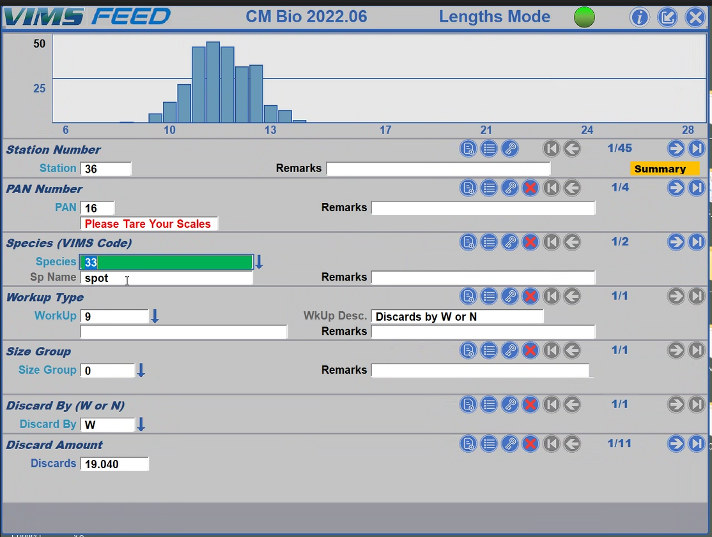

# VIMS/FEED

## VIMS/FEED Overview  {#feetop} 

FEED is a small company owned by Chris Bonzek who works in association with Virginia Institute of Marine Science (VIMS), a division of the College of William and Mary. In Virginia, the State does not conduct any research or monitoring of the state aquatic resources; VIMS and other universities conduct all aquatic monitoring.  

VIMS has been using electronic data collection since 1980’s and 'FEED' (Fisheries Environment for Electronic Data) is an app configuration method that VIMS ended up developing to provide customization of their own field data entry software. Now, many people use VIMS/FEED (form software/customization) across the country and in Canada. Thus, FEED was specifically developed for fisheries monitoring and, as a business, provides complete individualized customization of Form and Access database for each specific survey requirements.

## VIMS/FEED: Key Features 
- Can read in data from many sources and normally uses access for a database. 
- Can create manual backups to csv or backup the whole app database. 
- Can view a summary report, based on access queries. 
- QAQC queries can be included in the data entry tool (e.g., combo boxes, length/weight checks, out of range values etc).
- Hierarchical structured data.
- Can have multiple data collecting stations that feed into one database. 
- Can be programmed such that the collection form adjusts depending on what data you collected for certain species; these adjustments can be based on multiple conditions (e.g., species and size). 
- Many different sample applications.
- GPS info collected from any GPS device:
    * Tow Distance: app records actual track, not just calculating difference between start and end coordinates. 
    * Any GPS unit can be used (even the small hand-held version); an NMEA stream starts each sentence with an ID. As long at FEED knows what it is, can parse it out.

Some links for VIMS and FEED:

- Description on VIMS site: https://www.vims.edu/research/departments/fisheries/programs2/multispecies_fisheries_research/feed/index.php
- Main website: https://www.feedapps.net
- Youtube video featuring FEED: https://www.youtube.com/watch?v=ko-Yv3xk7kA

### VIMS/FEED External Device Interface

The VIMS/FEED app is designed to use a Local Area Network in contrast to other app that have an on-line interface or cloud-based data transfer options. Two key advantages of keeping the data collections and storage local: 1. no change in behavior of the tool if the survey loses internet connectivity; and 2. **Ease of connection to peripheral devices such as fish boards, scales, GPS systems via a LAN router.**  

(\#fig:feeddev)Graphic representation of the various peripheral connections possible with the FEED app devopement tool 

### FEED App/VIMS Form Development

The FEED App works in conjunction with the VIMS Form software which is a generic form program writtenm in ____ (a .NET programming language).  The FEED 'App' consists of an Access database (\@ref(fig:feedAdb)) and clear text file (\@ref(fig:feedtxt)) which tells .NET software how to interact with database and how the form appears on the screen. 

The FEED approach is not attempting to be a user friendly app development tool, but rather a customization service. Chris Bonzek indicates that, after the initial survey configuration set up, many people learn how to make adjustments to the configuration file independently of his help. 

(\#fig:feedtxt)An example of the FEED configuration file that is used to run the VIMS app

(\#fig:feedAdb)An example of the FEED Access database that is configured specifically to work with the VIMS app (Note: This is not a final storage database).

### FEED App/VIMS Form Appearance

The VIMS/FEED App provides a clear data entry interface with a variety of controls on the allowable values entered, including drop down, radio buttons, calculated values.

(\#fig:feedfrm)An example of the VIMS/FEED form interface providing realtime frequency plotting

(\#fig:feedfeat)An example of the VIMS/FEED form interface providing realtime frequency plotting

### VIMS/FEED App Data Output Format

VIMS/FEED is configured to work with and Access database. Survey data collections are stored in Access db as an intermediate location, but data tables will need to be formatted further to establish the final database format (using a processing script: R, Python, SAS, other).  

## FEED: Criteria Tables

###  FEED: Forms Options

<table class=" lightable-paper table" style='font-family: "Arial Narrow", arial, helvetica, sans-serif; margin-left: auto; margin-right: auto; font-size: 18px; width: auto !important; margin-left: auto; margin-right: auto;'>
<caption style="font-size: initial !important;">(\#tab:feedform)Forms Options</caption>
 <thead>
  <tr>
   <th style="text-align:left;position: sticky; top:0; background-color: #FFFFFF;position: sticky; top:0; background-color: #FFFFFF;"> Category </th>
   <th style="text-align:left;position: sticky; top:0; background-color: #FFFFFF;position: sticky; top:0; background-color: #FFFFFF;"> Feature </th>
   <th style="text-align:left;position: sticky; top:0; background-color: #FFFFFF;position: sticky; top:0; background-color: #FFFFFF;"> Available </th>
   <th style="text-align:left;position: sticky; top:0; background-color: #FFFFFF;position: sticky; top:0; background-color: #FFFFFF;"> Description </th>
   <th style="text-align:left;position: sticky; top:0; background-color: #FFFFFF;position: sticky; top:0; background-color: #FFFFFF;"> Group Notes </th>
   <th style="text-align:left;position: sticky; top:0; background-color: #FFFFFF;position: sticky; top:0; background-color: #FFFFFF;"> External  Reviews </th>
  </tr>
 </thead>
<tbody>
  <tr>
   <td style="text-align:left;min-width: 2.5cm; font-weight: bold;max-width: 3cm; font-weight: bold;"> Data entry validation/QC </td>
   <td style="text-align:left;min-width: 2.5cm; max-width: 3cm; "> Geo-referencing </td>
   <td style="text-align:left;min-width: 1.5cm; max-width: 2cm; "> Yes </td>
   <td style="text-align:left;min-width: 2cm; max-width: 5cm; "> Can read any data in a NMEA data stream and/or can record continuous GPS data. </td>
   <td style="text-align:left;min-width: 2cm; max-width: 5cm; ">  </td>
   <td style="text-align:left;min-width: 2cm; max-width: 5cm; ">  </td>
  </tr>
  <tr>
   <td style="text-align:left;min-width: 2.5cm; font-weight: bold;max-width: 3cm; font-weight: bold;">  </td>
   <td style="text-align:left;min-width: 2.5cm; max-width: 3cm; "> Constrained choices from a list </td>
   <td style="text-align:left;min-width: 1.5cm; max-width: 2cm; "> Yes </td>
   <td style="text-align:left;min-width: 2cm; max-width: 5cm; "> User entries can be constrained via drop-down boxes, allowed-entry lists, or range checks. </td>
   <td style="text-align:left;min-width: 2cm; max-width: 5cm; ">  </td>
   <td style="text-align:left;min-width: 2cm; max-width: 5cm; ">  </td>
  </tr>
  <tr>
   <td style="text-align:left;min-width: 2.5cm; font-weight: bold;max-width: 3cm; font-weight: bold;">  </td>
   <td style="text-align:left;min-width: 2.5cm; max-width: 3cm; "> Rules guiding answer series (e.g., “Conditional Questions” and “Skips”) </td>
   <td style="text-align:left;min-width: 1.5cm; max-width: 2cm; "> Yes </td>
   <td style="text-align:left;min-width: 2cm; max-width: 5cm; "> Data fields can appear or disappear based on entries made in other fields.   Data fields can be defined as ‘required.’  Data fields can appear or disappear based on entries made in other fields. </td>
   <td style="text-align:left;min-width: 2cm; max-width: 5cm; ">  </td>
   <td style="text-align:left;min-width: 2cm; max-width: 5cm; ">  </td>
  </tr>
  <tr>
   <td style="text-align:left;min-width: 2.5cm; font-weight: bold;max-width: 3cm; font-weight: bold;">  </td>
   <td style="text-align:left;min-width: 2.5cm; max-width: 3cm; "> Constrained choices from an external table or set of rules </td>
   <td style="text-align:left;min-width: 1.5cm; max-width: 2cm; "> Yes </td>
   <td style="text-align:left;min-width: 2cm; max-width: 5cm; "> Can compute responses; For example, entered weight data can be checked against predicted values from species-specific l-w regression parameters. </td>
   <td style="text-align:left;min-width: 2cm; max-width: 5cm; ">  </td>
   <td style="text-align:left;min-width: 2cm; max-width: 5cm; ">  </td>
  </tr>
  <tr>
   <td style="text-align:left;min-width: 2.5cm; font-weight: bold;max-width: 3cm; font-weight: bold;">  </td>
   <td style="text-align:left;min-width: 2.5cm; max-width: 3cm; "> Form Version Control </td>
   <td style="text-align:left;min-width: 1.5cm; max-width: 2cm; "> Yes </td>
   <td style="text-align:left;min-width: 2cm; max-width: 5cm; ">  </td>
   <td style="text-align:left;min-width: 2cm; max-width: 5cm; ">  </td>
   <td style="text-align:left;min-width: 2cm; max-width: 5cm; ">  </td>
  </tr>
  <tr>
   <td style="text-align:left;min-width: 2.5cm; font-weight: bold;max-width: 3cm; font-weight: bold;">  </td>
   <td style="text-align:left;min-width: 2.5cm; max-width: 3cm; "> Real-time Data Review </td>
   <td style="text-align:left;min-width: 1.5cm; max-width: 2cm; "> Yes </td>
   <td style="text-align:left;min-width: 2cm; max-width: 5cm; "> There are several ways to view entered data. </td>
   <td style="text-align:left;min-width: 2cm; max-width: 5cm; ">  </td>
   <td style="text-align:left;min-width: 2cm; max-width: 5cm; ">  </td>
  </tr>
  <tr>
   <td style="text-align:left;min-width: 2.5cm; font-weight: bold;max-width: 3cm; font-weight: bold;">  </td>
   <td style="text-align:left;min-width: 2.5cm; max-width: 3cm; "> Real-time Edit (“on the fly”) </td>
   <td style="text-align:left;min-width: 1.5cm; max-width: 2cm; "> Yes </td>
   <td style="text-align:left;min-width: 2cm; max-width: 5cm; "> Data can be altered either within the FEED application or directly in the Access data base </td>
   <td style="text-align:left;min-width: 2cm; max-width: 5cm; ">  </td>
   <td style="text-align:left;min-width: 2cm; max-width: 5cm; ">  </td>
  </tr>
  <tr>
   <td style="text-align:left;min-width: 2.5cm; font-weight: bold;max-width: 3cm; font-weight: bold;"> Ease of Form Development </td>
   <td style="text-align:left;min-width: 2.5cm; max-width: 3cm; "> Intuitive form design tool </td>
   <td style="text-align:left;min-width: 1.5cm; max-width: 2cm; "> No </td>
   <td style="text-align:left;min-width: 2cm; max-width: 5cm; "> The software interprets instructions from a clear text file written in a proprietary scripting language. These instructions tell the software how to interact with the bespoke MS Access data base and with any external devices as well as how to present data screens to the users. </td>
   <td style="text-align:left;min-width: 2cm; max-width: 5cm; ">  </td>
   <td style="text-align:left;min-width: 2cm; max-width: 5cm; ">  </td>
  </tr>
  <tr>
   <td style="text-align:left;min-width: 2.5cm; font-weight: bold;max-width: 3cm; font-weight: bold;">  </td>
   <td style="text-align:left;min-width: 2.5cm; max-width: 3cm; "> Coding language required? </td>
   <td style="text-align:left;min-width: 1.5cm; max-width: 2cm; "> Yes </td>
   <td style="text-align:left;min-width: 2cm; max-width: 5cm; "> See above </td>
   <td style="text-align:left;min-width: 2cm; max-width: 5cm; ">  </td>
   <td style="text-align:left;min-width: 2cm; max-width: 5cm; ">  </td>
  </tr>
  <tr>
   <td style="text-align:left;min-width: 2.5cm; font-weight: bold;max-width: 3cm; font-weight: bold;">  </td>
   <td style="text-align:left;min-width: 2.5cm; max-width: 3cm; "> Different styles of question types </td>
   <td style="text-align:left;min-width: 1.5cm; max-width: 2cm; "> Yes </td>
   <td style="text-align:left;min-width: 2cm; max-width: 5cm; ">  </td>
   <td style="text-align:left;min-width: 2cm; max-width: 5cm; ">  </td>
   <td style="text-align:left;min-width: 2cm; max-width: 5cm; ">  </td>
  </tr>
  <tr>
   <td style="text-align:left;min-width: 2.5cm; font-weight: bold;max-width: 3cm; font-weight: bold;">  </td>
   <td style="text-align:left;min-width: 2.5cm; max-width: 3cm; "> Flexibility to configure in a logical order for field entry (e.g., nested desgin) </td>
   <td style="text-align:left;min-width: 1.5cm; max-width: 2cm; "> Yes </td>
   <td style="text-align:left;min-width: 2cm; max-width: 5cm; "> Each application is customized according to the survey’s needs and specifications. </td>
   <td style="text-align:left;min-width: 2cm; max-width: 5cm; ">  </td>
   <td style="text-align:left;min-width: 2cm; max-width: 5cm; ">  </td>
  </tr>
  <tr>
   <td style="text-align:left;min-width: 2.5cm; font-weight: bold;max-width: 3cm; font-weight: bold;"> Other IEP Survey needs </td>
   <td style="text-align:left;min-width: 2.5cm; max-width: 3cm; "> Permissions Management </td>
   <td style="text-align:left;min-width: 1.5cm; max-width: 2cm; "> No </td>
   <td style="text-align:left;min-width: 2cm; max-width: 5cm; "> Permissions management is not a feature. </td>
   <td style="text-align:left;min-width: 2cm; max-width: 5cm; ">  </td>
   <td style="text-align:left;min-width: 2cm; max-width: 5cm; ">  </td>
  </tr>
  <tr>
   <td style="text-align:left;min-width: 2.5cm; font-weight: bold;max-width: 3cm; font-weight: bold;">  </td>
   <td style="text-align:left;min-width: 2.5cm; max-width: 3cm; "> Muti-users of an app </td>
   <td style="text-align:left;min-width: 1.5cm; max-width: 2cm; "> Yes </td>
   <td style="text-align:left;min-width: 2cm; max-width: 5cm; ">  </td>
   <td style="text-align:left;min-width: 2cm; max-width: 5cm; ">  </td>
   <td style="text-align:left;min-width: 2cm; max-width: 5cm; ">  </td>
  </tr>
  <tr>
   <td style="text-align:left;min-width: 2.5cm; font-weight: bold;max-width: 3cm; font-weight: bold;">  </td>
   <td style="text-align:left;min-width: 2.5cm; max-width: 3cm; "> Off-line capacity </td>
   <td style="text-align:left;min-width: 1.5cm; max-width: 2cm; "> Yes </td>
   <td style="text-align:left;min-width: 2cm; max-width: 5cm; ">  </td>
   <td style="text-align:left;min-width: 2cm; max-width: 5cm; ">  </td>
   <td style="text-align:left;min-width: 2cm; max-width: 5cm; ">  </td>
  </tr>
  <tr>
   <td style="text-align:left;min-width: 2.5cm; font-weight: bold;max-width: 3cm; font-weight: bold;"> User Accessability </td>
   <td style="text-align:left;min-width: 2.5cm; max-width: 3cm; "> Multiple-language options </td>
   <td style="text-align:left;min-width: 1.5cm; max-width: 2cm; "> No </td>
   <td style="text-align:left;min-width: 2cm; max-width: 5cm; ">  </td>
   <td style="text-align:left;min-width: 2cm; max-width: 5cm; ">  </td>
   <td style="text-align:left;min-width: 2cm; max-width: 5cm; ">  </td>
  </tr>
  <tr>
   <td style="text-align:left;min-width: 2.5cm; font-weight: bold;max-width: 3cm; font-weight: bold;">  </td>
   <td style="text-align:left;min-width: 2.5cm; max-width: 3cm; "> Font adjustment/Speak-to-text </td>
   <td style="text-align:left;min-width: 1.5cm; max-width: 2cm; "> No </td>
   <td style="text-align:left;min-width: 2cm; max-width: 5cm; ">  </td>
   <td style="text-align:left;min-width: 2cm; max-width: 5cm; ">  </td>
   <td style="text-align:left;min-width: 2cm; max-width: 5cm; ">  </td>
  </tr>
</tbody>
</table>

### FEED: Data Interface {#feedat}

<table class=" lightable-paper table" style='font-family: "Arial Narrow", arial, helvetica, sans-serif; margin-left: auto; margin-right: auto; font-size: 18px; width: auto !important; margin-left: auto; margin-right: auto;'>
<caption style="font-size: initial !important;">(\#tab:feeddat)Data Interface Options</caption>
 <thead>
  <tr>
   <th style="text-align:left;position: sticky; top:0; background-color: #FFFFFF;position: sticky; top:0; background-color: #FFFFFF;"> Category </th>
   <th style="text-align:left;position: sticky; top:0; background-color: #FFFFFF;position: sticky; top:0; background-color: #FFFFFF;"> Feature </th>
   <th style="text-align:left;position: sticky; top:0; background-color: #FFFFFF;position: sticky; top:0; background-color: #FFFFFF;"> Available </th>
   <th style="text-align:left;position: sticky; top:0; background-color: #FFFFFF;position: sticky; top:0; background-color: #FFFFFF;"> Description </th>
   <th style="text-align:left;position: sticky; top:0; background-color: #FFFFFF;position: sticky; top:0; background-color: #FFFFFF;"> Group Notes </th>
   <th style="text-align:left;position: sticky; top:0; background-color: #FFFFFF;position: sticky; top:0; background-color: #FFFFFF;"> External  Reviews </th>
  </tr>
 </thead>
<tbody>
  <tr>
   <td style="text-align:left;min-width: 2.5cm; font-weight: bold;max-width: 3cm; font-weight: bold;"> Database interface </td>
   <td style="text-align:left;min-width: 2.5cm; max-width: 3cm; "> Cloud-storage </td>
   <td style="text-align:left;min-width: 1.5cm; max-width: 2cm; "> No </td>
   <td style="text-align:left;min-width: 2cm; max-width: 5cm; "> FEED is based on a local access network (LAN). </td>
   <td style="text-align:left;min-width: 2cm; max-width: 5cm; ">  </td>
   <td style="text-align:left;min-width: 2cm; max-width: 5cm; ">  </td>
  </tr>
  <tr>
   <td style="text-align:left;min-width: 2.5cm; font-weight: bold;max-width: 3cm; font-weight: bold;">  </td>
   <td style="text-align:left;min-width: 2.5cm; max-width: 3cm; "> Direct integration with database </td>
   <td style="text-align:left;min-width: 1.5cm; max-width: 2cm; "> No </td>
   <td style="text-align:left;min-width: 2cm; max-width: 5cm; "> Data is stored in a custom MS Access data base specific for app function and collections. The data base can be located either on the user’s local computer or on a file server on a LAN. </td>
   <td style="text-align:left;min-width: 2cm; max-width: 5cm; ">  </td>
   <td style="text-align:left;min-width: 2cm; max-width: 5cm; ">  </td>
  </tr>
  <tr>
   <td style="text-align:left;min-width: 2.5cm; font-weight: bold;max-width: 3cm; font-weight: bold;">  </td>
   <td style="text-align:left;min-width: 2.5cm; max-width: 3cm; "> Integrate data from local tables </td>
   <td style="text-align:left;min-width: 1.5cm; max-width: 2cm; "> Yes </td>
   <td style="text-align:left;min-width: 2cm; max-width: 5cm; "> Specific parameters or reference listings can be added to the FEED app Access db to be used by the app. </td>
   <td style="text-align:left;min-width: 2cm; max-width: 5cm; ">  </td>
   <td style="text-align:left;min-width: 2cm; max-width: 5cm; ">  </td>
  </tr>
  <tr>
   <td style="text-align:left;min-width: 2.5cm; font-weight: bold;max-width: 3cm; font-weight: bold;"> Edit after transfer </td>
   <td style="text-align:left;min-width: 2.5cm; max-width: 3cm; "> Editing data ‘on-the-fly’ (data already submitted) </td>
   <td style="text-align:left;min-width: 1.5cm; max-width: 2cm; "> Yes </td>
   <td style="text-align:left;min-width: 2cm; max-width: 5cm; "> Edits can be made either in FEED or directly in Access. </td>
   <td style="text-align:left;min-width: 2cm; max-width: 5cm; ">  </td>
   <td style="text-align:left;min-width: 2cm; max-width: 5cm; ">  </td>
  </tr>
  <tr>
   <td style="text-align:left;min-width: 2.5cm; font-weight: bold;max-width: 3cm; font-weight: bold;"> Data format </td>
   <td style="text-align:left;min-width: 2.5cm; max-width: 3cm; "> Open (standard) format output </td>
   <td style="text-align:left;min-width: 1.5cm; max-width: 2cm; "> Yes </td>
   <td style="text-align:left;min-width: 2cm; max-width: 5cm; "> Data is formated in MS Access relational db tables. </td>
   <td style="text-align:left;min-width: 2cm; max-width: 5cm; ">  </td>
   <td style="text-align:left;min-width: 2cm; max-width: 5cm; ">  </td>
  </tr>
  <tr>
   <td style="text-align:left;min-width: 2.5cm; font-weight: bold;max-width: 3cm; font-weight: bold;">  </td>
   <td style="text-align:left;min-width: 2.5cm; max-width: 3cm; "> Data format logical / useable </td>
   <td style="text-align:left;min-width: 1.5cm; max-width: 2cm; "> Yes </td>
   <td style="text-align:left;min-width: 2cm; max-width: 5cm; "> The data base is in a hierarchical / relational structure. </td>
   <td style="text-align:left;min-width: 2cm; max-width: 5cm; ">  </td>
   <td style="text-align:left;min-width: 2cm; max-width: 5cm; ">  </td>
  </tr>
  <tr>
   <td style="text-align:left;min-width: 2.5cm; font-weight: bold;max-width: 3cm; font-weight: bold;"> Data transfer </td>
   <td style="text-align:left;min-width: 2.5cm; max-width: 3cm; "> Real-time data transfer </td>
   <td style="text-align:left;min-width: 1.5cm; max-width: 2cm; "> No </td>
   <td style="text-align:left;min-width: 2cm; max-width: 5cm; "> Because FEED is based on a LAN, there is not a way to transfer data to the final database.  Further, a data configuration step is required to transfer from FEED Access db to the final db.   The FEED CEO says he uses SAS to process the data and it takes him a day or two. </td>
   <td style="text-align:left;min-width: 2cm; max-width: 5cm; ">  </td>
   <td style="text-align:left;min-width: 2cm; max-width: 5cm; ">  </td>
  </tr>
  <tr>
   <td style="text-align:left;min-width: 2.5cm; font-weight: bold;max-width: 3cm; font-weight: bold;">  </td>
   <td style="text-align:left;min-width: 2.5cm; max-width: 3cm; "> Cloud connectivity &amp; back up </td>
   <td style="text-align:left;min-width: 1.5cm; max-width: 2cm; "> No </td>
   <td style="text-align:left;min-width: 2cm; max-width: 5cm; ">  </td>
   <td style="text-align:left;min-width: 2cm; max-width: 5cm; ">  </td>
   <td style="text-align:left;min-width: 2cm; max-width: 5cm; ">  </td>
  </tr>
  <tr>
   <td style="text-align:left;min-width: 2.5cm; font-weight: bold;max-width: 3cm; font-weight: bold;"> Data change logs </td>
   <td style="text-align:left;min-width: 2.5cm; max-width: 3cm; "> Audit trails (data version control) </td>
   <td style="text-align:left;min-width: 1.5cm; max-width: 2cm; "> No </td>
   <td style="text-align:left;min-width: 2cm; max-width: 5cm; ">  </td>
   <td style="text-align:left;min-width: 2cm; max-width: 5cm; ">  </td>
   <td style="text-align:left;min-width: 2cm; max-width: 5cm; ">  </td>
  </tr>
</tbody>
</table>

###  FEED: Photo Integration and External Sensors {#feepho}

<table class=" lightable-paper table" style='font-family: "Arial Narrow", arial, helvetica, sans-serif; margin-left: auto; margin-right: auto; font-size: 18px; width: auto !important; margin-left: auto; margin-right: auto;'>
<caption style="font-size: initial !important;">(\#tab:feedphot)Photo Integration and External Sensors</caption>
 <thead>
  <tr>
   <th style="text-align:left;position: sticky; top:0; background-color: #FFFFFF;position: sticky; top:0; background-color: #FFFFFF;"> Category </th>
   <th style="text-align:left;position: sticky; top:0; background-color: #FFFFFF;position: sticky; top:0; background-color: #FFFFFF;"> Feature </th>
   <th style="text-align:left;position: sticky; top:0; background-color: #FFFFFF;position: sticky; top:0; background-color: #FFFFFF;"> Available </th>
   <th style="text-align:left;position: sticky; top:0; background-color: #FFFFFF;position: sticky; top:0; background-color: #FFFFFF;"> Description </th>
   <th style="text-align:left;position: sticky; top:0; background-color: #FFFFFF;position: sticky; top:0; background-color: #FFFFFF;"> Group Notes </th>
   <th style="text-align:left;position: sticky; top:0; background-color: #FFFFFF;position: sticky; top:0; background-color: #FFFFFF;"> External  Reviews </th>
  </tr>
 </thead>
<tbody>
  <tr>
   <td style="text-align:left;min-width: 2.5cm; font-weight: bold;max-width: 3.5cm; font-weight: bold;"> Photo Integration </td>
   <td style="text-align:left;min-width: 2.5cm; max-width: 4cm; "> Collect photo &amp; assoc. with element </td>
   <td style="text-align:left;min-width: 2cm; max-width: 2.5cm; "> Yes </td>
   <td style="text-align:left;min-width: 4cm; max-width: 5.5cm; "> FEED can interact with a camera in two ways. It can activate a Windows Web Cam and associate the image with the particular record. For other cameras, FEED can monitor any particular file folder and when a new image file appears it then can associate the file with the current record. </td>
   <td style="text-align:left;min-width: 4cm; max-width: 5.5cm; ">  </td>
   <td style="text-align:left;">  </td>
  </tr>
  <tr>
   <td style="text-align:left;min-width: 2.5cm; font-weight: bold;max-width: 3.5cm; font-weight: bold;">  </td>
   <td style="text-align:left;min-width: 2.5cm; max-width: 4cm; "> Ease of interface </td>
   <td style="text-align:left;min-width: 2cm; max-width: 2.5cm; "> Yes </td>
   <td style="text-align:left;min-width: 4cm; max-width: 5.5cm; "> Easy to use. Must be careful in the script programming. </td>
   <td style="text-align:left;min-width: 4cm; max-width: 5.5cm; ">  </td>
   <td style="text-align:left;">  </td>
  </tr>
  <tr>
   <td style="text-align:left;min-width: 2.5cm; font-weight: bold;max-width: 3.5cm; font-weight: bold;">  </td>
   <td style="text-align:left;min-width: 2.5cm; max-width: 4cm; "> Multi-photo per element (and # limit) </td>
   <td style="text-align:left;min-width: 2cm; max-width: 2.5cm; "> Yes </td>
   <td style="text-align:left;min-width: 4cm; max-width: 5.5cm; "> One photo per data field but can include multiple data fields if multiple photos are needed. </td>
   <td style="text-align:left;min-width: 4cm; max-width: 5.5cm; ">  </td>
   <td style="text-align:left;">  </td>
  </tr>
  <tr>
   <td style="text-align:left;min-width: 2.5cm; font-weight: bold;max-width: 3.5cm; font-weight: bold;">  </td>
   <td style="text-align:left;min-width: 2.5cm; max-width: 4cm; "> Drawing-on/ Annotating photo </td>
   <td style="text-align:left;min-width: 2cm; max-width: 2.5cm; "> No </td>
   <td style="text-align:left;min-width: 4cm; max-width: 5.5cm; ">  </td>
   <td style="text-align:left;min-width: 4cm; max-width: 5.5cm; ">  </td>
   <td style="text-align:left;">  </td>
  </tr>
  <tr>
   <td style="text-align:left;min-width: 2.5cm; font-weight: bold;max-width: 3.5cm; font-weight: bold;"> X-tern sensors </td>
   <td style="text-align:left;min-width: 2.5cm; max-width: 4cm; "> GPS from device </td>
   <td style="text-align:left;min-width: 2cm; max-width: 2.5cm; "> Yes </td>
   <td style="text-align:left;min-width: 4cm; max-width: 5.5cm; "> Interaction with external sensors is very easy with a LAN type of app set up. </td>
   <td style="text-align:left;min-width: 4cm; max-width: 5.5cm; ">  </td>
   <td style="text-align:left;">  </td>
  </tr>
  <tr>
   <td style="text-align:left;min-width: 2.5cm; font-weight: bold;max-width: 3.5cm; font-weight: bold;">  </td>
   <td style="text-align:left;min-width: 2.5cm; max-width: 4cm; "> Integrate data from bar codes </td>
   <td style="text-align:left;min-width: 2cm; max-width: 2.5cm; "> Yes </td>
   <td style="text-align:left;min-width: 4cm; max-width: 5.5cm; "> Interaction with external sensors is very easy with a LAN type of app set up. </td>
   <td style="text-align:left;min-width: 4cm; max-width: 5.5cm; ">  </td>
   <td style="text-align:left;">  </td>
  </tr>
  <tr>
   <td style="text-align:left;min-width: 2.5cm; font-weight: bold;max-width: 3.5cm; font-weight: bold;">  </td>
   <td style="text-align:left;min-width: 2.5cm; max-width: 4cm; "> Integrate data from external sensors </td>
   <td style="text-align:left;min-width: 2cm; max-width: 2.5cm; "> Yes </td>
   <td style="text-align:left;min-width: 4cm; max-width: 5.5cm; "> Interaction with external sensors is very easy with a LAN type of app set up. </td>
   <td style="text-align:left;min-width: 4cm; max-width: 5.5cm; ">  </td>
   <td style="text-align:left;">  </td>
  </tr>
</tbody>
</table>

###  FEED:  Hardware Platforms  {#feehrd}

[Top of section](feetop)

<table class=" lightable-paper table" style='font-family: "Arial Narrow", arial, helvetica, sans-serif; margin-left: auto; margin-right: auto; font-size: 18px; width: auto !important; margin-left: auto; margin-right: auto;'>
<caption style="font-size: initial !important;">(\#tab:feedhard)Hardware Platform Options</caption>
 <thead>
  <tr>
   <th style="text-align:left;position: sticky; top:0; background-color: #FFFFFF;position: sticky; top:0; background-color: #FFFFFF;"> Feature </th>
   <th style="text-align:left;position: sticky; top:0; background-color: #FFFFFF;position: sticky; top:0; background-color: #FFFFFF;"> Available </th>
   <th style="text-align:left;position: sticky; top:0; background-color: #FFFFFF;position: sticky; top:0; background-color: #FFFFFF;"> Group Notes </th>
   <th style="text-align:left;position: sticky; top:0; background-color: #FFFFFF;position: sticky; top:0; background-color: #FFFFFF;"> External  Reviews </th>
  </tr>
 </thead>
<tbody>
  <tr>
   <td style="text-align:left;min-width: 7cm; font-weight: bold;max-width: 8cm; font-weight: bold;"> Smart Phones and Tablets </td>
   <td style="text-align:left;min-width: 3cm; max-width: 3.5cm; ">  </td>
   <td style="text-align:left;min-width: 4.5cm; max-width: 5cm; ">  </td>
   <td style="text-align:left;min-width: 4.5cm; max-width: 5cm; ">  </td>
  </tr>
  <tr>
   <td style="text-align:left;min-width: 7cm; font-weight: bold;max-width: 8cm; font-weight: bold;"> -      iOS (phone and tablet) </td>
   <td style="text-align:left;min-width: 3cm; max-width: 3.5cm; "> No </td>
   <td style="text-align:left;min-width: 4.5cm; max-width: 5cm; ">  </td>
   <td style="text-align:left;min-width: 4.5cm; max-width: 5cm; ">  </td>
  </tr>
  <tr>
   <td style="text-align:left;min-width: 7cm; font-weight: bold;max-width: 8cm; font-weight: bold;"> -      Android(phone and tablet) </td>
   <td style="text-align:left;min-width: 3cm; max-width: 3.5cm; "> No </td>
   <td style="text-align:left;min-width: 4.5cm; max-width: 5cm; ">  </td>
   <td style="text-align:left;min-width: 4.5cm; max-width: 5cm; ">  </td>
  </tr>
  <tr>
   <td style="text-align:left;min-width: 7cm; font-weight: bold;max-width: 8cm; font-weight: bold;"> Desktop/laptop </td>
   <td style="text-align:left;min-width: 3cm; max-width: 3.5cm; ">  </td>
   <td style="text-align:left;min-width: 4.5cm; max-width: 5cm; ">  </td>
   <td style="text-align:left;min-width: 4.5cm; max-width: 5cm; ">  </td>
  </tr>
  <tr>
   <td style="text-align:left;min-width: 7cm; font-weight: bold;max-width: 8cm; font-weight: bold;"> -      Windows 7,8,10, 11 </td>
   <td style="text-align:left;min-width: 3cm; max-width: 3.5cm; "> Yes </td>
   <td style="text-align:left;min-width: 4.5cm; max-width: 5cm; "> Tablets, laptops, desktops. </td>
   <td style="text-align:left;min-width: 4.5cm; max-width: 5cm; ">  </td>
  </tr>
  <tr>
   <td style="text-align:left;min-width: 7cm; font-weight: bold;max-width: 8cm; font-weight: bold;"> -      MacOS (computer) </td>
   <td style="text-align:left;min-width: 3cm; max-width: 3.5cm; "> No </td>
   <td style="text-align:left;min-width: 4.5cm; max-width: 5cm; ">  </td>
   <td style="text-align:left;min-width: 4.5cm; max-width: 5cm; ">  </td>
  </tr>
  <tr>
   <td style="text-align:left;min-width: 7cm; font-weight: bold;max-width: 8cm; font-weight: bold;"> -      Ubuntu Linux </td>
   <td style="text-align:left;min-width: 3cm; max-width: 3.5cm; "> No </td>
   <td style="text-align:left;min-width: 4.5cm; max-width: 5cm; ">  </td>
   <td style="text-align:left;min-width: 4.5cm; max-width: 5cm; ">  </td>
  </tr>
</tbody>
</table>

### FEED: Security Factors {#feesec}

<table class=" lightable-paper table" style='font-family: "Arial Narrow", arial, helvetica, sans-serif; margin-left: auto; margin-right: auto; font-size: 18px; width: auto !important; margin-left: auto; margin-right: auto;'>
<caption style="font-size: initial !important;">(\#tab:feedsec)Security Factors</caption>
 <thead>
  <tr>
   <th style="text-align:left;position: sticky; top:0; background-color: #FFFFFF;position: sticky; top:0; background-color: #FFFFFF;"> Feature </th>
   <th style="text-align:left;position: sticky; top:0; background-color: #FFFFFF;position: sticky; top:0; background-color: #FFFFFF;"> Available </th>
   <th style="text-align:left;position: sticky; top:0; background-color: #FFFFFF;position: sticky; top:0; background-color: #FFFFFF;"> Description </th>
   <th style="text-align:left;position: sticky; top:0; background-color: #FFFFFF;position: sticky; top:0; background-color: #FFFFFF;"> Group Notes </th>
   <th style="text-align:left;position: sticky; top:0; background-color: #FFFFFF;position: sticky; top:0; background-color: #FFFFFF;"> External  Reviews </th>
  </tr>
 </thead>
<tbody>
  <tr>
   <td style="text-align:left;min-width: 3cm; font-weight: bold;max-width: 4cm; font-weight: bold;"> Where’s the application/product origins from? </td>
   <td style="text-align:left;min-width: 2cm; max-width: 3cm; "> U.S. Virginia. </td>
   <td style="text-align:left;min-width: 3cm; max-width: 4cm; ">  </td>
   <td style="text-align:left;min-width: 4.5cm; max-width: 5cm; ">  </td>
   <td style="text-align:left;min-width: 4.5cm; max-width: 5cm; ">  </td>
  </tr>
  <tr>
   <td style="text-align:left;min-width: 3cm; font-weight: bold;max-width: 4cm; font-weight: bold;"> Is the application Cloud based, and if so, where? </td>
   <td style="text-align:left;min-width: 2cm; max-width: 3cm; "> N/A </td>
   <td style="text-align:left;min-width: 3cm; max-width: 4cm; ">  </td>
   <td style="text-align:left;min-width: 4.5cm; max-width: 5cm; ">  </td>
   <td style="text-align:left;min-width: 4.5cm; max-width: 5cm; ">  </td>
  </tr>
  <tr>
   <td style="text-align:left;min-width: 3cm; font-weight: bold;max-width: 4cm; font-weight: bold;"> Where is the data being stored for the application? </td>
   <td style="text-align:left;min-width: 2cm; max-width: 3cm; "> Either on the local computer or on a file server on a LAN. </td>
   <td style="text-align:left;min-width: 3cm; max-width: 4cm; ">  </td>
   <td style="text-align:left;min-width: 4.5cm; max-width: 5cm; ">  </td>
   <td style="text-align:left;min-width: 4.5cm; max-width: 5cm; ">  </td>
  </tr>
  <tr>
   <td style="text-align:left;min-width: 3cm; font-weight: bold;max-width: 4cm; font-weight: bold;"> Is the data center FedRAMP certified? </td>
   <td style="text-align:left;min-width: 2cm; max-width: 3cm; "> N/A </td>
   <td style="text-align:left;min-width: 3cm; max-width: 4cm; ">  </td>
   <td style="text-align:left;min-width: 4.5cm; max-width: 5cm; ">  </td>
   <td style="text-align:left;min-width: 4.5cm; max-width: 5cm; ">  </td>
  </tr>
  <tr>
   <td style="text-align:left;min-width: 3cm; font-weight: bold;max-width: 4cm; font-weight: bold;"> Online Security measures </td>
   <td style="text-align:left;min-width: 2cm; max-width: 3cm; "> N/A </td>
   <td style="text-align:left;min-width: 3cm; max-width: 4cm; ">  </td>
   <td style="text-align:left;min-width: 4.5cm; max-width: 5cm; ">  </td>
   <td style="text-align:left;min-width: 4.5cm; max-width: 5cm; ">  </td>
  </tr>
</tbody>
</table>

### FEED: Business Model and Customer Support {#feebus}

[Top of section](#feetop)

<table class=" lightable-paper table" style='font-family: "Arial Narrow", arial, helvetica, sans-serif; margin-left: auto; margin-right: auto; font-size: 18px; width: auto !important; margin-left: auto; margin-right: auto;'>
<caption style="font-size: initial !important;">(\#tab:feedbus)Security Factors</caption>
 <thead>
  <tr>
   <th style="text-align:left;position: sticky; top:0; background-color: #FFFFFF;position: sticky; top:0; background-color: #FFFFFF;"> Feature </th>
   <th style="text-align:left;position: sticky; top:0; background-color: #FFFFFF;position: sticky; top:0; background-color: #FFFFFF;"> Available </th>
   <th style="text-align:left;position: sticky; top:0; background-color: #FFFFFF;position: sticky; top:0; background-color: #FFFFFF;"> Description </th>
   <th style="text-align:left;position: sticky; top:0; background-color: #FFFFFF;position: sticky; top:0; background-color: #FFFFFF;"> Group Notes </th>
   <th style="text-align:left;position: sticky; top:0; background-color: #FFFFFF;position: sticky; top:0; background-color: #FFFFFF;"> External  Reviews </th>
  </tr>
 </thead>
<tbody>
  <tr>
   <td style="text-align:left;min-width: 3cm; font-weight: bold;max-width: 4cm; font-weight: bold;"> Price (Option 1) </td>
   <td style="text-align:left;min-width: 2cm; max-width: 3cm; "> Software costs $2K for each 5-seat license. </td>
   <td style="text-align:left;min-width: 3cm; max-width: 4cm; "> 2000 </td>
   <td style="text-align:left;min-width: 4.5cm; max-width: 5cm; "> The price seems very reasonable for the amount of programming/Access db set-up time. </td>
   <td style="text-align:left;min-width: 4.5cm; max-width: 5cm; ">  </td>
  </tr>
  <tr>
   <td style="text-align:left;min-width: 3cm; font-weight: bold;max-width: 4cm; font-weight: bold;"> Price (Option 2) </td>
   <td style="text-align:left;min-width: 2cm; max-width: 3cm; "> N/A </td>
   <td style="text-align:left;min-width: 3cm; max-width: 4cm; ">  </td>
   <td style="text-align:left;min-width: 4.5cm; max-width: 5cm; ">  </td>
   <td style="text-align:left;min-width: 4.5cm; max-width: 5cm; ">  </td>
  </tr>
  <tr>
   <td style="text-align:left;min-width: 3cm; font-weight: bold;max-width: 4cm; font-weight: bold;"> Business model </td>
   <td style="text-align:left;min-width: 2cm; max-width: 3cm; "> Application development is a fixed cost once a price is agreed upon and is set until the customer accepts the application. </td>
   <td style="text-align:left;min-width: 3cm; max-width: 4cm; ">  </td>
   <td style="text-align:left;min-width: 4.5cm; max-width: 5cm; "> FEED is a very small company (1 CEO and collaborators at Virginia Institue of Ocean Science) </td>
   <td style="text-align:left;min-width: 4.5cm; max-width: 5cm; ">  </td>
  </tr>
  <tr>
   <td style="text-align:left;min-width: 3cm; font-weight: bold;max-width: 4cm; font-weight: bold;"> Technical Support </td>
   <td style="text-align:left;min-width: 2cm; max-width: 3cm; "> Support for subsequent updates may be gratis or may require additional costs, again depending upon the complexity. References are available. </td>
   <td style="text-align:left;min-width: 3cm; max-width: 4cm; ">  </td>
   <td style="text-align:left;min-width: 4.5cm; max-width: 5cm; ">  </td>
   <td style="text-align:left;min-width: 4.5cm; max-width: 5cm; ">  </td>
  </tr>
</tbody>
</table>

