# Big Fin

## Overview  {#BFtop} 

The Big Fin Scientific Data Collection System (DCS) was created for both outdoor and in-lab data collection, with the purpose of decreasing the costs and time associated with gathering and using Field Data. The Big Fin Scientific DCS includes feature and hardware to support fish survey type of applications with an emphasis on keeping collection device costs low.

## Key Features 

### DCS Tablet Software: DCSLinkStream 

Big Fin DCS software "DCSLinkStream" can only be used with Android tablets.  Big Fin measurements boards use an open Bluetooth (2.0) protocol which is compatible with all devices, and boards can be hard wired with USB waterproof cables.  

DCSLinkStream collects data with a local area network and uses a separate Access db as an interface between field measurements and the final database. Data can be interfaced with a cloud-based storage utility called "DCSUnity".

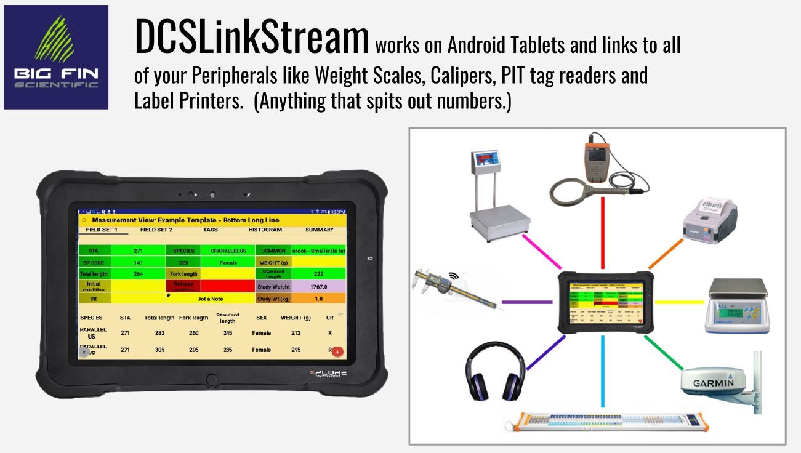

(\#fig:DCSperi)The BigFin software DCSLinkStream can be configured to read data from a variety of peripherals

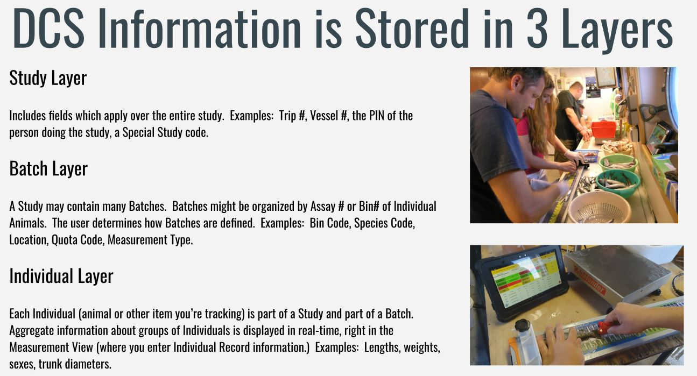

(\#fig:DCSlayr)The BigFin software DCSLinkStream is organized into three generic layers that can be customized for the individual application

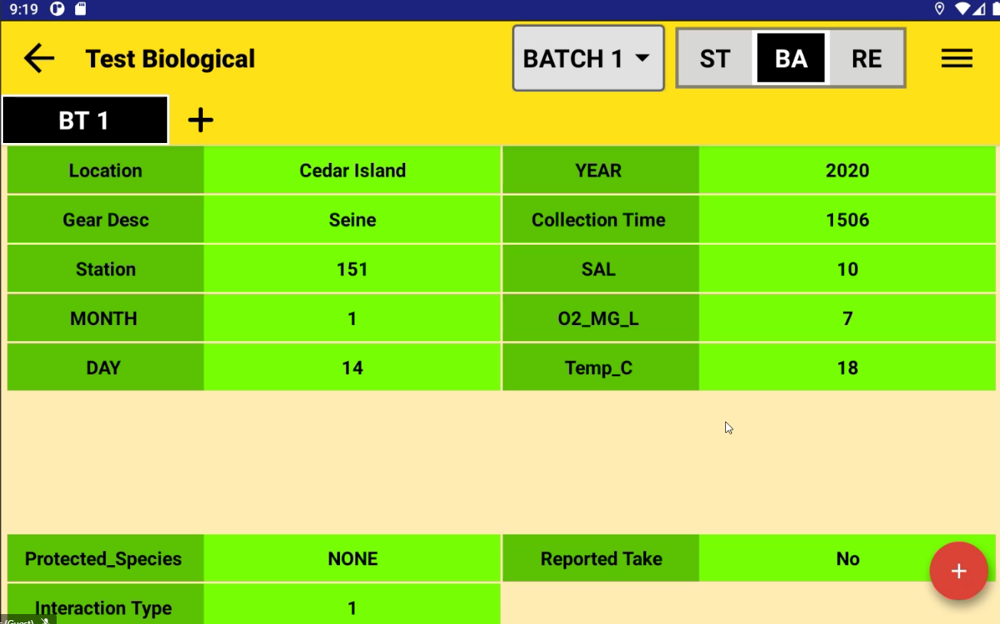

(\#fig:DCSbatch)Screen shot of the DCSLinkStream form within the 'Batch' layer

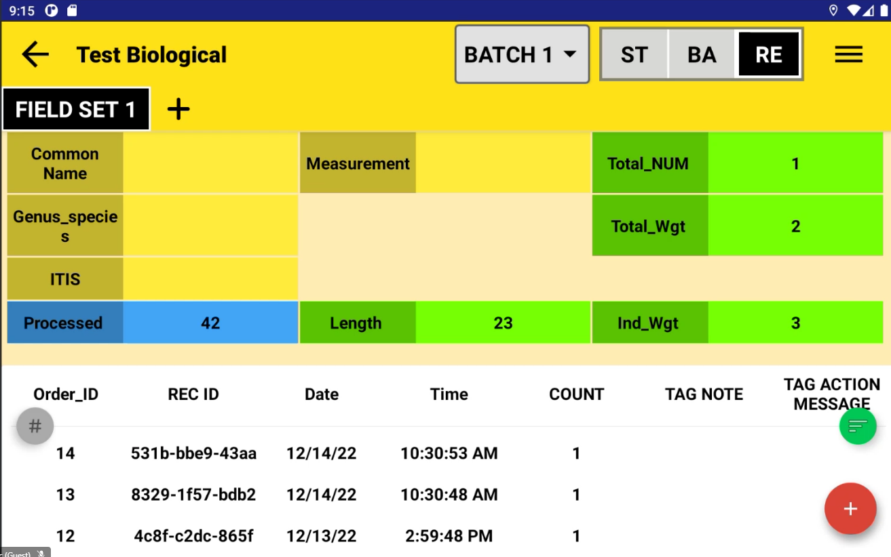

(\#fig:DCSrec)Screen shot of the DCSLinkStream form within the 'Record' layer

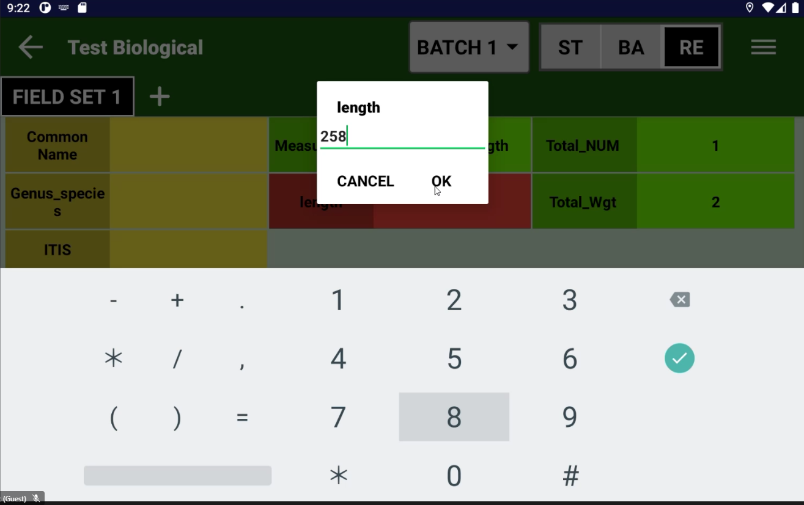

(\#fig:DCSrec2)Screen shot of the DCSLinkStream form within the 'Record' layer

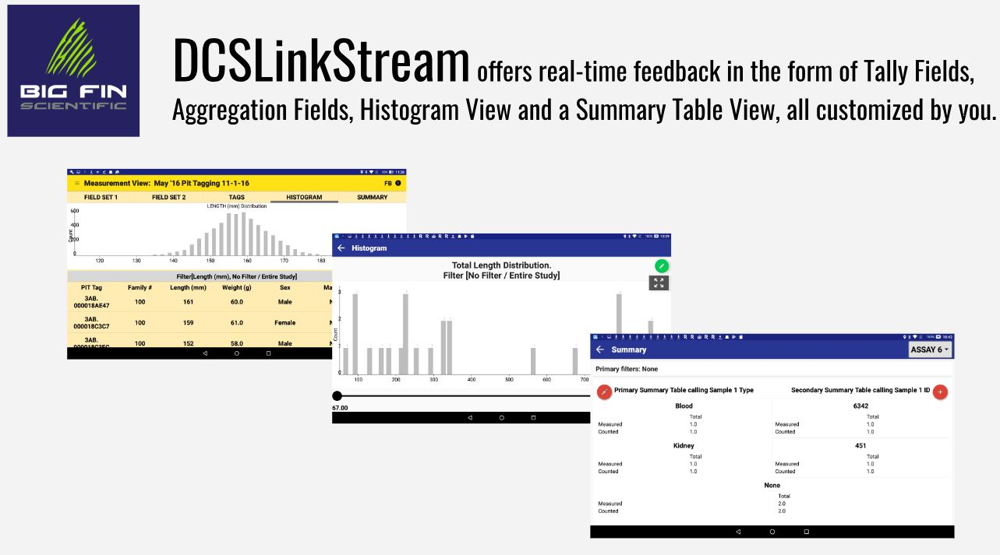

(\#fig:DCSgraph)The BigFin software DCSLinkStream provides real-time feedback, both in graphical frequencies and tallied data summaries.

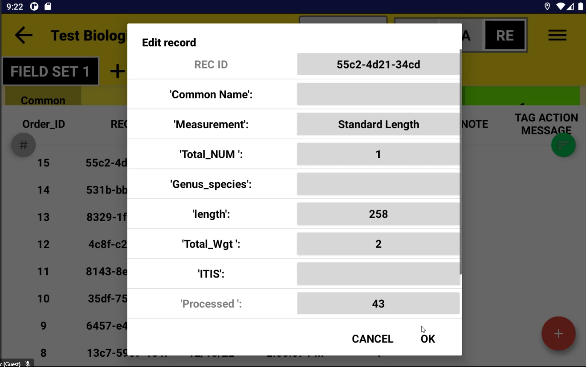

(\#fig:DCSedit)The BigFin software DCSLinkStream can be configured to read data from a variety of peripherals

### DCS Web Based Tool: DCSUnity

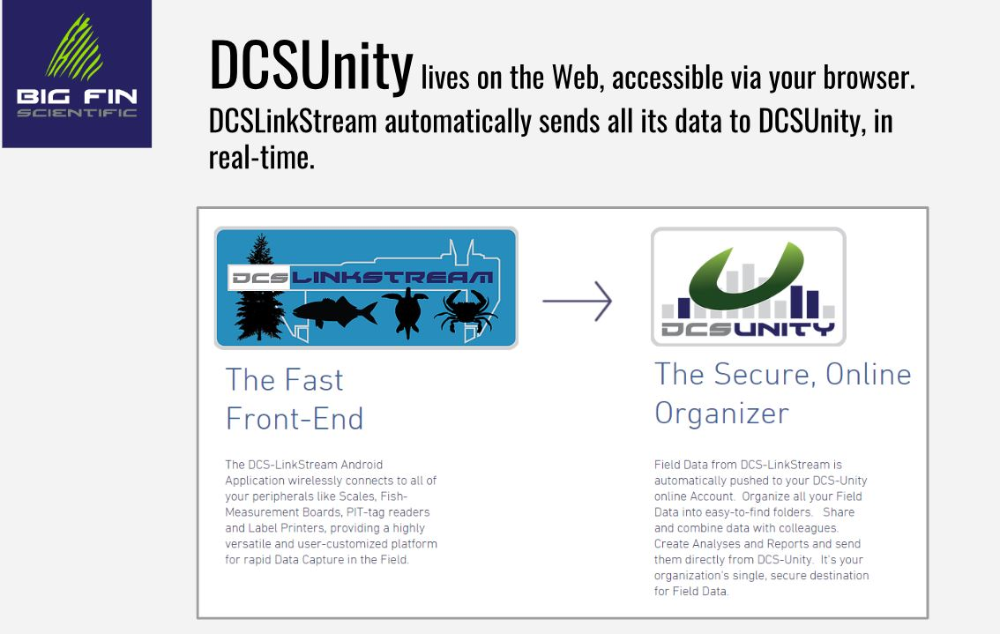

(\#fig:DCSunity)The BigFin DCSUnity software provides a web based data repository and data viewing/organizing interface.  Field data from DSC-LinkStream is automatically pushed to the DCS-Unity online Account.

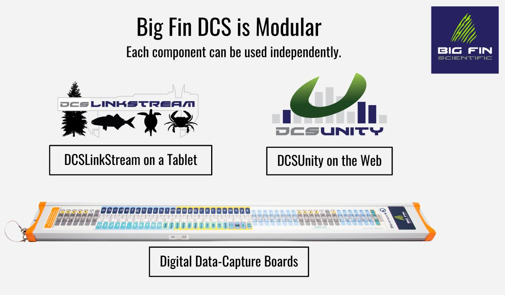

(\#fig:BFmod)The BigFin software products and the fish boards may be used separately or configured together

### Digital Data-Capture Boards

Big Fin measurement boards can be manufactured in any length up to the largest size, 2.5 meters. Boards are waterproof, lightweight, rugged, and can wash down easily; Easy to maintain. Big Fin boards interface directly with DCSLinkStream and the user can program many input keys along the board. The measurement resolution of the board is 100 microns. The boards gets calibrated initially and can be re-calibrated in 30 seconds. Drift is temperature dependent but the unit does not drift quickly because the electronics keep it warm and relatively stable. 

(\#fig:BFboard1)BigFin CEO Chris Carroll demonstrating the water proof control center of the fish measurement boards

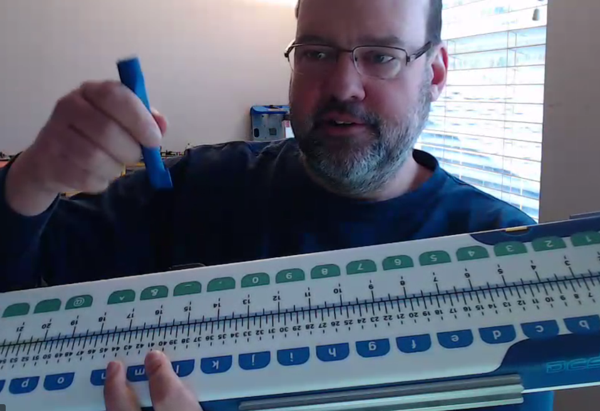

(\#fig:BFboard2)BigFin CEO Chris Carroll demonstrating the use of the stylis with the programmed short-cut buttons for species or other category.

(\#fig:BFboard3)BigFin CEO Chris Carroll demonstrating the battery pack on the back of the fish boards which may be changed out if necessary.

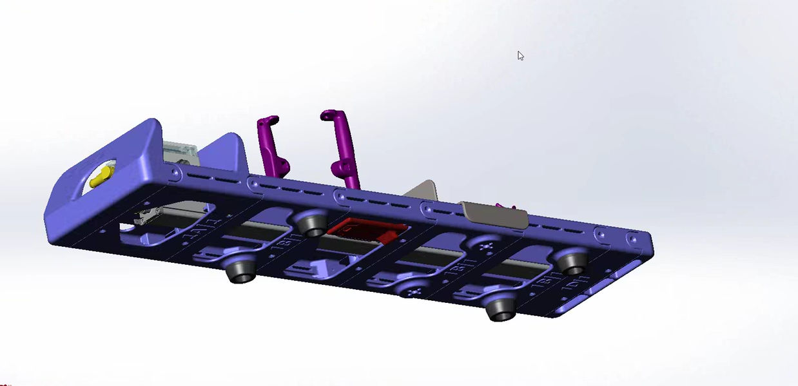

(\#fig:BF3d)In 2023, business is moving towards selling board specs so client can 3D print the entire board.

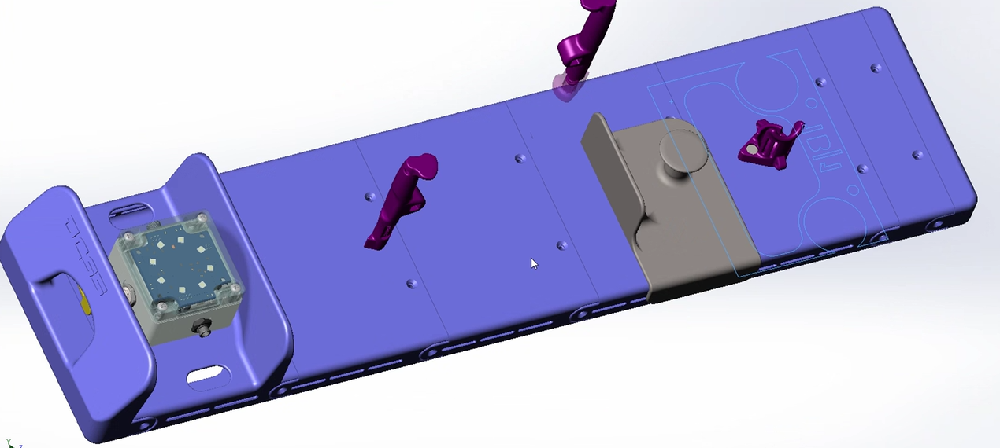

(\#fig:BF3d2)In 2023, business is moving towards selling board specs so client can 3D print the entire board.

## Criteria Tables

###  Forms Options

<table class=" lightable-paper table" style='font-family: "Arial Narrow", arial, helvetica, sans-serif; margin-left: auto; margin-right: auto; font-size: 18px; width: auto !important; margin-left: auto; margin-right: auto;'>
<caption style="font-size: initial !important;">(\#tab:BFform)Forms Options</caption>
 <thead>
  <tr>
   <th style="text-align:left;position: sticky; top:0; background-color: #FFFFFF;"> Category </th>
   <th style="text-align:left;position: sticky; top:0; background-color: #FFFFFF;"> Feature </th>
   <th style="text-align:left;position: sticky; top:0; background-color: #FFFFFF;"> Available </th>
   <th style="text-align:left;position: sticky; top:0; background-color: #FFFFFF;"> Description </th>
   <th style="text-align:left;position: sticky; top:0; background-color: #FFFFFF;"> Group Notes </th>
   <th style="text-align:left;position: sticky; top:0; background-color: #FFFFFF;"> External  Reviews </th>
  </tr>
 </thead>
<tbody>
  <tr>
   <td style="text-align:left;min-width: 2.5cm; font-weight: bold;max-width: 3cm; font-weight: bold;"> Data entry validation/QC </td>
   <td style="text-align:left;min-width: 2.5cm; max-width: 3cm; "> Geo-referencing </td>
   <td style="text-align:left;min-width: 1.5cm; max-width: 2cm; "> Yes </td>
   <td style="text-align:left;min-width: 2cm; max-width: 5cm; "> Can read any data in a NMEA data stream and/or can record continuous GPS data. </td>
   <td style="text-align:left;min-width: 2cm; max-width: 5cm; ">  </td>
   <td style="text-align:left;min-width: 2cm; max-width: 5cm; ">  </td>
  </tr>
  <tr>
   <td style="text-align:left;min-width: 2.5cm; font-weight: bold;max-width: 3cm; font-weight: bold;">  </td>
   <td style="text-align:left;min-width: 2.5cm; max-width: 3cm; "> Constrained choices from a list </td>
   <td style="text-align:left;min-width: 1.5cm; max-width: 2cm; "> Yes </td>
   <td style="text-align:left;min-width: 2cm; max-width: 5cm; "> User entries can be constrained via drop-down boxes, allowed-entry lists, or range checks. </td>
   <td style="text-align:left;min-width: 2cm; max-width: 5cm; ">  </td>
   <td style="text-align:left;min-width: 2cm; max-width: 5cm; ">  </td>
  </tr>
  <tr>
   <td style="text-align:left;min-width: 2.5cm; font-weight: bold;max-width: 3cm; font-weight: bold;">  </td>
   <td style="text-align:left;min-width: 2.5cm; max-width: 3cm; "> Rules guiding answer series (e.g., “Conditional Questions” and “Skips”) </td>
   <td style="text-align:left;min-width: 1.5cm; max-width: 2cm; "> Yes </td>
   <td style="text-align:left;min-width: 2cm; max-width: 5cm; "> Data fields can appear or disappear based on entries made in other fields.   Data fields can be defined as ‘required.’  Data fields can appear or disappear based on entries made in other fields. </td>
   <td style="text-align:left;min-width: 2cm; max-width: 5cm; ">  </td>
   <td style="text-align:left;min-width: 2cm; max-width: 5cm; ">  </td>
  </tr>
  <tr>
   <td style="text-align:left;min-width: 2.5cm; font-weight: bold;max-width: 3cm; font-weight: bold;">  </td>
   <td style="text-align:left;min-width: 2.5cm; max-width: 3cm; "> Constrained choices from an external table or set of rules </td>
   <td style="text-align:left;min-width: 1.5cm; max-width: 2cm; "> Yes </td>
   <td style="text-align:left;min-width: 2cm; max-width: 5cm; "> Can compute responses; For example, entered weight data can be checked against predicted values from species-specific l-w regression parameters. </td>
   <td style="text-align:left;min-width: 2cm; max-width: 5cm; ">  </td>
   <td style="text-align:left;min-width: 2cm; max-width: 5cm; ">  </td>
  </tr>
  <tr>
   <td style="text-align:left;min-width: 2.5cm; font-weight: bold;max-width: 3cm; font-weight: bold;">  </td>
   <td style="text-align:left;min-width: 2.5cm; max-width: 3cm; "> Form Version Control </td>
   <td style="text-align:left;min-width: 1.5cm; max-width: 2cm; "> Yes </td>
   <td style="text-align:left;min-width: 2cm; max-width: 5cm; ">  </td>
   <td style="text-align:left;min-width: 2cm; max-width: 5cm; ">  </td>
   <td style="text-align:left;min-width: 2cm; max-width: 5cm; ">  </td>
  </tr>
  <tr>
   <td style="text-align:left;min-width: 2.5cm; font-weight: bold;max-width: 3cm; font-weight: bold;">  </td>
   <td style="text-align:left;min-width: 2.5cm; max-width: 3cm; "> Real-time Data Review </td>
   <td style="text-align:left;min-width: 1.5cm; max-width: 2cm; "> Yes </td>
   <td style="text-align:left;min-width: 2cm; max-width: 5cm; "> There are several ways to view entered data. </td>
   <td style="text-align:left;min-width: 2cm; max-width: 5cm; ">  </td>
   <td style="text-align:left;min-width: 2cm; max-width: 5cm; ">  </td>
  </tr>
  <tr>
   <td style="text-align:left;min-width: 2.5cm; font-weight: bold;max-width: 3cm; font-weight: bold;">  </td>
   <td style="text-align:left;min-width: 2.5cm; max-width: 3cm; "> Real-time Edit (“on the fly”) </td>
   <td style="text-align:left;min-width: 1.5cm; max-width: 2cm; "> Yes </td>
   <td style="text-align:left;min-width: 2cm; max-width: 5cm; "> Data can be altered either within the FEED application or directly in the Access data base </td>
   <td style="text-align:left;min-width: 2cm; max-width: 5cm; ">  </td>
   <td style="text-align:left;min-width: 2cm; max-width: 5cm; ">  </td>
  </tr>
  <tr>
   <td style="text-align:left;min-width: 2.5cm; font-weight: bold;max-width: 3cm; font-weight: bold;"> Ease of Form Development </td>
   <td style="text-align:left;min-width: 2.5cm; max-width: 3cm; "> Intuitive form design tool </td>
   <td style="text-align:left;min-width: 1.5cm; max-width: 2cm; "> No </td>
   <td style="text-align:left;min-width: 2cm; max-width: 5cm; "> The software interprets instructions from a clear text file written in a proprietary scripting language. These instructions tell the software how to interact with the bespoke MS Access data base and with any external devices as well as how to present data screens to the users. </td>
   <td style="text-align:left;min-width: 2cm; max-width: 5cm; ">  </td>
   <td style="text-align:left;min-width: 2cm; max-width: 5cm; ">  </td>
  </tr>
  <tr>
   <td style="text-align:left;min-width: 2.5cm; font-weight: bold;max-width: 3cm; font-weight: bold;">  </td>
   <td style="text-align:left;min-width: 2.5cm; max-width: 3cm; "> Coding language required? </td>
   <td style="text-align:left;min-width: 1.5cm; max-width: 2cm; "> Yes </td>
   <td style="text-align:left;min-width: 2cm; max-width: 5cm; "> See above </td>
   <td style="text-align:left;min-width: 2cm; max-width: 5cm; ">  </td>
   <td style="text-align:left;min-width: 2cm; max-width: 5cm; ">  </td>
  </tr>
  <tr>
   <td style="text-align:left;min-width: 2.5cm; font-weight: bold;max-width: 3cm; font-weight: bold;">  </td>
   <td style="text-align:left;min-width: 2.5cm; max-width: 3cm; "> Different styles of question types </td>
   <td style="text-align:left;min-width: 1.5cm; max-width: 2cm; "> Yes </td>
   <td style="text-align:left;min-width: 2cm; max-width: 5cm; ">  </td>
   <td style="text-align:left;min-width: 2cm; max-width: 5cm; ">  </td>
   <td style="text-align:left;min-width: 2cm; max-width: 5cm; ">  </td>
  </tr>
  <tr>
   <td style="text-align:left;min-width: 2.5cm; font-weight: bold;max-width: 3cm; font-weight: bold;">  </td>
   <td style="text-align:left;min-width: 2.5cm; max-width: 3cm; "> Flexibility to configure in a logical order for field entry (e.g., nested desgin) </td>
   <td style="text-align:left;min-width: 1.5cm; max-width: 2cm; "> Yes </td>
   <td style="text-align:left;min-width: 2cm; max-width: 5cm; "> Each application is customized according to the survey’s needs and specifications. </td>
   <td style="text-align:left;min-width: 2cm; max-width: 5cm; ">  </td>
   <td style="text-align:left;min-width: 2cm; max-width: 5cm; ">  </td>
  </tr>
  <tr>
   <td style="text-align:left;min-width: 2.5cm; font-weight: bold;max-width: 3cm; font-weight: bold;"> Other IEP Survey needs </td>
   <td style="text-align:left;min-width: 2.5cm; max-width: 3cm; "> Permissions Management </td>
   <td style="text-align:left;min-width: 1.5cm; max-width: 2cm; "> No </td>
   <td style="text-align:left;min-width: 2cm; max-width: 5cm; "> Permissions management is not a feature. </td>
   <td style="text-align:left;min-width: 2cm; max-width: 5cm; ">  </td>
   <td style="text-align:left;min-width: 2cm; max-width: 5cm; ">  </td>
  </tr>
  <tr>
   <td style="text-align:left;min-width: 2.5cm; font-weight: bold;max-width: 3cm; font-weight: bold;">  </td>
   <td style="text-align:left;min-width: 2.5cm; max-width: 3cm; "> Muti-users of an app </td>
   <td style="text-align:left;min-width: 1.5cm; max-width: 2cm; "> Yes </td>
   <td style="text-align:left;min-width: 2cm; max-width: 5cm; ">  </td>
   <td style="text-align:left;min-width: 2cm; max-width: 5cm; ">  </td>
   <td style="text-align:left;min-width: 2cm; max-width: 5cm; ">  </td>
  </tr>
  <tr>
   <td style="text-align:left;min-width: 2.5cm; font-weight: bold;max-width: 3cm; font-weight: bold;">  </td>
   <td style="text-align:left;min-width: 2.5cm; max-width: 3cm; "> Off-line capacity </td>
   <td style="text-align:left;min-width: 1.5cm; max-width: 2cm; "> Yes </td>
   <td style="text-align:left;min-width: 2cm; max-width: 5cm; ">  </td>
   <td style="text-align:left;min-width: 2cm; max-width: 5cm; ">  </td>
   <td style="text-align:left;min-width: 2cm; max-width: 5cm; ">  </td>
  </tr>
  <tr>
   <td style="text-align:left;min-width: 2.5cm; font-weight: bold;max-width: 3cm; font-weight: bold;"> User Accessability </td>
   <td style="text-align:left;min-width: 2.5cm; max-width: 3cm; "> Multiple-language options </td>
   <td style="text-align:left;min-width: 1.5cm; max-width: 2cm; "> No </td>
   <td style="text-align:left;min-width: 2cm; max-width: 5cm; ">  </td>
   <td style="text-align:left;min-width: 2cm; max-width: 5cm; ">  </td>
   <td style="text-align:left;min-width: 2cm; max-width: 5cm; ">  </td>
  </tr>
  <tr>
   <td style="text-align:left;min-width: 2.5cm; font-weight: bold;max-width: 3cm; font-weight: bold;">  </td>
   <td style="text-align:left;min-width: 2.5cm; max-width: 3cm; "> Font adjustment/Speak-to-text </td>
   <td style="text-align:left;min-width: 1.5cm; max-width: 2cm; "> No </td>
   <td style="text-align:left;min-width: 2cm; max-width: 5cm; ">  </td>
   <td style="text-align:left;min-width: 2cm; max-width: 5cm; ">  </td>
   <td style="text-align:left;min-width: 2cm; max-width: 5cm; ">  </td>
  </tr>
</tbody>
</table>

### Data Interface {#BFdat}

<table class=" lightable-paper table" style='font-family: "Arial Narrow", arial, helvetica, sans-serif; margin-left: auto; margin-right: auto; font-size: 18px; width: auto !important; margin-left: auto; margin-right: auto;'>
<caption style="font-size: initial !important;">(\#tab:BFdat)Data Interface Options</caption>
 <thead>
  <tr>
   <th style="text-align:left;position: sticky; top:0; background-color: #FFFFFF;"> Category </th>
   <th style="text-align:left;position: sticky; top:0; background-color: #FFFFFF;"> Feature </th>
   <th style="text-align:left;position: sticky; top:0; background-color: #FFFFFF;"> Available </th>
   <th style="text-align:left;position: sticky; top:0; background-color: #FFFFFF;"> Description </th>
   <th style="text-align:left;position: sticky; top:0; background-color: #FFFFFF;"> Group Notes </th>
   <th style="text-align:left;position: sticky; top:0; background-color: #FFFFFF;"> External  Reviews </th>
  </tr>
 </thead>
<tbody>
  <tr>
   <td style="text-align:left;min-width: 2.5cm; font-weight: bold;max-width: 3cm; font-weight: bold;"> Database interface </td>
   <td style="text-align:left;min-width: 2.5cm; max-width: 3cm; "> Cloud-storage </td>
   <td style="text-align:left;min-width: 1.5cm; max-width: 2cm; "> Yes </td>
   <td style="text-align:left;min-width: 2cm; max-width: 5cm; "> Field data can be interfaced with a cloud-based storage utility called "DCSUnity". </td>
   <td style="text-align:left;min-width: 2cm; max-width: 5cm; ">  </td>
   <td style="text-align:left;min-width: 2cm; max-width: 5cm; ">  </td>
  </tr>
  <tr>
   <td style="text-align:left;min-width: 2.5cm; font-weight: bold;max-width: 3cm; font-weight: bold;">  </td>
   <td style="text-align:left;min-width: 2.5cm; max-width: 3cm; "> Direct integration with database </td>
   <td style="text-align:left;min-width: 1.5cm; max-width: 2cm; "> Yes </td>
   <td style="text-align:left;min-width: 2cm; max-width: 5cm; "> DCSLinkStream collects data with a local area network and uses a separate Access db as an interface between field measurements and a final database.  The transfer to a final database  would have to be configured separately.  Big Fin offers specific configuration services for a techician service fee. </td>
   <td style="text-align:left;min-width: 2cm; max-width: 5cm; ">  </td>
   <td style="text-align:left;min-width: 2cm; max-width: 5cm; ">  </td>
  </tr>
  <tr>
   <td style="text-align:left;min-width: 2.5cm; font-weight: bold;max-width: 3cm; font-weight: bold;">  </td>
   <td style="text-align:left;min-width: 2.5cm; max-width: 3cm; "> Integrate data from local tables </td>
   <td style="text-align:left;min-width: 1.5cm; max-width: 2cm; "> Yes </td>
   <td style="text-align:left;min-width: 2cm; max-width: 5cm; "> See above. </td>
   <td style="text-align:left;min-width: 2cm; max-width: 5cm; ">  </td>
   <td style="text-align:left;min-width: 2cm; max-width: 5cm; ">  </td>
  </tr>
  <tr>
   <td style="text-align:left;min-width: 2.5cm; font-weight: bold;max-width: 3cm; font-weight: bold;"> Edit after transfer </td>
   <td style="text-align:left;min-width: 2.5cm; max-width: 3cm; "> Editing data ‘on-the-fly’ (data already submitted) </td>
   <td style="text-align:left;min-width: 1.5cm; max-width: 2cm; "> Yes </td>
   <td style="text-align:left;min-width: 2cm; max-width: 5cm; "> Edit interface is available.  Editing cannot be done within a listing, but has to be done through an edit interface (see Figure 9.7) </td>
   <td style="text-align:left;min-width: 2cm; max-width: 5cm; ">  </td>
   <td style="text-align:left;min-width: 2cm; max-width: 5cm; ">  </td>
  </tr>
  <tr>
   <td style="text-align:left;min-width: 2.5cm; font-weight: bold;max-width: 3cm; font-weight: bold;"> Data format </td>
   <td style="text-align:left;min-width: 2.5cm; max-width: 3cm; "> Open (standard) format output </td>
   <td style="text-align:left;min-width: 1.5cm; max-width: 2cm; "> Yes </td>
   <td style="text-align:left;min-width: 2cm; max-width: 5cm; "> Data exported from DCSLinkStream is as .CSV files. </td>
   <td style="text-align:left;min-width: 2cm; max-width: 5cm; ">  </td>
   <td style="text-align:left;min-width: 2cm; max-width: 5cm; ">  </td>
  </tr>
  <tr>
   <td style="text-align:left;min-width: 2.5cm; font-weight: bold;max-width: 3cm; font-weight: bold;">  </td>
   <td style="text-align:left;min-width: 2.5cm; max-width: 3cm; "> Data format logical / useable </td>
   <td style="text-align:left;min-width: 1.5cm; max-width: 2cm; "> Yes </td>
   <td style="text-align:left;min-width: 2cm; max-width: 5cm; "> Data exported from DCSLinkStream is formated in relational tables relative to the 3 main storage layers: study layer, batch layer and individual record layer. </td>
   <td style="text-align:left;min-width: 2cm; max-width: 5cm; ">  </td>
   <td style="text-align:left;min-width: 2cm; max-width: 5cm; ">  </td>
  </tr>
  <tr>
   <td style="text-align:left;min-width: 2.5cm; font-weight: bold;max-width: 3cm; font-weight: bold;"> Data transfer </td>
   <td style="text-align:left;min-width: 2.5cm; max-width: 3cm; "> Real-time data transfer </td>
   <td style="text-align:left;min-width: 1.5cm; max-width: 2cm; "> Yes </td>
   <td style="text-align:left;min-width: 2cm; max-width: 5cm; "> Big Fin DCSLinkStream software automatically sends all its data to DCSUnity in real-time. </td>
   <td style="text-align:left;min-width: 2cm; max-width: 5cm; ">  </td>
   <td style="text-align:left;min-width: 2cm; max-width: 5cm; ">  </td>
  </tr>
  <tr>
   <td style="text-align:left;min-width: 2.5cm; font-weight: bold;max-width: 3cm; font-weight: bold;">  </td>
   <td style="text-align:left;min-width: 2.5cm; max-width: 3cm; "> Cloud connectivity &amp; back up </td>
   <td style="text-align:left;min-width: 1.5cm; max-width: 2cm; "> Yes </td>
   <td style="text-align:left;min-width: 2cm; max-width: 5cm; "> Big Fin DCSUnity software is a cloud-based storage, web accessable utility. </td>
   <td style="text-align:left;min-width: 2cm; max-width: 5cm; ">  </td>
   <td style="text-align:left;min-width: 2cm; max-width: 5cm; ">  </td>
  </tr>
  <tr>
   <td style="text-align:left;min-width: 2.5cm; font-weight: bold;max-width: 3cm; font-weight: bold;"> Data change logs </td>
   <td style="text-align:left;min-width: 2.5cm; max-width: 3cm; "> Audit trails (data version control) </td>
   <td style="text-align:left;min-width: 1.5cm; max-width: 2cm; "> ? </td>
   <td style="text-align:left;min-width: 2cm; max-width: 5cm; ">  </td>
   <td style="text-align:left;min-width: 2cm; max-width: 5cm; ">  </td>
   <td style="text-align:left;min-width: 2cm; max-width: 5cm; ">  </td>
  </tr>
</tbody>
</table>

###  Photo Integration and External Sensors {#BFpho}

<table class=" lightable-paper table" style='font-family: "Arial Narrow", arial, helvetica, sans-serif; margin-left: auto; margin-right: auto; font-size: 18px; width: auto !important; margin-left: auto; margin-right: auto;'>
<caption style="font-size: initial !important;">(\#tab:BFphot)Photo Integration and External Sensors</caption>
 <thead>
  <tr>
   <th style="text-align:left;position: sticky; top:0; background-color: #FFFFFF;"> Category </th>
   <th style="text-align:left;position: sticky; top:0; background-color: #FFFFFF;"> Feature </th>
   <th style="text-align:left;position: sticky; top:0; background-color: #FFFFFF;"> Available </th>
   <th style="text-align:left;position: sticky; top:0; background-color: #FFFFFF;"> Description </th>
   <th style="text-align:left;position: sticky; top:0; background-color: #FFFFFF;"> Group Notes </th>
   <th style="text-align:left;position: sticky; top:0; background-color: #FFFFFF;"> External  Reviews </th>
  </tr>
 </thead>
<tbody>
  <tr>
   <td style="text-align:left;min-width: 2.5cm; font-weight: bold;max-width: 3.5cm; font-weight: bold;"> Photo Integration </td>
   <td style="text-align:left;min-width: 2.5cm; max-width: 4cm; "> Collect photo &amp; assoc. with element </td>
   <td style="text-align:left;min-width: 2cm; max-width: 2.5cm; "> ? </td>
   <td style="text-align:left;min-width: 4cm; max-width: 5.5cm; ">  </td>
   <td style="text-align:left;min-width: 4cm; max-width: 5.5cm; ">  </td>
   <td style="text-align:left;">  </td>
  </tr>
  <tr>
   <td style="text-align:left;min-width: 2.5cm; font-weight: bold;max-width: 3.5cm; font-weight: bold;">  </td>
   <td style="text-align:left;min-width: 2.5cm; max-width: 4cm; "> Ease of interface </td>
   <td style="text-align:left;min-width: 2cm; max-width: 2.5cm; "> ? </td>
   <td style="text-align:left;min-width: 4cm; max-width: 5.5cm; ">  </td>
   <td style="text-align:left;min-width: 4cm; max-width: 5.5cm; ">  </td>
   <td style="text-align:left;">  </td>
  </tr>
  <tr>
   <td style="text-align:left;min-width: 2.5cm; font-weight: bold;max-width: 3.5cm; font-weight: bold;">  </td>
   <td style="text-align:left;min-width: 2.5cm; max-width: 4cm; "> Multi-photo per element (and # limit) </td>
   <td style="text-align:left;min-width: 2cm; max-width: 2.5cm; "> ? </td>
   <td style="text-align:left;min-width: 4cm; max-width: 5.5cm; ">  </td>
   <td style="text-align:left;min-width: 4cm; max-width: 5.5cm; ">  </td>
   <td style="text-align:left;">  </td>
  </tr>
  <tr>
   <td style="text-align:left;min-width: 2.5cm; font-weight: bold;max-width: 3.5cm; font-weight: bold;">  </td>
   <td style="text-align:left;min-width: 2.5cm; max-width: 4cm; "> Drawing-on/ Annotating photo </td>
   <td style="text-align:left;min-width: 2cm; max-width: 2.5cm; "> ? </td>
   <td style="text-align:left;min-width: 4cm; max-width: 5.5cm; ">  </td>
   <td style="text-align:left;min-width: 4cm; max-width: 5.5cm; ">  </td>
   <td style="text-align:left;">  </td>
  </tr>
  <tr>
   <td style="text-align:left;min-width: 2.5cm; font-weight: bold;max-width: 3.5cm; font-weight: bold;"> X-tern sensors </td>
   <td style="text-align:left;min-width: 2.5cm; max-width: 4cm; "> GPS from device </td>
   <td style="text-align:left;min-width: 2cm; max-width: 2.5cm; "> Yes </td>
   <td style="text-align:left;min-width: 4cm; max-width: 5.5cm; "> DCSLinStream is designed to interface smoothly with many peripheral types, including navigation devices. </td>
   <td style="text-align:left;min-width: 4cm; max-width: 5.5cm; ">  </td>
   <td style="text-align:left;">  </td>
  </tr>
  <tr>
   <td style="text-align:left;min-width: 2.5cm; font-weight: bold;max-width: 3.5cm; font-weight: bold;">  </td>
   <td style="text-align:left;min-width: 2.5cm; max-width: 4cm; "> Integrate data from bar codes </td>
   <td style="text-align:left;min-width: 2cm; max-width: 2.5cm; "> Yes </td>
   <td style="text-align:left;min-width: 4cm; max-width: 5.5cm; "> DCSLinStream is designed to interface smoothly with many peripheral types, including barcode readers. </td>
   <td style="text-align:left;min-width: 4cm; max-width: 5.5cm; ">  </td>
   <td style="text-align:left;">  </td>
  </tr>
  <tr>
   <td style="text-align:left;min-width: 2.5cm; font-weight: bold;max-width: 3.5cm; font-weight: bold;">  </td>
   <td style="text-align:left;min-width: 2.5cm; max-width: 4cm; "> Integrate data from external sensors </td>
   <td style="text-align:left;min-width: 2cm; max-width: 2.5cm; ">  </td>
   <td style="text-align:left;min-width: 4cm; max-width: 5.5cm; ">  </td>
   <td style="text-align:left;min-width: 4cm; max-width: 5.5cm; ">  </td>
   <td style="text-align:left;">  </td>
  </tr>
</tbody>
</table>

###  Hardware Platforms  {#BFhrd}

<table class=" lightable-paper table" style='font-family: "Arial Narrow", arial, helvetica, sans-serif; margin-left: auto; margin-right: auto; font-size: 18px; width: auto !important; margin-left: auto; margin-right: auto;'>
<caption style="font-size: initial !important;">(\#tab:BFhard)Hardware Platform Options</caption>
 <thead>
  <tr>
   <th style="text-align:left;position: sticky; top:0; background-color: #FFFFFF;"> Feature </th>
   <th style="text-align:left;position: sticky; top:0; background-color: #FFFFFF;"> Available </th>
   <th style="text-align:left;position: sticky; top:0; background-color: #FFFFFF;"> Group Notes </th>
   <th style="text-align:left;position: sticky; top:0; background-color: #FFFFFF;"> External  Reviews </th>
  </tr>
 </thead>
<tbody>
  <tr>
   <td style="text-align:left;min-width: 7cm; font-weight: bold;max-width: 8cm; font-weight: bold;"> Smart Phones and Tablets </td>
   <td style="text-align:left;min-width: 3cm; max-width: 3.5cm; ">  </td>
   <td style="text-align:left;min-width: 4.5cm; max-width: 5cm; ">  </td>
   <td style="text-align:left;min-width: 4.5cm; max-width: 5cm; ">  </td>
  </tr>
  <tr>
   <td style="text-align:left;min-width: 7cm; font-weight: bold;max-width: 8cm; font-weight: bold;"> -      iOS (phone and tablet) </td>
   <td style="text-align:left;min-width: 3cm; max-width: 3.5cm; "> No </td>
   <td style="text-align:left;min-width: 4.5cm; max-width: 5cm; ">  </td>
   <td style="text-align:left;min-width: 4.5cm; max-width: 5cm; ">  </td>
  </tr>
  <tr>
   <td style="text-align:left;min-width: 7cm; font-weight: bold;max-width: 8cm; font-weight: bold;"> -      Android(phone and tablet) </td>
   <td style="text-align:left;min-width: 3cm; max-width: 3.5cm; "> Yes </td>
   <td style="text-align:left;min-width: 4.5cm; max-width: 5cm; ">  </td>
   <td style="text-align:left;min-width: 4.5cm; max-width: 5cm; ">  </td>
  </tr>
  <tr>
   <td style="text-align:left;min-width: 7cm; font-weight: bold;max-width: 8cm; font-weight: bold;"> Desktop/laptop </td>
   <td style="text-align:left;min-width: 3cm; max-width: 3.5cm; ">  </td>
   <td style="text-align:left;min-width: 4.5cm; max-width: 5cm; ">  </td>
   <td style="text-align:left;min-width: 4.5cm; max-width: 5cm; ">  </td>
  </tr>
  <tr>
   <td style="text-align:left;min-width: 7cm; font-weight: bold;max-width: 8cm; font-weight: bold;"> -      Windows 7,8,10, 11 </td>
   <td style="text-align:left;min-width: 3cm; max-width: 3.5cm; "> Yes </td>
   <td style="text-align:left;min-width: 4.5cm; max-width: 5cm; "> Web-based only: DCSUnity </td>
   <td style="text-align:left;min-width: 4.5cm; max-width: 5cm; ">  </td>
  </tr>
  <tr>
   <td style="text-align:left;min-width: 7cm; font-weight: bold;max-width: 8cm; font-weight: bold;"> -      MacOS (computer) </td>
   <td style="text-align:left;min-width: 3cm; max-width: 3.5cm; "> Yes </td>
   <td style="text-align:left;min-width: 4.5cm; max-width: 5cm; "> Web-based only: DCSUnity </td>
   <td style="text-align:left;min-width: 4.5cm; max-width: 5cm; ">  </td>
  </tr>
  <tr>
   <td style="text-align:left;min-width: 7cm; font-weight: bold;max-width: 8cm; font-weight: bold;"> -      Ubuntu Linux </td>
   <td style="text-align:left;min-width: 3cm; max-width: 3.5cm; "> Yes </td>
   <td style="text-align:left;min-width: 4.5cm; max-width: 5cm; "> Web-based only: DCSUnity </td>
   <td style="text-align:left;min-width: 4.5cm; max-width: 5cm; ">  </td>
  </tr>
</tbody>
</table>

[Top of section](#BFtop)

### Security Factors {#BFsec}

<table class=" lightable-paper table" style='font-family: "Arial Narrow", arial, helvetica, sans-serif; margin-left: auto; margin-right: auto; font-size: 18px; width: auto !important; margin-left: auto; margin-right: auto;'>
<caption style="font-size: initial !important;">(\#tab:BFsec)Security Factors</caption>
 <thead>
  <tr>
   <th style="text-align:left;position: sticky; top:0; background-color: #FFFFFF;"> Feature </th>
   <th style="text-align:left;position: sticky; top:0; background-color: #FFFFFF;"> Available </th>
   <th style="text-align:left;position: sticky; top:0; background-color: #FFFFFF;"> Description </th>
   <th style="text-align:left;position: sticky; top:0; background-color: #FFFFFF;"> Group Notes </th>
   <th style="text-align:left;position: sticky; top:0; background-color: #FFFFFF;"> External  Reviews </th>
  </tr>
 </thead>
<tbody>
  <tr>
   <td style="text-align:left;min-width: 3cm; font-weight: bold;max-width: 4cm; font-weight: bold;"> Where’s the application/product origins from? </td>
   <td style="text-align:left;min-width: 2cm; max-width: 3cm; "> company is moving to Virginia </td>
   <td style="text-align:left;min-width: 3cm; max-width: 4cm; ">  </td>
   <td style="text-align:left;min-width: 4.5cm; max-width: 5cm; ">  </td>
   <td style="text-align:left;min-width: 4.5cm; max-width: 5cm; ">  </td>
  </tr>
  <tr>
   <td style="text-align:left;min-width: 3cm; font-weight: bold;max-width: 4cm; font-weight: bold;"> Is the application Cloud based, and if so, where? </td>
   <td style="text-align:left;min-width: 2cm; max-width: 3cm; "> Yes, .. What service? </td>
   <td style="text-align:left;min-width: 3cm; max-width: 4cm; ">  </td>
   <td style="text-align:left;min-width: 4.5cm; max-width: 5cm; ">  </td>
   <td style="text-align:left;min-width: 4.5cm; max-width: 5cm; ">  </td>
  </tr>
  <tr>
   <td style="text-align:left;min-width: 3cm; font-weight: bold;max-width: 4cm; font-weight: bold;"> Where is the data being stored for the application? </td>
   <td style="text-align:left;min-width: 2cm; max-width: 3cm; "> Initially on the local computer; automatically pushed to the cloud with *DCSUnity </td>
   <td style="text-align:left;min-width: 3cm; max-width: 4cm; ">  </td>
   <td style="text-align:left;min-width: 4.5cm; max-width: 5cm; ">  </td>
   <td style="text-align:left;min-width: 4.5cm; max-width: 5cm; ">  </td>
  </tr>
  <tr>
   <td style="text-align:left;min-width: 3cm; font-weight: bold;max-width: 4cm; font-weight: bold;"> Is the data center FedRAMP certified? </td>
   <td style="text-align:left;min-width: 2cm; max-width: 3cm; "> ? </td>
   <td style="text-align:left;min-width: 3cm; max-width: 4cm; ">  </td>
   <td style="text-align:left;min-width: 4.5cm; max-width: 5cm; ">  </td>
   <td style="text-align:left;min-width: 4.5cm; max-width: 5cm; ">  </td>
  </tr>
  <tr>
   <td style="text-align:left;min-width: 3cm; font-weight: bold;max-width: 4cm; font-weight: bold;"> Online Security measures </td>
   <td style="text-align:left;min-width: 2cm; max-width: 3cm; "> ? </td>
   <td style="text-align:left;min-width: 3cm; max-width: 4cm; ">  </td>
   <td style="text-align:left;min-width: 4.5cm; max-width: 5cm; ">  </td>
   <td style="text-align:left;min-width: 4.5cm; max-width: 5cm; ">  </td>
  </tr>
</tbody>
</table>

### Business Model and Customer Support {#BFbus}

<table class=" lightable-paper table" style='font-family: "Arial Narrow", arial, helvetica, sans-serif; margin-left: auto; margin-right: auto; font-size: 18px; width: auto !important; margin-left: auto; margin-right: auto;'>
<caption style="font-size: initial !important;">(\#tab:BFbus)Security Factors</caption>
 <thead>
  <tr>
   <th style="text-align:left;position: sticky; top:0; background-color: #FFFFFF;"> Feature </th>
   <th style="text-align:left;position: sticky; top:0; background-color: #FFFFFF;"> Available </th>
   <th style="text-align:left;position: sticky; top:0; background-color: #FFFFFF;"> Description </th>
   <th style="text-align:left;position: sticky; top:0; background-color: #FFFFFF;"> Group Notes </th>
   <th style="text-align:left;position: sticky; top:0; background-color: #FFFFFF;"> External  Reviews </th>
  </tr>
 </thead>
<tbody>
  <tr>
   <td style="text-align:left;min-width: 3cm; font-weight: bold;max-width: 4cm; font-weight: bold;"> Price (Option 1) </td>
   <td style="text-align:left;min-width: 2cm; max-width: 3cm; ">  </td>
   <td style="text-align:left;min-width: 3cm; max-width: 4cm; "> ? </td>
   <td style="text-align:left;min-width: 4.5cm; max-width: 5cm; ">  </td>
   <td style="text-align:left;min-width: 4.5cm; max-width: 5cm; ">  </td>
  </tr>
  <tr>
   <td style="text-align:left;min-width: 3cm; font-weight: bold;max-width: 4cm; font-weight: bold;"> Price (Option 2) </td>
   <td style="text-align:left;min-width: 2cm; max-width: 3cm; ">  </td>
   <td style="text-align:left;min-width: 3cm; max-width: 4cm; "> ? </td>
   <td style="text-align:left;min-width: 4.5cm; max-width: 5cm; ">  </td>
   <td style="text-align:left;min-width: 4.5cm; max-width: 5cm; ">  </td>
  </tr>
  <tr>
   <td style="text-align:left;min-width: 3cm; font-weight: bold;max-width: 4cm; font-weight: bold;"> Business model </td>
   <td style="text-align:left;min-width: 2cm; max-width: 3cm; ">  </td>
   <td style="text-align:left;min-width: 3cm; max-width: 4cm; ">  </td>
   <td style="text-align:left;min-width: 4.5cm; max-width: 5cm; ">  </td>
   <td style="text-align:left;min-width: 4.5cm; max-width: 5cm; ">  </td>
  </tr>
  <tr>
   <td style="text-align:left;min-width: 3cm; font-weight: bold;max-width: 4cm; font-weight: bold;"> Technical Support </td>
   <td style="text-align:left;min-width: 2cm; max-width: 3cm; ">  </td>
   <td style="text-align:left;min-width: 3cm; max-width: 4cm; ">  </td>
   <td style="text-align:left;min-width: 4.5cm; max-width: 5cm; ">  </td>
   <td style="text-align:left;min-width: 4.5cm; max-width: 5cm; ">  </td>
  </tr>
</tbody>
</table>

[Top of section](#BFtop)

