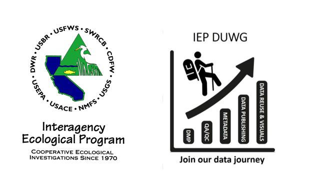

--- 
title: "Electronic Data Entry Options for IEP Surveys"
author: "IEP DUWG 'e-Device' Sub-group"
date: "2023-08-15"
site: bookdown::bookdown_site
url: "https://interagencyecologicalprogram.github.io/e-device/"
documentclass: book
description: "This bookdown document is intended to summarize the research collected by IEP DUWG members regarding the use of electronic data entry tools in IEP Surveys."
bibliography:
- book.bib
- packages.bib
biblio-style: apalike
csl: "chicago-fullnote-bibliography.csl"
always_allow_html: yes
---

# Preamble

**This bookdown document is intended as a repository of technical information related to the use of electronic field data entry tools**, including reviews of different software options, hardware, and factors regarding interfacing with external sensors and downstream databases.  

The initial information was gleaned from interviews and presentations organized during a DUWG Electronic Data Entry Device ("e-device") focus group (6/2022-6/2023), but these reports are far from exhaustive and there are many software/hardware options for field data entry that have not yet been reviewed.  Meanwhile communication and cloud processing technology is advancing rapidly.  

**This initiative generally asks that all IEP survey teams that have e-device experience, or those that are adding digital data-entry tools to their program, please share these experiences and help to develop this resource for other IEP surveys seeking to update data entry protocols.**

