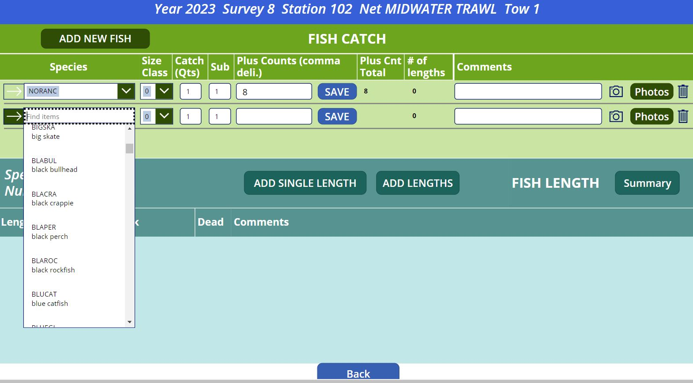

# SF Bay Study: PowerApps Trial App   {#powdem}

The SF Bay Study ES staff have explored several electronic data entry software to support the complex Bay Study survey collections.  The software app that has shown the most promise is the Microsoft Form software 'Power Apps'.  T

After approximately 6 months of app development in collaboration with the CDFW IT department and with Tuongvan Nguyen (IEP), the SF Bay Study Power app is now in a lab/field testing phase of development. Included below are screen shots of the app demonstrating the key features.

SF Bay Study Power app (BSPapp) main menu options include new sample and edit sample options; data export by csv or direct transfer to the SQL database; options to edit records that are stored on the device, call "collections" or records that have been transferred to the SQL database located on a remote system.

(\#fig:padem1)Screen capture of SF Bay Study Power Apps demo app: Main Screen options.

The 'New Sample' menu of the BSPapp includes dropdown manus and default field entries to support quick data entry.

(\#fig:padem2)Screen capture of SF Bay Study Power Apps demo app: Day Level and Sample Info menus.

The 'View/Add Tow' menu of the BSPapp: GPS coordinates currently extracted from the device. Photos can be attached to a tow record.  

(\#fig:padem3)Screen capture of SF Bay Study Power Apps demo app: Tow Info fields.

The 'View/Add Fish' menu of the BSPapp: Provides options to add single length or multiple lengths for faster entry.

(\#fig:padem4)Screen capture of SF Bay Study Power Apps demo app: View/Add Fish screen; showing dropdown menu for adding a new fish species.

BSPapp options to add photos associated with each species: direct photos captured from device camera or uploaded from file on the device.

(\#fig:padem6)Screen capture of SF Bay Study Power Apps demo app: Options to add photos to each spcies record; can collect photes from device file folder or directly from camera.

The 'Add Lengths' menu of the BSPapp:Provides realtime frequency plotting.

(\#fig:padem5)Screen capture of SF Bay Study Power Apps demo app: Add Lengths screen with realtime frequency plotting.

SF Bay Study Power add (BSPapp) provided options to edit records that are in the 'collections' on the device; alternatively can edit records that have already been transferred to the SQL database.

(\#fig:padem7)Screen capture of SF Bay Study Power Apps demo app: Edit Sample options; 

BSPapp designed to provide summary for each species with both listed lengths and frequency plots.

(\#fig:padem8)Screen capture of SF Bay Study Power Apps demo app: Main Screen options.

BSPapp designed to provide .csv export to OneDrive for all relational tables.  BSPapp also provides option to export data collection to a json file as a back up for extended off-line periods.

(\#fig:padem9)Screen capture of SF Bay Study Power Apps demo app: Main Screen options.

