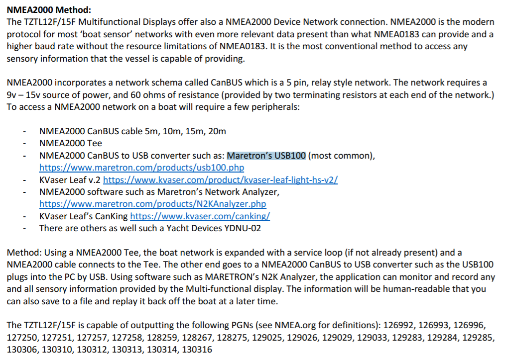

# (PART\*) External Sensors {-}

# Fishboards

## Using Big Fin Boards with non-Big Fin Software

### Integration Guide

The Integration Guide is found here: https://docs.google.com/document/d/1dsl45kLUo_u6044DCm82qgpmtCswVcmYyMqIZAow1VE/edit
"Admittedly, it also needs updating with some of the newer commands.  Until that can be accomplished, hopefully soon, I will work directly with anyone wanting to integrate their application with the boards."
Chris Carroll <chris@bigfinscientific.com>

### Alternative Software: Python Example

Here's a recent application, made by Jerome Guay, which interfaces to the DCS5 XT boards:
https://github.com/iml-gddaiss/dcs5

### DCS5 Firmware
And here's a Discord channel where you can ask questions about the DCS5 Firmware-
https://discord.gg/XHW2cbGwXk

# Navigation Data

## NMEA2000 CanBUS to USB converter

The gateway allows you to see data from a NMEA 2000 marine digital network on a PC, laptop or tablet PC with Microsoft Windows, Mac OS or Linux. With it, you get marine network data including vessel course, speed, position, wind speed and direction, water depth. 

(\#fig:nmea)This picture shows how the scientists laptop can plug into the system without getting in the way of the captains station.

The device is called a NMEA2000 CanBUS to USB converter. There are several commercial versions offered. The USB100 from Maretron is the most common: https://www.maretron.com/products/usb100.php ($295)

This is the type of connector we need in order to tap into the ships navigation system:
https://www.garmin.com/en-US/p/13372 NMEA 2000® T-connector ($25.00)

Depending on the set up in the vessel, we may also need to order a small NMEA 2000 power cable: ($27.00)
https://www.basspro.com/shop/en/ancor-nmea-2000-power-cable-with-tee?hvarAID=shopping_googleproductextensions&ds_e=GOOGLE&ds_c=BPS%7CShopping%7CSmart%7CBoating%7CGeneral%7CNAud%7CNVol%7CNMT&gclid=EAIaIQobChMIktP_jsWE_gIVxm1vBB2Y8QSwEAQYAyABEgJCBvD_BwE&gclsrc=aw.ds

Here is a blurb from an email from the Furuno technical expert regarding this method of data extraction from the navigation equipment:

(\#fig:nmea2)Here is a blurb from an email from the Furuno technical expert regarding this method of data extraction from the navigation equipment.

