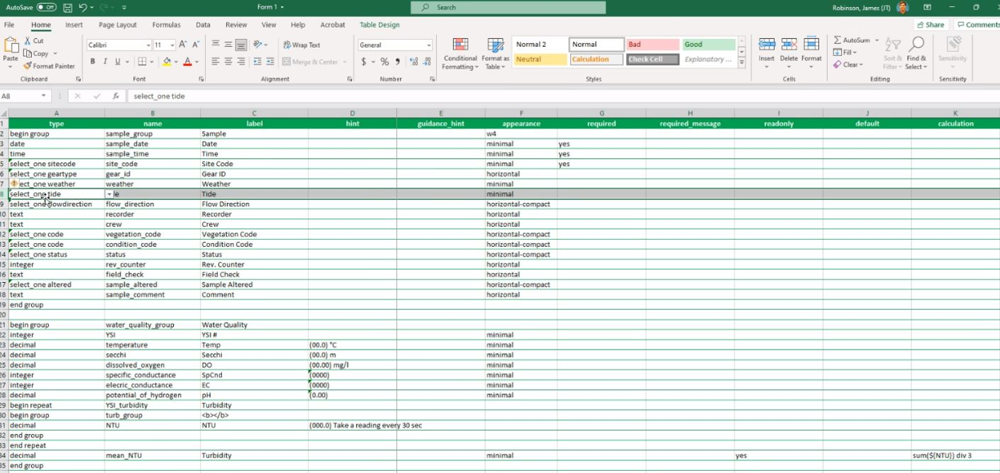
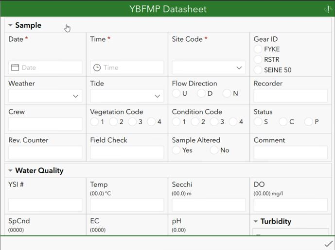
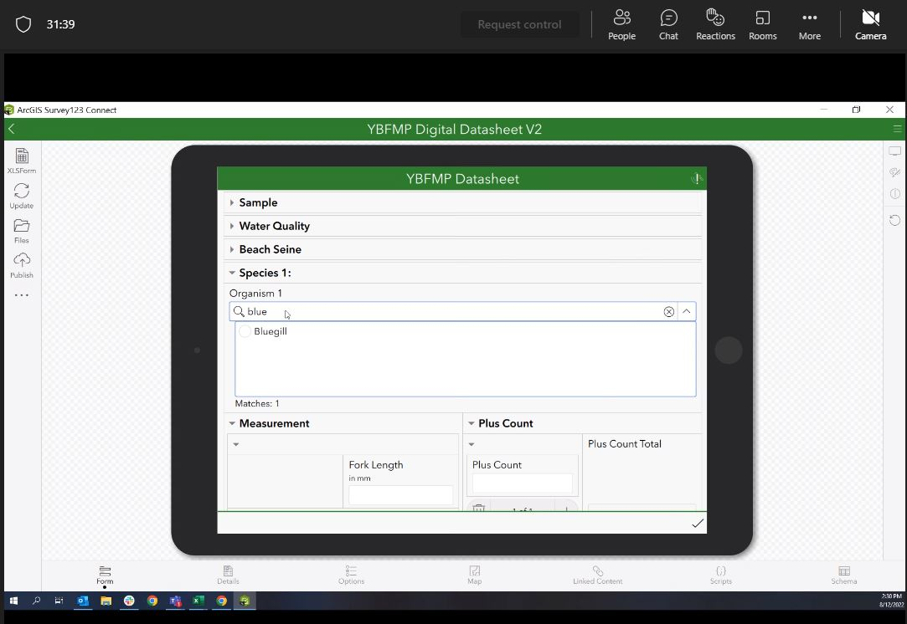
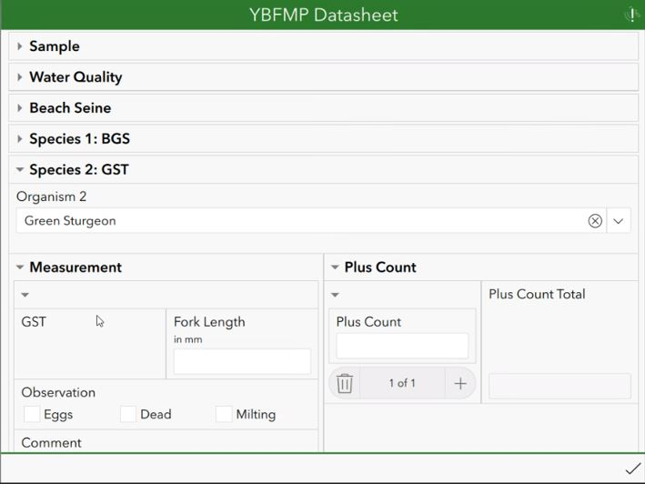
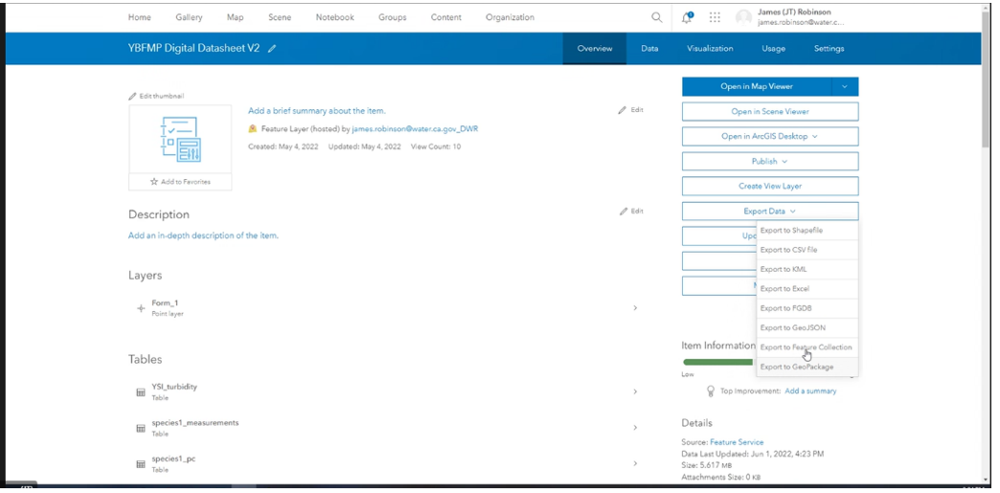
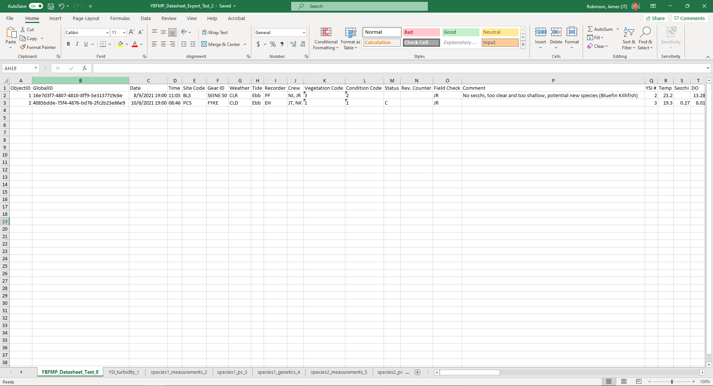

# (PART\*) IEP Survey Demos {-}

# Yolo Bipass: Survey123 Trial App {#yoldem}

An ES staff team from the Yolo Bipass Fish Monitoring Program, led by JT Robinson (DWR), have explored the use of the ESRI Survey 123 forms app for field-based digital entry of fish and water quality monitoring data.  The below screen-shots were extracted JT Robinson's presentation to the e-device sub-team meeting in August of 2022.  The design of the YBFMP field app has likely modified since this presentation as this team was still in development phase of the project.

The ‘XLSForm spreadsheet’ for the YBFMP app was used to define the more advanced form properties of the data entry form using the XLSForm coding language. 

(\#fig:Yolodemo10)Screen capture of the ESRI web interface for Survey123 highlighting the two main options for designing a Survey123 form: the web designer or the Survey123 Connect tool.

(\#fig:Yolodemo6)Screen capture of the ESRI web interface for Survey123 highlighting the two main options for designing a Survey123 form: the web designer or the Survey123 Connect tool.

(\#fig:Yolodemo7)Screen capture of the ESRI web interface for Survey123 highlighting the two main options for designing a Survey123 form: the web designer or the Survey123 Connect tool.

(\#fig:Yolodemo)Screen capture of the ESRI web interface for Survey123 highlighting the two main options for designing a Survey123 form: the web designer or the Survey123 Connect tool.

(\#fig:Yolodemo8)Screen capture of the ESRI web interface for Survey123 highlighting the two main options for designing a Survey123 form: the web designer or the Survey123 Connect tool.

(\#fig:Yolodemo2)Screen capture of the ESRI web interface for Survey123 highlighting the two main options for designing a Survey123 form: the web designer or the Survey123 Connect tool.

(\#fig:Yolodemo9)Screen capture of the ESRI web interface for Survey123 highlighting the two main options for designing a Survey123 form: the web designer or the Survey123 Connect tool.

(\#fig:Yolodemo5)Screen capture of the ESRI web interface for Survey123 highlighting the two main options for designing a Survey123 form: the web designer or the Survey123 Connect tool.

(\#fig:Yolodemo3)Screen capture of the ESRI web interface for Survey123 highlighting the two main options for designing a Survey123 form: the web designer or the Survey123 Connect tool.

(\#fig:Yolodemo4)Screen capture of the ESRI web interface for Survey123 highlighting the two main options for designing a Survey123 form: the web designer or the Survey123 Connect tool.

