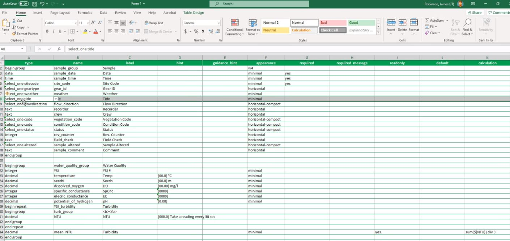

# (PART\*) IEP Survey Demos {-}

# Yolo Bipass: Survey123 Trial App {#yoldem}

An ES staff team from the Yolo Bipass Fish Monitoring Program, led by JT Robinson (DWR), have explored the use of the ESRI Survey 123 forms app for field-based digital entry of fish and water quality monitoring data.  The below screen-shots were extracted JT Robinson's presentation to the e-device sub-team meeting in August of 2022.  The design of the YBFMP field app has likely changed since this time that this presentation was given since the team was still in development phase of the project.

The ‘XLSForm spreadsheet’ for the YBFMP app was used to define the more advanced form properties of the data entry form using the XLSForm coding language. 

(\#fig:Yolodemo1)Screen capture of the XLSForm spreadsheet for the Survey123 form for YBFMP.

The YBFMP form is set up using several different types of possible fields; e.g., auto populates date/time, site code (drop down), gear (circle), weather/tide (drop-down, more than 4 options, can only pick 1), flow direction (circle), text fields, number fields (does not accept text). Screenshot below shows the form:

